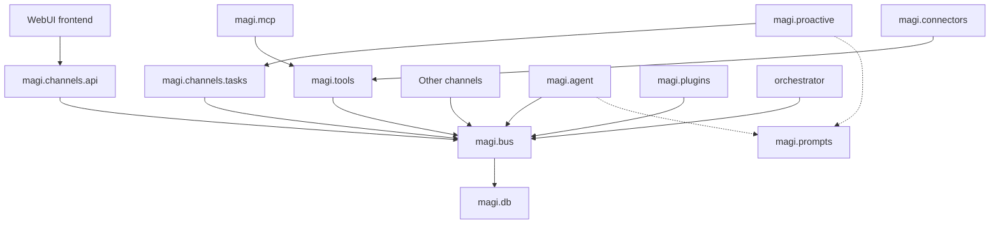

# MAGI Architecture

> The design philosophy, component layout, and core mechanics of MAGI.
> For the high-level vision, see the [README](../README.md).
> For the build plan, see [ROADMAP.md](ROADMAP.md).
> For the current production storage boundary and remaining work, see
> [production-persistence.md](production-persistence.md).
> For the bicultural glossary of product terms, see [terms.md](terms.md).
> For the local standalone deployment plan, see
> [MAGI_LOCAL_STANDALONE_DEPLOYMENT_IMPLEMENTATION_PLAN.md](MAGI_LOCAL_STANDALONE_DEPLOYMENT_IMPLEMENTATION_PLAN.md).
> For detailed per-module responsibilities, see
> [MAGI_MODULE_RESPONSIBILITIES_AND_DEPENDENCIES.md](MAGI_MODULE_RESPONSIBILITIES_AND_DEPENDENCIES.md).
>
> The original BUS-centric architecture source is preserved in
> [MAGI_BUS_CENTRIC_ARCHITECTURE.md](MAGI_BUS_CENTRIC_ARCHITECTURE.md).

This document is the **authoritative architecture** for MAGI. It is organised
in three parts:

- **Part I — The Agentic Society**: the product model, runtime principle,
  repository layout, three-layer memory, tool pattern, and deployment shape.
- **Part II — BUS-Centric Module Model**: inter-module boundaries, dependency
  rules, per-module responsibilities, and the BUS as sole protocol plane.
- **Part III — Durable Actor Runtime**: how a MAGI runtime turns input into
  committed transitions — the transaction protocol, queues, catalog, delivery,
  streaming, and recovery.

`magi.bus` and `magi.prompts` are the **only shared modules** across domain
code. BUS holds cross-module contracts, queues, outbox, and persistence
invariants; Prompts holds reusable content (SOUL, compaction, titles,
templates). Private SQLite and MAGIS PostgreSQL are implementation details
hidden behind BUS.

---

# Part I — The Agentic Society

## Agentic Society Model

MAGI is built around the idea of an **agentic society** — not a single agent, not a
chatbot serving a person, but a **group of autonomous agents that form organizations
and act as a collective**.

```
  MAGIS                       One MAGI Society; it may have child MAGIS.
    ├── ADAM                  Leading MAGI and control-plane runtime.
    ├── MAGI                  Individual runtimes, including MAGI with the EVA role.
    └── Contacts              People known to a MAGI's private runtime.
```

An agent is not a thread or a session. A **MAGI** has its own container (or
host process), identity, LLM configuration and private persistent state.

See [terms.md](terms.md) for the canonical product / society split and
the ADAM / EVA archetype mapping.

---

## Runtime Principle

**One agent = one container = one runtime process.**

There is one binary (`magi`). At boot, `MAGI_NODE_ROLE` selects the archetype
preset (`adam` or `eva`). The actual role, instructions and provider
configuration are read through BUS from the MAGIS database. Every
architectural choice is an independent configuration axis:

| Axis | Env var | Default by archetype |
|---|---|---|
| Position | `MAGI_NODE_ROLE` | `adam` = leader, `eva` = member |
| Channels | `settings.channels.enabled` (DB) | seeded `[webui]`; editable in the UI — not a launch flag |
| Private state | `<workspace>/memories/magi.db` | SQLite, one per MAGI; resolved from `MAGI_WORKSPACE_DIR` (K8s) or `HOST_WORKSPACE_DIR` (Local) |
| MAGIS database | `MAGIS_DATABASE_URL` | direct MAGIS PostgreSQL (K8s) or separate SQLite (Local) |
| LLM provider | MAGIS database (via BUS) | per-MAGI configuration; not injected as an env var |

All persistence — private SQLite and MAGIS database — is reached only through
BUS. Domain modules (Agent, Tools, Channels, proactive, connectors,
orchestrator) never construct an engine, open a session, or execute a query
directly.

---

## Deployment Profiles

MAGI supports three deployment modes, sharing the same binary and module
boundaries:

| | Kubernetes (production) | k8s-dev (kind) | Local (non-container) |
|---|---|---|---|
| One MAGI = | Pod + PVC + ClusterIP Service | Pod + hostPath workspace | independent OS process + workspace directory + localhost port |
| MAGIS storage | PostgreSQL Deployment | PostgreSQL (kind) | separate SQLite database |
| MAGIS workspace | shared PVC | shared hostPath | shared directory |
| WebUI entry | `magi webui` Service | kind NodePort 30069→42069 | `127.0.0.1:42069` |
| Orchestrator | K8s ServiceAccount | K8s ServiceAccount (kind) | none (each MAGI is its own process) |

**CLI Profile process model** (each MAGI is an independent process):

```
magi-adam.service        127.0.0.1:42069    (systemd unit, port 42069)
magi-eva-00.service      127.0.0.1:42070    (independent systemd unit)
magi-eva-01.service      127.0.0.1:42071    (independent systemd unit)
```

`magi cli start` uses `execve` to replace the current process with
`magi runtime` — no launcher, no supervisor, no subprocess tree.
`magi cli install-service` registers one systemd user unit per MAGI
so each MAGI starts, crashes, and restarts independently.

Each runtime is an independent OS process with its own workspace, SQLite,
port, logs, and provider configuration. CLI Profile is a trusted single-user
mode; it provides no container-level isolation.

---

## Repository Layout

```
magi/
├── __main__.py        # composition root; calls bus.bootstrap() to wire workers/adapters
├── runtime.py         # process composition: worker_lifespan() for ASGI apps
├── bus/               # sole public protocol & data-access boundary
│   ├── contracts/     # immutable DTOs, AgentMessage, queue records
│   ├── services/      # domain-oriented facades (agent_runs, tool_catalog, delivery, ...)
│   ├── models/        # ORM models (owned by bus, persisted by db)
│   ├── bootstrap.py   # wires workers/adapters from configuration
│   └── _persistence/  # engines, ORM base, Alembic — internal to bus
├── agent/             # reasoning, context, one provider step, AgentWorker
│   ├── step.py        # one provider inference step
│   ├── worker.py      # durable inbox consumer and transition owner
│   └── llm/           # provider adapters (Anthropic, Minimax, OpenAI)
├── tools/             # executable registry, discovery, ToolWorker
├── channels/          # protocol adapters and delivery workers
│   ├── api/           # WebUI backend (HTTP/SSE/WS)
│   ├── tasks/         # generic scheduler Worker (consumes task commands via BUS)
│   ├── telegram/      # TG bot adapter
│   ├── a2a/           # Agent-to-Agent channel
│   └── delivery/      # outbox delivery workers
├── skills/            # SKILL.md loader, catalog, and load_skill tool
├── mcp/               # MCP Server adapter (connects MCP tools into Tools)
├── connectors/        # product-specific tool adapters (Gmail, Calendar, …)
├── proactive/         # system-level tasks and heartbeats (enhances Agent initiative)
├── orchestrator/      # K8s / local process lifecycle backend
├── plugins/           # plugin discovery and lifecycle (BUS-only)
├── db/                # SQLAlchemy models, engines, migrations (BUS-only)
├── prompts/           # central Markdown + YAML prompt corpus and hot-reload loader
├── types.py           # shared dataclasses (ToolContext, ToolResult)
└── WebUI/             # React 19 + Vite 5 + Tailwind v4 SPA
```

---

## Channel Dispatcher (D.28)

Domain code talks to the dispatcher, never to a specific adapter:

```
  domain code (tools, runner, webui, chat send)
     ↓  talks in: uid + channel
  channels/dispatcher.py
     ↓
  ┌──────────┬──────────┬──────────┐
  telegram   slack      wechat     ...
```

Each adapter implements `ChannelAdapter`. Adding a channel means writing one
adapter and registering it. Inbound is symmetric: every adapter normalises
input into an `AgentMessage` and submits it through BUS — never directly to
the AgentWorker.

---

## Agent Loop

`magi.agent.worker.AgentWorker` consumes durable inputs and invokes
`magi.agent.step.run_agent_step()`:

1. Claim a durable input through BUS (lease-owned).
2. Validate per-agent credentials (mandatory; no fallback).
3. Assemble context (SOUL + instructions + memory + contacts + skills) via BUS.
4. Run the LLM inference **outside** a transaction — at most one per transition.
5. Persist committed transcript, run state, tool jobs, and outbox effects
   atomically through BUS.
6. Return DTO intents for the next durable input.

Slow work — Tool execution, outbound delivery, A2A peer calls — is represented
by durable jobs or outbox effects, never executed inside a database transaction.

---

## Persistence

Two storage domains, both reached only through BUS:

| Domain | Tables / files | Owner |
|---|---|---|
| Private SQLite + `/workspace` | sessions, memory, contacts, tasks, settings, SOUL, skills | one MAGI |
| MAGIS database + `/magis` | `magis`, `magic`, roles, memberships, instructions, providers, `eva_runtimes` | one MAGIS |

### CLI Profile storage

```
MAGI_HOME/                         (~/.magi on Linux)
├── MAGIS/<magis_id>-<slug>/       # one SQLite per MAGIS
│   ├── magis.db                   # organisation + control-plane state
│   ├── control-secret             # launcher HMAC key
│   └── launcher-state/            # launcher BUS scratch
└── MAGIC/<slug>/                 # slug derived from MAGIC name (e.g. eva-000)
    └── workspace/                 # per-MAGI workspace (= K8s /workspace)
        ├── memories/magi.db       # private SQLite
        ├── skills/
        ├── SOUL.md
        ├── logs/
        └── tmp/
```

MAGIS data is never written into a MAGI's private `magi.db`; each MAGIS has
its own SQLite file with WAL, busy timeout, and foreign keys. The
`workspace/memories/magi.db` convention is identical across all three
deployment modes — K8s Pods resolve `<workspace>` from `MAGI_WORKSPACE_DIR`,
CLI processes resolve it from `HOST_WORKSPACE_DIR`.

### Private SQLite tables

| Table | Holds |
|---|---|
| `contacts`, `contact_notes` | Person directory |
| `action_items` | Operator to-do inbox |
| `token_usage` | Per-call LLM billing |
| `tasks` / `task_runs` | Scheduled tasks |
| `chat_sessions` / `chat_messages` | Conversation history |
| `chat_messages_fts` | FTS5 trigram full-text search |
| `memory_entries` | MAGI's self-memory |
| `mcp_servers` | Operator-configured MCP servers |
| `tools` | Tool Catalog (Agent's schema source) |
| `skills` | Skill Catalog (system prompt source) |
| `meta` / `settings` | KV runtime config |

SQLite uses WAL + `busy_timeout=5000` + `BEGIN IMMEDIATE`. One writable
runtime per file.

---

## Three-Layer Memory

| Layer | Table | Stores |
|---|---|---|
| Session | `chat_sessions` / `chat_messages` | Conversation history. Auto-compaction keeps context within LLM window |
| Contacts | `contacts` | What the society knows about people. LLM records facts via tools |
| Self | `memory_entries` | MAGI's own long-term memory. Facts, ongoing work, decisions |

All layers share `Base` and FK to `contacts`, but no inter-layer FKs.
The committed session transcript is the only authority for the next provider
context; StreamHub views are best-effort.

---

## Tools

```
class Tool(ABC):
    name: str
    description: str
    input_schema: dict

    async def run(ctx: ToolContext, **kwargs) -> ToolResult
```

20+ built-in tools. MCP tools loaded at boot via the MCP adapter. Agent-created
skills live under `workspace/skills/`.

The database **Tool Catalog** is the Agent's single schema authority. The
Agent never imports the tool registry and never knows whether a schema came
from built-in code, MCP, or a Skill.

Tool implementation sources obey a tiered model:

```
MCP Server ──→ magi.mcp ──┐
product API ─→ connectors ─┼──→ magi.tools → BUS Tool Catalog / jobs
built-in / Skill ──────────┘
```

`magi.mcp` adapts MCP connections into Tools contracts. `magi.connectors`
wraps product-specific APIs as Tools. Both depend on Tools; Tools never
depends back on MCP or connectors.

---

## Unified WebUI and Runtime API

Two service roles from one image:

```text
Browser → magi-webui Service (`magi webui`)
              ├─ React SPA, login, MAGIS/MAGI control API
              └─ signed internal proxy
                     ├─ magi Runtime API (one selected MAGI)
                     └─ magi Runtime API (another selected MAGI)
```

The `magi` process has no SPA mount. It serves a private Runtime API so the
WebUI can operate on a selected MAGI's workspace. The browser does not choose
an upstream URL; WebUI resolves the selected `magic_id` from the registry and
sends a short-lived HMAC request bound to method, path, operator and target ID.

See [unified-webui.md](unified-webui.md) for the WebUI service shape.

---

# Part II — BUS-Centric Module Model

`magi.bus` and `magi.prompts` are the **only shared modules** across domain
code. Cross-module state exchange flows through BUS. Arrow `A → B` means **A
may import and depend on B**; it does not represent runtime message flow.

## Dependency Graph



Only `magi.bus` depends on `magi.db`. `magi.prompts` depends on no MAGI
module. The narrower `MCP → Tools`, `proactive → channels.tasks`, and
`WebUI → channels.api` edges are explicit extension relationships, not
permission to treat Tools or Channels as general shared APIs.

## Forbidden Dependencies

```text
agent      -X-> tools / channels / plugins / db
tools      -X-> agent / channels / plugins / MCP / db
channels   -X-> agent / tools / plugins / db
plugins    -X-> agent / tools / channels / MCP / db

proactive  -X-> bus / db / agent / tools
MCP        -X-> bus / db / agent / channels
WebUI      -X-> bus / db / agent / tools

connectors, orchestrator -X-> db

db         -X-> bus / agent / tools / channels / proactive / plugins / MCP
bus        -X-> agent / tools / channels / proactive / plugins / MCP / prompts
             / Tool implementations / LLM providers / protocol clients
```

This includes indirect shortcuts. ORM models, sessions, engines, and raw SQL
helpers remain persistence access even if re-exported from a different package.

## Allowed Dependencies Matrix

| Caller | Allowed | Forbidden |
|---|---|---|
| `agent` | `bus`, `prompts` | `tools`, `mcp`, `connectors`, `channels`, `plugins`, `db` |
| `tools` | `bus` | `agent`, `mcp`, `connectors`, `channels`, `plugins`, `db` |
| `mcp` | `tools` | `bus`, `agent`, `connectors`, `channels`, `plugins`, `db` |
| `connectors` | `tools` | `bus`, `agent`, `mcp`, `channels`, `plugins`, `db` |
| `channels.api` | `bus` | `agent`, `tools`, `mcp`, `tasks`, `plugins`, `db` |
| `channels.tasks` | `bus` | `agent`, `tools`, `mcp`, `plugins`, `db` |
| other `channels.*` | `bus` | `agent`, `tools`, `mcp`, `plugins`, `db` |
| `proactive` | `tasks`, `prompts` | `bus`, `agent`, `tools`, `db` |
| `plugins` | `bus` | `agent`, `tools`, `mcp`, `connectors`, `channels`, `db` |
| `bus` | `db` | all domain modules |
| `db` | stdlib/SQLAlchemy | all MAGI business modules |
| `prompts` | stdlib | all MAGI business modules |

## Per-Module Responsibilities

### `magi.bus`

**Owns:** cross-module contracts, services, repositories, queues, leases,
outbox, transactions, idempotency, retries, recovery, storage routing, data
permissions, and persistence invariants.

**Must not:** execute LLM inference, run Tool implementations, perform
channel/A2A I/O, make Agent decisions, or contain ORM models (those belong
to `magi.db`).

BUS APIs return only immutable dataclasses, Pydantic DTOs, primitives, or
JSON-safe payloads. They never expose ORM instances, sessions, connections,
queries, or dialect objects.

```python
bus.agent_runs.publish_input(...)
bus.agent_runs.claim_next(...)
bus.agent_runs.commit_transition(...)

bus.tool_catalog.replace_snapshot(...)
bus.tool_catalog.list_schemas(...)

bus.tool_jobs.claim_next(...)
bus.tool_jobs.complete(...)

bus.delivery.enqueue(...)
bus.delivery.claim_next(...)
bus.delivery.complete(...)

bus.session.get_transcript(...)
bus.memory.search(...)
bus.settings.get(...)
bus.magis.get_runtime_identity(...)
```

### `magi.db`

**Owns:** SQLAlchemy models, engines, sessions, Alembic migrations, database
configuration, and repository implementations.

**Must not:** define cross-module business protocols, decide message routing,
or be imported by any domain module (only BUS). Types must not be re-exported
through public packages.

### `magi.prompts`

**Owns:** system prompts, SOUL, context blocks, compaction templates, chat
title prompts, task templates, and bot reply strings.

**Must not:** call LLMs, read sessions or databases, publish events, or
depend on any MAGI business module. It is a content resource, not a
coordination layer.

### `magi.agent`

**Owns:** reasoning loop, context assembly, one provider step, `AgentWorker`,
LLM provider adapters, and stream handling.

**Must not:** call Tool implementations directly, deliver channel messages,
access the database, maintain the Tool Catalog, or perform plugin discovery.

**Depends on:** `magi.bus`, `magi.prompts`.

### `magi.tools`

**Owns:** unified Tool descriptor, parameter schema, execution result protocol,
built-in Tool registry, ToolWorker, Tool Catalog sync to BUS, tool permission
and timeout control. Provides stable extension contracts for MCP and connectors.

**Must not:** initiate Agent reasoning, modify session context, access the
database, or depend on MCP/connectors (they are upstream adapters).

**Depends on:** `magi.bus`.

Tool classification:
- **Core built-in**: stateless, reusable across products (read_file, bash, search_sessions, …)
- **Connector tools**: product-specific wrappers owned by a `magi.connectors` module
- **MCP tools**: provided by external servers, adapted through `magi.mcp`

Core Tools must not accumulate product-specific logic.

### `magi.mcp`

**Owns:** MCP server configuration, connection/session management, tool
discovery from MCP servers, translating MCP descriptors into Tools contracts.

**Must not:** access BUS or DB directly, register tools directly on BUS, or
be imported by Tools core.

**Depends on:** `magi.tools` (extension contracts only).

### `magi.connectors`

**Owns:** product-specific tool groups with shared auth, configuration, and
lifecycle. Wraps product APIs/SDKs/CLIs into Tools contracts.

**Must not:** define a parallel tool protocol, access DB directly, depend on
Channels/Plugins/MCP, or push product logic into core Tools.

**Depends on:** `magi.tools`.

### `magi.channels`

Channels normalise external input into BUS protocol and convert BUS output
into channel-specific formats. They are boundary adapters, not business logic.

**Owns:** input validation/normalisation, BUS command/event submission, outbox
delivery consumption, channel-level auth, rate limiting, and connection
lifecycle.

**Must not:** invoke Agent directly, execute Tools, access the database, or
decide Agent reasoning steps.

#### `magi.channels.api`

The WebUI backend. Provides HTTP, WebSocket, and SSE endpoints for session
queries, message submission, run status, streaming output, and management
operations. The WebUI frontend's sole backend boundary.

#### `magi.channels.tasks`

A generic scheduler Worker. Consumes `task.schedule/update/cancel/pause/resume`
commands from BUS, manages schedule definitions, and publishes standard
`agent.input` events on expiry.

**Must not:** contain preset tasks, proactive policies, Agent prompts, or
direct Agent/Tool calls. `correlation_id` links commands to result events
for synchronous callers.

```
API / Tools / Proactive
     ↓ task.schedule / update / cancel / pause / resume
    BUS
     ↓
channels.tasks Worker
     ↓ task.scheduled / updated / rejected 等结果事件
    BUS
     ↓ 到期时发布标准 agent.input
 AgentWorker
```

### `magi.proactive`

**Owns:** system-level task and heartbeat definitions. Decides what proactive
tasks to create based on policy, state, or external events.

**Must not:** create Agent runs directly, call Agent/Tools/Channels, access
DB, or implement task delivery (that's `channels.tasks`' job).

**Depends on:** `magi.channels.tasks`, `magi.prompts`.

### `magi.plugins`

**Owns:** plugin discovery, validation, enable/disable, manifest/version
management, and capability registration through BUS.

**Must not:** import Agent, Tools, or Channels directly. Even if a plugin
provides tools, connectors, or channel capabilities, the plugin manager
remains BUS-only.

**Depends on:** `magi.bus`.

### `magi.orchestrator`

**Owns:** constrained runtime lifecycle operations (create, start, stop,
delete MAGI instances) through a platform-agnostic `RuntimeBackend`.

```python
class RuntimeBackend(Protocol):
    def start(self, spec: RuntimeSpec) -> RuntimeOperationResult: ...
    def stop(self, spec: RuntimeSpec) -> RuntimeOperationResult: ...
    def delete(self, spec: RuntimeSpec) -> RuntimeOperationResult: ...
    def inspect(self, runtime_id: int) -> RuntimeStatus: ...
    def reconcile(self) -> ReconcileResult: ...
```

Implementations: `KubernetesRuntimeBackend` (production / k8s-dev).
The CLI Profile has no orchestrator backend — each MAGI is an independent
OS process, managed directly by systemd or run in the foreground.

The Orchestrator Worker consumes lifecycle commands from BUS, calls the
backend, and writes results back through BUS. BUS never imports the backend;
the backend never accesses the registry ORM directly.

```
WebUI → channels.api → BUS → Orchestrator Worker → RuntimeBackend
                                ↓
                         BUS 状态/结果事件
```

### `magi.__main__` (Composition Root)

**Owns:** argument parsing, environment configuration, creating BUS/DB,
assembling workers and adapters, starting runtime/channel processes, managing
startup order, health checks, and graceful shutdown.

**Must not:** implement message routing, Agent reasoning, Tool execution,
or Channel business logic. It can import all modules for assembly but must
not become a data-passing middle layer.

---

## Runtime Collaboration Flows

### User message → reply

```
WebUI → channels.api → BUS (agent.input) → AgentWorker
  → BUS (read context) → LLM inference → BUS (commit transcript)
  → channels.api (SSE/WS push) → WebUI
```

API and Agent never call each other directly.

### Agent tool call

```
AgentWorker → BUS (write tool call/job) → ToolWorker
  → execute tool → BUS (tool result) → AgentWorker (resume run)
```

Agent reads the Tool Catalog from BUS, never imports the registry.

### MCP tool discovery and execution

```
MCP Server → magi.mcp (tool list) → Tools (register descriptor)
  → BUS (sync catalog)
  → ToolWorker claims job → Tools → MCP adapter → MCP Server
  → BUS (tool result)
```

Agent only sees the normalised Tool Catalog and results.

### Scheduled task

```
API / Tools / Proactive → BUS (task.schedule) → channels.tasks Worker
  → persist schedule → wait expiry → BUS (agent.input)
  → AgentWorker → BUS (result)
```

The scheduler is generic; `proactive` defines system-level tasks and
heartbeats. They do not call each other directly.

---

# Part III — Durable Actor Runtime

> This part defines the technical Actor model, queue architecture,
> transaction protocol, and recovery semantics.

## Purpose

MAGI is a society of independent runtimes. Each runtime owns private execution
state and exchanges work with users, tools, channels, and peer MAGI runtimes
through durable messages and effects.

Two inseparable rules:

1. **BUS-centric boundaries.** `magi.bus` is the sole protocol and data-access
   boundary between MAGI modules.
2. **Durable Actor execution.** One MAGI processes one durable input transition
   at a time; slow work is represented by durable jobs or outbox effects and
   never executes inside a database transaction.

The BUS is an in-process Python protocol/data plane, not a required network
service. It guarantees durable, authorised state exchange while an Agent
retains reasoning and coordination decisions.

## Goals

- Every module submits, queries, and changes shared state through BUS.
- BUS owns transactions, idempotency, leases, retries, recovery, storage
  routing, data permissions, and persistence invariants.
- Local SQLite and MAGIS database are implementation details behind BUS.
- Agent-visible tool schemas have one durable authority: the Tool Catalog.
- A crash, duplicate delivery, lease expiry, or lost network response does not
  silently lose a committed transition.
- StreamHub/SSE remains a fast view, while committed state remains authoritative.

## Durable Actor Runtime

A MAGI is an Actor with a private durable mailbox. One runtime owns one active
Agent transition at a time; different MAGI runtimes proceed independently.

```
WebUI / Telegram / Tasks / Proactive / A2A ingress
                            |
                            v
                    BUS durable agent inbox
                            |
                            v
          AgentWorker: one message, one transition
             |          |                       |
             v          v                       v
       LLM + StreamHub tool jobs         delivery/A2A outbox
             |          |                       |
             +----------+-----------------------+
                            |
                            v
                    durable result/input
```

Each transition:

```
claim durable input
  → query required state through BUS
  → at most one complete LLM inference outside a transaction
  → atomically commit state and subsequent jobs/outbox through BUS
```

The Actor never waits synchronously for a Tool, an A2A peer, or outbound
delivery. Their completion is a later durable input to the same run.

## Input Envelope

Agent input is a versioned DTO with a stable producer-supplied
`event_id`/idempotency key and causality metadata:

```
event_id, kind, source_type, source_id, external_event_id
conversation_id, run_id/target_run_id
correlation_id, causation_id, reply_to
caller identity/role, deadline, payload, metadata
```

Durable inbox kinds:

```
channel.message.received, task.triggered,
tool.result, tool.failed,
run.steer, run.cancel,
a2a.request, a2a.result
```

## Separate Queues and Projections

One SQLite file does not mean one universal `messages` table:

| Record | Producer | Consumer | Responsibility |
|---|---|---|---|
| `agent_inbox` | channels, scheduler, ToolWorker, A2A ingress | AgentWorker | Agent input |
| `agent_runs` | AgentWorker | AgentWorker | continuation and run state |
| `run_inputs` | channels/BUS | AgentWorker | steering/control inputs |
| `tool_calls` / `tool_jobs` | AgentWorker | ToolWorker | tool effects |
| `a2a_invocations` | Agent, A2A workers | AgentWorker | delegation binding |
| `delivery_outbox` | Agent/Tool transition | delivery worker | external delivery |
| `llm_attempts` | AgentWorker | AgentWorker/WebUI | diagnostics |
| `session_messages` | committed transition | context builder | transcript |

## Run Invariants

An `agent_run` stores status (`queued`, `running`, `waiting_tool`,
`waiting_a2a`, `completed`, `failed`, `cancelled`), continuation, pending effect
IDs, deadline, version, iteration count, and failure details. `received_seq`
is the real arrival order; `context_seq` is the order content enters the
provider transcript. They must remain distinct.

## Transaction, Lease, and Recovery Protocol

```
1. Claim: claim eligible work, write a processing lease, increment attempts, commit.
2. Execute: LLM inference, Tool execution, or network delivery outside a transaction.
3. Complete: persist outcome, create next durable records, complete/retry/dead-letter, commit.
```

For an Agent, `commit_agent_transition()` atomically writes the committed
transcript, run/continuation, tool calls/jobs, A2A invocations, delivery
records, LLM attempt outcome, and completed inbox state.

Reliability model: **at-least-once delivery plus idempotent consumption**.
Lease expiry, bounded exponential retry, dead-letter handling, and startup
recovery are ordinary control paths.

No database transaction may contain LLM inference, Tool execution, Telegram or
A2A HTTP, SSE/WebSocket writes, or another unbounded wait.

## Agent Lifecycle and Steering

- When idle, the next eligible external input starts a run.
- During inference, new input is durable but cannot interrupt the stream.
- During an active same-conversation run, ordinary input becomes a durable
  steering input. It neither cancels Tools nor creates a parallel run.
- Another conversation remains queued until the active run finishes.
- Only `POST /api/runs/{run_id}/cancel` creates `run.cancel`; ordinary
  language never implies cancellation.

After tool use, provider input order:

```
user request → assistant tool-use → tool results by original ordinal
             → steering inputs by received_seq → next inference
```

## LLM Streaming and Committed Truth

Provider deltas are normalised through `StreamHub`. Every stream event carries
`run_id`, `llm_attempt_id`, and sequence information. StreamHub and SSE are
in-memory, best-effort views. The authoritative result is the full provider
response committed by the transition; only then is `message.committed` emitted.

## Tool Catalog and ToolWorker

```
MCP discovery → Tools extension contract ──┐
built-in / Skill discovery ────────────────┤
                                            ├→ Tools → BUS snapshot → SQLite
Agent ← BUS list_schemas                    │
ToolWorker → executable registry only       │
```

A definition includes name, source, description, JSON schema, allowed roles,
enabled state, implementation version, schema hash, and revision. Snapshot
replacement validates definitions, upserts current entries, disables missing
entries, advances revision/hash, then commits atomically.

## Channels, Delivery, and A2A

Channels normalise input into `AgentMessage` and submit through BUS. WebUI
returns `202 Accepted` with `run_id`, exposes best-effort SSE, and reads the
durable result through BUS.

A2A is accept-then-process:

```
source Agent transition → durable A2A delivery → HTTP POST with event ID
  → target A2A ingress durably publishes request → target returns 202
  → target Actor runs independently → durable result returns to source
```

`message_magi` is one-way by default. An explicit `expect_reply` persists an
`a2a_invocation` with the run, reply target, deadline, and idempotency key.

## SQLite, Deployment, and Wake-up

Private SQLite is the execution authority because it can atomically commit a
transition and its local jobs/outbox. WAL, foreign keys, busy timeout, bounded
`SQLITE_BUSY` retry, short transactions, and queue indexes.

One SQLite file = one writable runtime. No concurrent Pods or processes, no
network filesystem sharing. Local MAGIS SQLite uses the same WAL/busy/FK
configuration.

Path resolution: K8s Pods set `MAGI_WORKSPACE_DIR` to the PVC mount point;
Local processes set `HOST_WORKSPACE_DIR` + `MAGI_RUNTIME_ID` + `MAGI_RUNTIME_SLUG`.
There is no hardcoded `/workspace` path anywhere in the codebase.

BUS commits durable work before signaling an in-memory wake-up. Bounded polling
and startup recovery are the fallback.

## CLI Deployment Security

CLI Profile is a trusted single-user mode:

- WebUI and Runtime bind `127.0.0.1` by default.
- Control secret uses cryptographically secure random generation.
- Provider API keys never enter CLI argv, logs, or launch JSON.
- Runtime proxy validates HMAC, target runtime ID, and freshness.
- Workspace paths use canonicalisation and boundary checks.
- Each MAGI is an independent OS process — no subprocess management, no `shell=True`.
- Delete defaults to archive, not permanent workspace removal.
- Documentation clearly states CLI Profile is not a security sandbox.

## Completion Criteria

The architecture is converged when:

- No domain module imports `magi.db`, ORM models, or sessions directly.
- `agent`, `tools`, `channels`, `plugins`, and `proactive` have no
  cross-module direct imports; runtime collaboration flows through BUS.
- `tools` has no dependency on `mcp` or `connectors`; they are upstream adapters.
- `proactive` does not access BUS or DB directly; it enters through `channels.tasks`.
- `channels.tasks` is a generic scheduler with no preset tasks or policies.
- `channels.tasks` publishes standard `agent.input` on expiry, never calls Agent directly.
- Agent reads Tool Catalog from BUS, never imports the registry.
- StreamHub views are best-effort; committed state is authoritative.
- All cross-worker state changes are recoverable from BUS/DB.
- `magi.__main__` is assembly-only, no business logic.
- Architecture import rules are enforced by automated tests.

---

# Glossary

- **MAGI** — The general kind of autonomous agent in this system.
- **MAGIS** — A MAGI Society. A group of MAGI that forms a tree via `parent_id`.
- **MAGIC** — Internal table/API name for an individual MAGI; not a separate product term.
- **ADAM** — Leading MAGI role for its direct MAGIS. MAGIS administrator grants
  are direct-only and do not inherit across the society tree.
- **EVA** — Default working MAGI role. Executes tasks and collaborates.
- **Contact** — A person known to the society. Role: `admin` (WebUI operator),
  `assigned` (the served user), or `guest` (everyone else).
- **BUS (`magi.bus`)** — The sole public protocol and data-access boundary
  between MAGI modules. Holds contracts, services, repositories, queues,
  leases, outbox, transactions, and persistence invariants.
- **Prompts (`magi.prompts`)** — The sole shared content resource module.
  Holds prompt templates, SOUL, context blocks, and bot reply strings.
- **Actor** — A MAGI runtime that owns one private durable mailbox, processes
  one durable input transition at a time, and emits durable state and effects.
- **Transition** — One complete claim → execute → commit cycle for an Agent
  input; the atomic unit of Agent work.
- **Tool Catalog** — The database table that is the only Agent schema
  authority; populated from registry / MCP / Skill discovery via BUS.
- **StreamHub** — The in-memory, best-effort view of provider deltas; never
  the authority for state.
- **A2A** — Agent-to-Agent communication via accept-then-process HTTP with
  HMAC-signed, idempotent events.
- **Saga** — Cross-store work modelled as local transaction → outbox →
  worker → other-store transaction → result/event through BUS.
- **Composition Root** — `magi.__main__` and `magi.runtime`; the only places
  that instantiate and wire all modules. They do not carry business logic.
