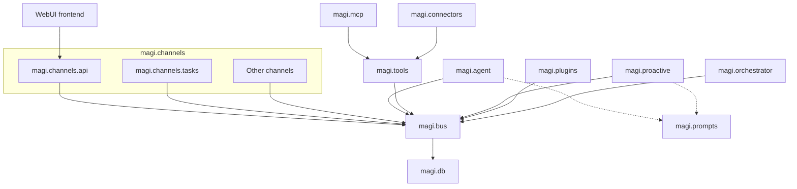

# MAGI BUS-Centric Actor Runtime Architecture

> Status: authoritative architecture. This document supersedes
> `MAGI_BUS_CENTRIC_ARCHITECTURE_REFACTOR_PLAN.md`,
> `MAGI_single_agent_event_driven_runtime_design.md`, and
> `message-driven-agent-runtime.md`.

## 1. Purpose

MAGI is a society of independent runtimes. Each runtime owns private execution
state and exchanges work with users, tools, channels, and peer MAGI runtimes
through durable messages and effects.

This document defines two inseparable rules:

1. **BUS-centric boundaries.** `magi.bus` is the sole shared protocol and
   data-access boundary between MAGI runtime modules. `magi.prompts` is the
   only other shared module, and contains content resources rather than
   runtime state or cross-module control.
2. **Durable Actor execution.** One MAGI processes one durable input transition
   at a time; slow work is represented by durable jobs or outbox effects and
   never executes inside a database transaction.

The BUS is an in-process Python protocol/data plane, not a required network
service. It is not a business-workflow coordinator: it guarantees durable,
authorised state exchange while an Agent retains reasoning and coordination
decisions. `magi.db` is a private persistence provider beneath BUS, not a
public module for domain code.

## 2. Goals and non-goals

The architecture ensures that:

- every module submits, queries, and changes shared runtime state through BUS;
- only BUS and Prompts are shared dependencies across domain modules;
- BUS owns transactions, idempotency, leases, retries, recovery, storage
  routing, data permissions, and persistence invariants;
- Local SQLite and MAGIS PostgreSQL are implemented by `magi.db` and remain
  inaccessible to domain modules except through BUS;
- Agent-visible tool schemas have one durable authority: the Tool Catalog;
- a crash, duplicate delivery, lease expiry, or lost network response does not
  silently lose a committed transition; and
- StreamHub/SSE remains a fast view, while committed state remains authoritative.

It deliberately does not introduce a global broker, a durable LLM worker,
workflow graph, central turn coordinator, shared private storage, or an
end-to-end exactly-once claim.

## 3. Module boundaries

### 3.1 Allowed dependencies

An arrow means that the module on the left may import and depend on the module
on the right:

```text
WebUI frontend       -> magi.channels.api
magi.mcp.*           -> magi.tools extension contracts
magi.connectors.*    -> magi.tools extension contracts

magi.agent.*         -> magi.bus public API + magi.prompts
                         + agent internals/LLM providers
magi.tools.*         -> magi.bus public API + tool registry/executors
magi.channels.*      -> magi.bus public API + channel-local adapters
magi.proactive.*     -> magi.bus public API + magi.prompts
magi.plugins.*       -> magi.bus public API
magi.orchestrator.*  -> magi.bus public API + Kubernetes client

magi.bus             -> magi.db persistence API
magi.db              -> Python/SQLAlchemy/database drivers only
magi.prompts         -> content/templates and standard library only
```



`magi.bus` and `magi.prompts` are the only **shared** modules: domain modules
may use BUS for runtime state and messages, and may use Prompts for reusable
prompt content. The narrower `mcp/connectors -> tools` and
`WebUI -> channels.api` relationships are explicit extension or delivery
edges, not permission to treat Tools or Channels as general shared APIs.
Proactive publishes scheduling commands to BUS; it does not import
`channels.tasks`.

`magi.__main__` is the composition root. It creates the runtime through
`bus.bootstrap()`, starts workers/adapters, instantiates MCP and Connector
executors, registers those instances with the Tools registry, and supplies
environment-specific configuration. The `McpWorker` is an independent worker
that manages MCP server connections and consumes the `mcpServerChangedJobBoard`;
Connectors do not own independent job workers. ToolWorker remains the sole
consumer of Tool Jobs. A domain module must not initialise a database itself or
import another domain merely to obtain a runtime capability.

### 3.2 Forbidden dependencies

```text
agent      -X-> tools / channels / plugins / db
tools      -X-> agent / channels / plugins / MCP / connectors / db
channels   -X-> agent / tools / plugins / db
plugins    -X-> agent / tools / channels / MCP / connectors / db

proactive  -X-> channels.tasks / db / agent / tools
MCP        -X-> bus / db / agent / channels / connectors
connectors -X-> bus / db / agent / channels / plugins / MCP
WebUI      -X-> bus / db / agent / tools

orchestrator -X-> db

db         -X-> bus / agent / tools / channels / proactive / plugins / MCP
               / connectors
bus        -X-> agent / tools / channels / proactive / plugins / MCP / prompts
             / connectors / Tool implementations / LLM providers
             / protocol clients
```

`proactive` publishes task commands through BUS; `magi.channels.tasks`
consumes those commands without a direct Python dependency in either direction.
MCP and Connectors implement narrow contracts owned by Tools; the Tools core
must not import either concrete adapter module. The WebUI frontend talks only
to `magi.channels.api`.

This includes indirect shortcuts. ORM models, sessions, engines, raw SQL
helpers, and database-specific settings remain persistence access even if
re-exported from a different package. Likewise, importing another domain's
worker, registry, dispatcher, or service locator violates the boundary even
when the call eventually reaches BUS.

### 3.3 DB is private beneath BUS

`magi.db` contains engine/session factories, ORM base and models,
database-specific settings, Local SQLite and MAGIS PostgreSQL configuration,
and Alembic support. It is not a shared application module: only `magi.bus`
may use its persistence API during normal runtime operation. AST
import-boundary tests enforce the `domain -> BUS -> DB` direction.

The composition root and Alembic migration runner are narrowly scoped setup
exceptions: they may initialise engines and metadata before BUS services
exist, but they must not query or mutate product state on behalf of a domain
module. DB types must not be re-exported through public packages.

BUS repositories translate between DB records and public DTOs. This keeps DB
responsible for tables, models, engines, sessions, and migrations, while BUS
owns the protocols and logic for reading and writing shared runtime state.

### 3.4 BUS public surface

BUS APIs return only immutable dataclasses, Pydantic DTOs, primitives, or
JSON-safe payloads. They never expose an ORM instance, session, connection,
query, lazy relationship, or database-dialect object.

The public API is domain-oriented rather than a God store:

```python
bus.agent_runs.publish_input(...)
bus.agent_runs.claim_next(...)
bus.agent_runs.commit_transition(...)

bus.tool_catalog.replace_snapshot(...)
bus.tool_catalog.list_schemas(...)
bus.tool_jobs.claim_next(...)
bus.tool_jobs.complete(...)
bus.delivery.enqueue(...)
bus.delivery.claim_next(...)
bus.delivery.complete(...)

bus.session.get_transcript(...)
bus.memory.search(...)
bus.settings.get(...)
bus.magis.get_runtime_identity(...)
```

`BusStoreProtocol` is the runtime-facing durable-store contract where the Actor
needs queue and transition primitives. It may be decomposed behind services and
repositories; expanding it into a catch-all application API is not the goal.

## 4. Responsibilities

| Module | Owns | Must not own |
| --- | --- | --- |
| `magi.bus` | public contracts, services, repositories, queues, leases, outbox, transactions and invariants | DB models, LLM inference, Tool implementation, channel/A2A I/O, Agent decisions |
| `magi.db` | SQLAlchemy models/base, engines/sessions, Alembic and database configuration | public application API, domain commands, cross-module orchestration |
| `magi.prompts` | reusable prompt templates and prompt content resources | runtime state, persistence or cross-module coordination |
| `magi.agent` | reasoning, context, one provider step, AgentWorker | direct DB access, Tool execution, channel delivery |
| `magi.tools` | Tool contracts, executable registry, catalog synchronisation and the sole ToolWorker | provider-specific loading in the core, Agent schema authority, direct DB/channel access |
| `magi.mcp` | MCP configuration, connections, discovery, ToolExecutor/ToolProvider adapters, and the McpWorker that owns every MCP connection and consumes the mcpServerChangedJobBoard | direct old-bus access, an independent Tool Job worker, direct DB access, or reverse dependency from Tools |
| `magi.channels` | protocol ingress, delivery workers and adapters | Agent orchestration, Tool execution, DB access |
| `magi.channels.api` | HTTP/SSE backend used by the WebUI frontend | direct Agent/Tool/DB access |
| `magi.channels.tasks` | generic scheduler Worker consuming BUS commands and publishing due Agent inputs | preset tasks, proactive policy or direct DB/Agent access |
| `magi.proactive` | system task/heartbeat definitions and policy published through BUS | direct Tasks/Agent/Tool/DB calls or scheduling execution |
| `magi.plugins` | plugin lifecycle and plugin-originated capability/state exchange through BUS | direct Agent, Tool, Channel, Connector or DB calls |
| `magi.connectors` | product-specific tool groups and ToolExecutor/ToolProvider adapters | an independent Tool Job worker, direct BUS/DB access, channel ingress or parallel Tool protocols |
| `magi.orchestrator` | constrained runtime lifecycle operations | direct DB access or domain business logic |

BUS stores and routes state but does not decide which MAGI should act, how
MAGI should divide work, or whether ordinary language is a cancellation.
Prompts provides shared content but no runtime coordination. Narrow extension
dependencies do not change these ownership rules.

## 5. Storage domains

Each MAGI has two stores, implemented by `magi.db` and accessed by domain code
only through BUS:

| BUS subdomain | Store | Responsibility |
| --- | --- | --- |
| inbox, runs, continuations, LLM attempts | Local SQLite | private Actor execution state |
| tool catalog, calls and jobs | Local SQLite | schema authority and tool effects |
| delivery outbox and A2A invocations | Local SQLite | reliable external delivery |
| sessions, memory, contacts, tasks, settings, MCP config | Local SQLite | private product state |
| MAGIS/MAGIC, memberships, roles, admins | MAGIS PostgreSQL | organisation facts and permissions |
| provider configuration and runtime identity | MAGIS PostgreSQL | MAGIS control-plane facts |

BUS presents a uniform facade but must not represent two commits as one
cross-database transaction. Cross-store work is a saga:

```text
local transaction -> durable outbox -> worker -> MAGIS transaction
                  -> durable result/event through BUS
```

## 6. Durable Actor runtime

A MAGI is an Actor with a private durable mailbox. One runtime owns one active
Agent transition and active run at a time; different MAGI runtimes proceed
independently. Tool and delivery jobs can run concurrently under their own
resource limits.

External surfaces reach the runtime through their declared owner:

```text
WebUI frontend -> channels.api ----------\
Telegram/etc. -> other channels ----------+-> BUS durable agent inbox
                                           
proactive -> BUS task commands -> channels.tasks Worker
          -> BUS standard agent input -----/

MCP / Connector adapters -> Tools registry -> BUS Tool Catalog / jobs
plugins -----------------------------------> BUS
```

The resulting Actor transition remains:

```text
BUS durable agent inbox
          |
          v
AgentWorker: one message, one transition
   |          |                       |
   v          v                       v
LLM + StreamHub tool jobs         delivery/A2A outbox
   |          |                       |
   +----------+-----------------------+
              |
              v
      durable result/input
```

Each transition means:

```text
claim durable input
  -> query required state through BUS
  -> at most one complete LLM inference outside a transaction
  -> atomically commit state and subsequent jobs/outbox through BUS
```

The Actor never waits synchronously for a Tool, an A2A peer, or outbound
delivery. Their completion is a later durable input to the same run.

## 7. Contracts and durable records

### 7.1 Input envelope

Agent input is a versioned DTO such as `AgentMessage`. It includes a stable
producer-supplied `event_id`/idempotency key and causality metadata:

```text
event_id, kind, source_type, source_id, external_event_id
conversation_id, run_id/target_run_id
correlation_id, causation_id, reply_to
caller identity/role, deadline, payload, metadata
```

`source_type + source_id + external_event_id` is an additional deduplication
key when the upstream system has a stable ID. `correlation_id` traces work;
`reply_to` binds Tool or A2A results to the original effect.

The durable inbox covers at least:

```text
channel.message.received, task.triggered,
tool.result, tool.failed,
run.steer, run.cancel,
a2a.request, a2a.result
```

### 7.2 Separate queues and projections

One SQLite file does not mean one universal `messages` table. Each durable
record has its own producer, consumer, lease, and invariant:

| Record | Producer | Consumer | Responsibility |
| --- | --- | --- | --- |
| `agent_inbox` | channels, scheduler, ToolWorker, A2A ingress | AgentWorker | Agent input |
| `agent_runs` | AgentWorker | AgentWorker | continuation and run state |
| `run_inputs` | channels/BUS | AgentWorker | steering/control inputs |
| `tool_calls` / `tool_jobs` | AgentWorker | ToolWorker/AgentWorker | tool effects and aggregation |
| `a2a_invocations` | Agent and A2A workers | AgentWorker | delegation/continuation binding |
| `delivery_outbox` | Agent/Tool transition | delivery worker | committed external delivery |
| `llm_attempts` | AgentWorker | AgentWorker/WebUI | diagnostics and stream lifecycle |
| `session_messages` | committed transition | context builder/WebUI | transcript, not a queue |

Queue records need a stable ID, status, availability time, lease owner/expiry,
attempt count, error, timestamps, and appropriate unique constraints. `run_inputs`
preserves actual receipt order; `session_messages` retains provider-native
assistant/tool-use/tool-result blocks, metadata, call IDs, and ordering.

### 7.3 Run invariants

An `agent_run` stores status (`queued`, `running`, `waiting_tool`,
`waiting_a2a`, `completed`, `failed`, `cancelled`), continuation, pending effect
IDs, deadline, version, iteration count, and failure details. `received_seq`
is the real arrival order; `context_seq` is the order content enters the
provider transcript. They must remain distinct.

## 8. Transaction, lease, and recovery protocol

Workers use short transactions around a long-running external operation:

```text
1. Claim: claim eligible work, write a processing lease, increment attempts, commit.
2. Execute: LLM inference, Tool execution, or network delivery outside a transaction.
3. Complete: persist outcome, create next durable records, complete/retry/dead-letter, commit.
```

For an Agent, `commit_agent_transition()` atomically writes the committed
transcript projection, run/continuation, tool calls/jobs, A2A invocations,
delivery records, LLM attempt outcome, and completed inbox state. A failed
commit leaves no partial transition or orphaned effect.

Tool completion updates its job/call and writes the matching `tool.result` or
`tool.failed` inbox input in one transaction. Delivery completion happens only
after the external sender reports success.

The reliability model is **at-least-once delivery plus idempotent consumption**.
Lease expiry, bounded exponential retry, dead-letter handling, and startup
recovery are ordinary control paths. External effects should receive the stable
idempotency key where supported; residual uncertainty must be recorded where
they cannot.

No database transaction may contain LLM inference, Tool execution, Telegram or
A2A HTTP, SSE/WebSocket writes, or another unbounded wait.

## 9. Agent lifecycle and steering

`AgentWorker` claims an input, queries context through BUS, performs at most
one provider inference, and returns DTO intents for transition commit. It does
not mutate a session, execute a Tool, or send a channel message directly.

- When idle, the next eligible external input starts a run.
- During inference, new input is durable but cannot interrupt the stream or
  start a second inference.
- During an active same-conversation run, ordinary input becomes a durable
  steering input. It neither cancels Tools nor creates a parallel run.
- Another conversation remains queued until the active run finishes.
- Only explicit control, including `POST /api/runs/{run_id}/cancel`, creates
  `run.cancel`; ordinary language never implies cancellation.

After tool use, the next provider input has this order:

```text
user request -> assistant tool-use -> tool results by original ordinal
             -> steering inputs by received_seq -> next inference
```

All required tool calls reach a real terminal state before continuation. This
keeps provider transcripts valid and avoids falsely reporting an already-run
external effect as cancelled.

## 10. LLM streaming and committed truth

The Actor calls `LLMGateway.stream()` directly for its one inference. Provider
deltas are normalised and sent through `StreamHub`. Every stream event has a
`run_id`, `llm_attempt_id`, and sequence information for client deduplication.

StreamHub and SSE are in-memory, best-effort views. Deltas are never individual
SQLite records, inbox messages, or outbox deliveries. The authoritative result
is the full provider response committed by the transition; only then is
`message.committed` emitted. On interruption, clients discard the uncommitted
draft and recovery creates a new attempt ID. Reconnection reads durable run and
transcript state through BUS.

## 11. Tool Catalog and ToolWorker

The database Tool Catalog is the only Agent schema source:

```text
McpWorker bootstrap -> MCP adapter (MCPTool) ----------\
product discovery -> Connector adapter -----------------+-> Tools registry -> BUS snapshot
built-in / Skill discovery (incl. MCP manage tools) ---/                    -> Local SQLite
Agent                                                              <- BUS list_schemas
BUS Tool Job -> ToolWorker -> executable registry -> registered executor instance
```

`magi.mcp` adapts external MCP server capabilities into `ToolProvider` and
`ToolExecutor` contracts owned by `magi.tools`. The `McpWorker` is the sole
owner of MCP connections: it bootstraps from `McpServerBook`, discovers tools,
injects them into the registry via `register_tools("mcp", ...)`, and consumes
the `mcpServerChangedJobBoard` for runtime configuration changes.

`magi.connectors` adapt product-specific capabilities through the same
contracts. Both import the contracts from Tools; Tools does not import either
concrete adapter module.

The composition root instantiates the workers and starts them in order:
Provider → Tool → MCP → Agent → Delivery → Proactive. The MCP worker
starts after Tools (catalog ready) and before Agent (tool menu complete).

The three directions are intentionally different:

```text
code imports:       MCP / Connectors -> Tools -> BUS (new_bus for MCP)
composition:        __main__ -> Tools + MCP + Connectors + Workers
runtime invocation: BUS Tool Job -> ToolWorker -> registry -> adapter instance
runtime MCP change: manage tools -> publish Job -> McpWorker claim -> re-inject
```

McpWorker is not a Tool Job worker — it does not claim tool execution jobs.
ToolWorker owns job claiming, policy, timeout, retry, idempotency and result
persistence, while each adapter owns only provider-specific discovery and
execution. Runtime invocation of an injected object does not reverse the
source-code dependency.

A definition includes name, source, description, JSON schema, allowed roles,
enabled state, implementation version, schema hash, and revision. Snapshot
replacement validates definitions, upserts current entries, disables entries
missing from the source, advances revision/hash, then commits atomically.

BUS performs role filtering from catalog data. Agent code neither imports the
registry nor knows whether a schema came from built-in code, MCP, or a Skill.
A tool job persists definition identity, catalog revision/schema hash, provider
tool-call ID, arguments, and idempotency key. A missing, disabled, or
incompatible tool produces a durable provider-valid failure, never a crash or
silent execution.

Tool implementations use their registry only for execution. All product-state
queries and cross-module effects use BUS; a Tool does not call a channel
dispatcher directly.

## 12. Channels, delivery, and A2A

Channels normalise external input into `AgentMessage` and submit it through
BUS. `magi.channels.api` is the WebUI backend; the frontend does not call BUS
or Agent directly. `magi.channels.tasks` is a generic scheduler Worker: it
consumes task management commands published to BUS by API, Tools, Proactive or
other authorised producers, persists schedules through BUS, and publishes a
standard Agent input through BUS when work is due. It contains no preset task
or proactive policy, and producers never call it directly. A successful
ingress means durable acceptance, not synchronous Agent completion. The API
returns `202 Accepted` with `run_id`, exposes best-effort SSE, and reads the
durable result through BUS when necessary.

Agent and Tool effects enter `delivery_outbox` through BUS. Delivery workers
claim records, call their protocol adapter outside a transaction, then complete,
retry, or dead-letter through BUS. They never invoke Agent code or read ORM
state.

A2A is accept-then-process:

```text
source Agent transition -> durable A2A delivery -> HTTP POST with event ID
  -> target A2A ingress durably publishes request -> target returns 202
  -> target Actor runs independently -> durable result/failure returns to source
```

`202 Accepted` confirms only committed receipt. `message_magi` is one-way by
default. An explicit `expect_reply` persists an `a2a_invocation` with the run,
reply target, deadline, and idempotency key; only a matching `reply_to` result
may resume a `waiting_a2a` run. A2A is HTTP between private runtimes, not a
shared database or token-stream transport.

## 13. SQLite, deployment, and wake-up

Private SQLite is the execution authority for one MAGI because it can atomically
commit a transition and its local jobs/outbox. Connections use WAL, foreign
keys, a busy timeout, bounded `SQLITE_BUSY` retry, short transactions, and
queue/idempotency/ordering indexes. Workers use independent connections.

One SQLite file permits one writable runtime:

```text
replicas: 1
exclusive PVC
StatefulSet or Deployment Recreate strategy
startup lease/attempt recovery; graceful shutdown stops new claims
```

Concurrent Pods and network-filesystem sharing are prohibited. If a MAGI later
needs active multi-Pod processing, shared mailboxes, or sustained SQLite
contention, replace the BUS repository/store implementation; do not alter
Agent, Tool, or Channel contracts.

BUS commits durable work before signaling an in-memory wake-up. Bounded polling
and startup recovery are the fallback: a missed wake-up may delay work but
cannot lose a committed record.

## 14. Verification and completion

AST import-boundary checks must enforce all dependencies in section 3,
including the one-way `domain -> BUS -> DB`,
`MCP/Connectors -> Tools`, `proactive -> BUS`, and
`WebUI -> channels.api` edges. They must catch direct DB
imports, type-only imports, re-exports, and known dynamic imports, with no
permanent allowlist. Tests cover catalog role filtering, ORM isolation,
idempotency, leases, crashes, duplicate and late Tool/A2A results, steering
order, delivery retry, restart recovery, and that LLM/Tool/network operations
occur outside transactions.

The architecture is fully converged only when Agent, Tools, Channels, Plugins,
Proactive, and Orchestrator cooperate through BUS rather than one another; BUS
alone depends on DB; Tasks consumes scheduling commands from BUS and publishes
due Agent inputs back through BUS; MCP and Connectors implement Tools-owned
contracts without independent workers; and the WebUI frontend enters through
`channels.api`. Both storage domains must be BUS-only, ToolWorker must be the
sole Tool Job consumer, the Tool Catalog must be the sole Agent schema source,
and all docs must describe `handle_message()` only as removed legacy
behaviour or a BUS-contained temporary wrapper.

Do not claim completion by deleting tests, weakening assertions, copying DB
access into another module, or combining wholesale path moves with behavioural
rewrites.

> A MAGI is an independent durable Actor. BUS is the sole shared protocol and
> data boundary; Prompts is the sole shared content module; DB is private beneath
> BUS. The Actor serially turns durable input into durable state and effects;
> external Tool, channel, plugin, and peer work occurs outside transactions and
> returns through the declared one-way boundaries.
