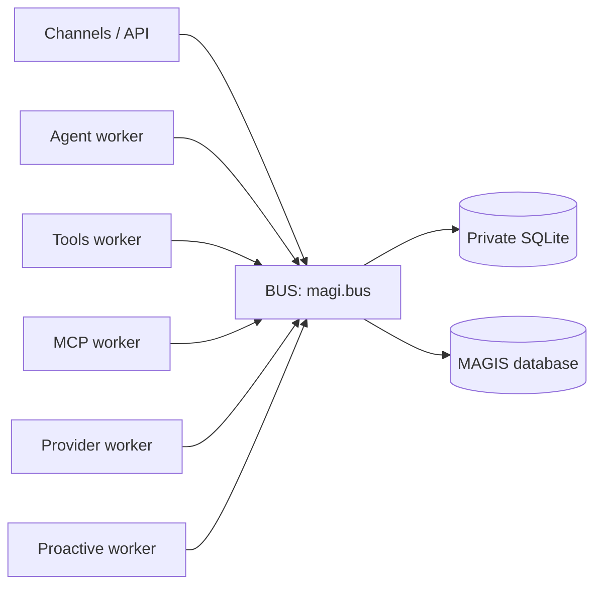

# MAGI BUS-Centric Architecture

## Status and terminology

This document is the authoritative architecture for the current runtime.
`BUS` is the system's single durable application boundary and its Python
package is `magi.bus`. There is no second bus, compatibility package, fallback
singleton, or dual-write path.

Use these names consistently:

| Concept | Name |
| --- | --- |
| Architecture boundary | BUS |
| Public Python package | `magi.bus` |
| Process-local facade | `Bus` |
| Runtime composition function | `open_bus(...)` |
| Storage provisioning function | `provision_node_storage(...)` |
| Durable read/write APIs | Books and Job Boards |

The package and facade names in the table are the only supported
names in code, tests, operational material, and user-facing documentation.

## Dependency direction



Domain modules may use BUS contracts, Books, and Job Boards. They must not
open SQLAlchemy sessions, import ORM rows, or own tables. Persistence is an
implementation detail inside `magi.bus.db` and `magi.bus.library`.

The permitted dependency direction is:

```text
magi.{agent,channels,tools,mcp,providers,proactive} -> magi.bus
magi.bus -> SQLAlchemy / database drivers / filesystem
```

BUS must not import domain worker implementations. Network, LLM, tool, and
channel effects occur in workers after a durable job has been claimed; they do
not occur inside a BUS transaction.

## BUS surface

`Bus` is built once by the composition root (`magi.startup.runtime`) with
resolved paths and injected into workers. The facade groups two kinds of API:

- **Books** provide typed CRUD/query operations and return DTOs or JSON-safe
  values. Examples: `sessions_book`, `messages_book`, `contacts_book`,
  `settings_book`, `tasks_book`, `tool_definitions_book`, and
  `memberships_book`.
- **Job Boards** provide durable `publish -> claim -> submit_result` workflows.
  Examples: `agent_job_board`, `llm_job_board`, `tool_job_board`,
  `delivery_job_board`, `a2a_job_board`, `run_task_job_board`, and
  `mcp_server_changed_job_board`.

`stream_hub` is an ephemeral notification aid only. Committed messages and job
results in BUS are the source of truth for recovery and SSE replay.

## Durable runtime rules

1. Persist input and publish a durable job before a worker performs external
   work.
2. A claim has explicit lease/attempt semantics; consumers are idempotent and
   must tolerate at-least-once delivery.
3. LLM, tool, HTTP, and channel I/O happen outside database transactions.
4. Worker completion is written back through the corresponding Job Board.
5. A terminal committed result outranks a streamed delta.
6. `/api/chat/send` is asynchronous: it returns `202 Accepted` with `run_id`;
   clients consume progress and final state through the durable run/SSE path.

## Storage ownership

Each MAGI owns a private SQLite state directory, normally ending in
`memories/magi.db`. BUS owns the engine factory, metadata, table registration,
and file-backed Books for that state. When configured, BUS also owns the MAGIS
database factory and the Books that access organization-scoped records.

No other package creates BUS tables or reaches into `magi.bus.db`. Database
schema compatibility is handled as an explicit operational migration, never as
runtime fallback code.

## Runtime composition

`magi.startup.provision` explicitly creates topology and node storage.
`magi.startup.runtime` then loads `RuntimeSpec`, calls `open_bus(...)`, and
injects the resulting `Bus` into
the provider, tool, MCP, agent, and channel workers, then manages their
lifecycle. API routes receive BUS through app-scoped FastAPI dependencies;
there is no process-global BUS selection.

## Verification

The architecture guard in `tests/architecture/test_import_boundaries.py`
enforces that domain code does not import `magi.bus.db`, that BUS does not
import domain worker implementations, and that no superseded BUS package names
reappear in production code.
