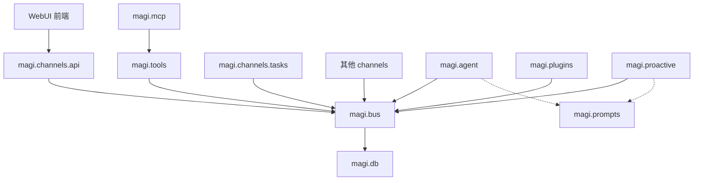

# MAGI Local Standalone Deployment Implementation Plan

> **状态：已完成核心实现，本文为历史参考。**
>
> 本文最初于 2026-08-02 编写，描述本地部署的工程计划。截至 2026-08-04，
> 核心目标已实现，但具体实现与本文的若干细节有差异。以下为关键偏离点：
>
> - **进程模型**：本文设计 launcher/supervisor 子进程模型（§7），实际实现改为
>   每个 MAGI 是独立 OS 进程（`execve` 替换当前进程），无 supervisor。
> - **systemd**：本文设计单个 launcher service（§8），实际实现为每 MAGI
>   独立 unit（`magi-adam.service`, `magi-eva-00.service`, ...）。
> - **数据根路径**：本文建议 `~/.local/share/magi`（XDG），实际使用 `~/.magi`
>   （openclaw 风格），见 `deploy/cli/README.md`。
> - **LocalProcessRuntimeBackend**：本文设计的 backend 已移除，不再需要。
> - **硬编码 `/workspace`**：已消除，K8s 通过 `MAGI_WORKSPACE_DIR` env var 显式注入，
>   Local 通过 `HOST_WORKSPACE_DIR` 推导。
>
> 权威文档请参阅：
> - `deploy/cli/README.md` — 本地部署完整指南
> - `deploy/README.md` — 三种部署方式对比
> - `docs/ARCHITECTURE.md` — 架构文档
>
> 本文最初基于 2026-08-02 的 `realTaki/MAGI` `main` 分支结构编写，并于 2026-08-03 按最新模块边界修订。执行时必须先检查最新代码与 `docs/MAGI_BUS_CENTRIC_ARCHITECTURE.md`，报告差异后再实施，不能机械地假设本文列出的路径和类型仍然完全相同。

## 1. 目标

MAGI 当前以 Kubernetes 为主要部署目标：每个 MAGI 是一个独立 Deployment，拥有自己的 PVC、Runtime Service 和私有 SQLite；每个 MAGIS 拥有 PostgreSQL 与公共 Workspace。

本计划增加第二种正式部署 Profile：

```text
Kubernetes Profile
  one MAGI = one Pod/Deployment + PVC + ClusterIP Service
  one MAGIS = PostgreSQL + shared PVC

Local Profile
  one MAGI = one host process + private workspace directory + localhost port
  one MAGIS = separate SQLite database + shared directory
```

最终用户体验应接近：

```bash
magi local start
```

或者双击安装后的 MAGI 应用，然后自动：

1. 解析或创建本机 MAGI data root；
2. 初始化 Genesis 与第一个 Adam MAGI；
3. 启动 Local Orchestrator、WebUI 和初始 Runtime；
4. 打开 `http://127.0.0.1:42069`；
5. 允许用户从 WebUI 启动、停止和删除更多本地 MAGI Runtime；
6. 在应用或计算机重启后恢复运行状态和所有 Workspace 数据。

## 2. 产品定位与收益

### 2.1 收益

- 降低先进个人用户、研究人员和开发者的试用门槛；
- 不要求用户理解 Kubernetes、PVC、Service、Secret 或镜像构建；
- 支持完全本地的 WebUI、记忆、Skills、MCP 和 Agent 实验；
- 为安全研究、benchmark、红蓝对抗和可复现实验提供更轻量的环境；
- 保留同一代码、同一 Runtime 和同一 WebUI，减少桌面版与集群版行为漂移；
- 保留"一 MAGI 一 Runtime"模型，不退化为多个 Agent 共享进程和工作目录；
- 为未来的原生桌面壳、托盘程序、自动更新和一键诊断建立基础。

### 2.2 非目标

本计划不包括：

- 用本地模式替代 Kubernetes 的生产/2B 部署；
- 在同一个 Python 进程内运行多个 MAGI；
- 在本地提供等同于容器、Namespace、RBAC 或 PVC 的强安全隔离；
- 要求个人用户安装或维护 PostgreSQL；
- 重写 React WebUI；
- 第一阶段引入 Electron/Tauri 重做客户端；
- 让 K8s Profile 改用 SQLite 作为 MAGIS 生产数据库；
- 将 Kubernetes 特有字段暴露到新的公共 Runtime contracts 中。

## 3. 当前代码基线

执行前需要重新确认，当前至少存在以下结构和假设：

| 位置 | 当前情况 | 本地化影响 |
| --- | --- | --- |
| `pyproject.toml` | 单一 `magi` console script；Python 3.12+ | 有利于构建统一可执行程序 |
| `magi/__main__.py` | 支持 `magi` Runtime 和 `magi webui` | 需要增加 Local/Orchestrator CLI，但保留旧入口兼容 |
| `magi/constants.py` | `STATE_DIR=/workspace/memories`、`WORKSPACE_DIR=/workspace` | 容器路径硬编码必须解除 |
| `magi/agent/workspace/paths.py` | Workspace 从 state dir 推导，并明确不允许覆盖 | 路径由 Composition Root 注入 Agent 自有配置，不把 RuntimePaths 变成新的公共业务模块 |
| `magi/orchestrator/kubernetes.py` | 直接创建 Secret、PVC、Service、Deployment 和 MAGIS PostgreSQL | 需要抽出 RuntimeBackend |
| `magi/orchestrator/service.py` | 每个请求直接构造 `KubernetesEvaBackend` | 需要 backend factory 与 Local backend |
| `magi/orchestrator/contracts.py` | 结果包含 namespace、deployment_name、workspace_claim_name | contracts 泄漏 K8s 概念，需要兼容迁移 |
| `magi/channels/webui/api/runtime_proxy.py` | 旧目录中用 `deployment_name:42069` 推导 Runtime URL | 迁移到 `magi.channels.api`，并改用 BUS 的平台无关 endpoint query |
| `magi/channels/webui/api/runtime_access.py` | 旧目录中的 Adam fallback 同样依赖 K8s Service 名 | 迁移到 `magi.channels.api`，并使用同一 BUS query |
| `magi/db/magis/engine.py` | 有 `MAGIS_DATABASE_URL` 时使用 PostgreSQL；缺失时回退本地 SQLite | 本地模式需要正式的独立 MAGIS SQLite，而不是与某个 MAGI 私有库混用 |
| `magi/channels/webui/app.py` | 旧 WebUI 后端可加载预编译 React `dist` | 后端迁移为 `magi.channels.api`；需要保证静态文件进入 wheel/standalone bundle |
| `magi/channels/tasks` | 通用任务调度能力可能仍与调用方直接耦合 | 固定为只依赖 BUS 的 Worker；API、Tools、Proactive 通过 BUS 发布任务命令 |
| `magi/proactive` | 系统级主动任务与心跳定义 | 只依赖 BUS 与 Prompts，不直接调用 Tasks |
| `magi/plugins` | 插件发现与生命周期 | 只依赖 BUS，不直接调用 Agent、Tools、Channels 或 DB |
| `magi/mcp` | MCP 连接与工具适配 | 只依赖 Tools；不得绕过 Tools 直接访问 BUS |
| `deploy/Dockerfile` | 构建 React 后复制进最终镜像 | 本地发行也需要等价的构建产物流程 |

当前代码中任何新增的 BUS-centric 重构结果优先于上表中的旧调用路径。本地 Profile 必须复用同一模块边界，不得重新引入业务模块之间的直接调用，也不得允许任何业务模块绕过 BUS 访问 DB。旧 `magi.channels.webui` 只能作为迁移来源或兼容入口，目标后端名称统一为 `magi.channels.api`。

## 4. 目标架构

### 4.1 Process topology

```text
MAGI Local Launcher / Supervisor
├── Local Orchestrator     127.0.0.1:42100
├── channels.api + SPA     127.0.0.1:42069
├── Adam Runtime           127.0.0.1:42101
├── EVA Runtime            127.0.0.1:<allocated>
└── EVA Runtime            127.0.0.1:<allocated>
```

每个 Runtime 必须是独立 OS process，并拥有：

- 唯一 `runtime_id`；
- 唯一 Workspace；
- 唯一本地 SQLite；
- 唯一监听端口；
- 独立日志；
- 自己的 provider configuration 和 Tool/MCP 状态；
- 只连接一个直属 MAGIS 的组织数据库和公共 Workspace。

### 4.2 Deployment abstraction

新增平台无关 backend contract，名称可根据仓库现状调整，但语义必须保留：

```python
class RuntimeBackend(Protocol):
    def provision_magis(self, spec: MagisSpec) -> MagisProvisionResult: ...
    def start(self, spec: RuntimeSpec) -> RuntimeOperationResult: ...
    def stop(self, spec: RuntimeSpec) -> RuntimeOperationResult: ...
    def delete(self, spec: RuntimeSpec) -> RuntimeOperationResult: ...
    def inspect(self, runtime_id: int) -> RuntimeStatus: ...
    def reconcile(self) -> ReconcileResult: ...
```

实现：

```text
KubernetesRuntimeBackend
LocalProcessRuntimeBackend
```

旧 `KubernetesEvaBackend` 可以先作为 compatibility implementation，不要求第一阶段移动文件或重命名所有类型。优先消除公共 contracts 中的 K8s 假设，再进行目录清理。

该 contract 属于 Orchestrator 内部部署适配层。只有 Orchestrator Worker 或其私有 Service 可以持有 `RuntimeBackend` 实例；BUS、`channels.api`、Agent、Tools、Tasks、Plugins 和其他 Channels 均不得导入该类型。backend 执行结果必须由 Orchestrator 转换为 BUS 的平台无关 DTO/事件。

### 4.3 Platform-neutral contracts

建议新增：

```python
class RuntimeEndpoint(BaseModel):
    runtime_id: int
    backend_kind: Literal["kubernetes", "local_process"]
    base_url: str
    backend_ref: str
    observed_state: str


class RuntimeOperationResult(BaseModel):
    runtime_id: int
    backend_kind: str
    backend_ref: str
    observed_state: str
    endpoint: RuntimeEndpoint | None = None
    message: str | None = None
```

`namespace`、`deployment_name`、`workspace_claim_name` 不得继续成为新公共 API 的必填通用字段。迁移期间可在 K8s-specific detail DTO 或兼容 wrapper 中保留。

`magi.channels.api`、Runtime access fallback 和其他调用方必须通过 BUS 的统一 query 获取 endpoint：

```python
endpoint = bus.runtimes.resolve_endpoint(runtime_id)
```

不得继续使用：

```python
f"http://{runtime.deployment_name}:42069"
```

### 4.4 BUS-centric 边界

本计划应服从 BUS-centric 重构约束：

- WebUI 前端只依赖 `magi.channels.api` 的 HTTP、WebSocket 或流式接口；
- `agent`、`tools`、`channels.*`、`plugins` 和 `proactive` 彼此不直接依赖，统一通过 BUS 协作；
- `magi.db` 仅供 `magi.bus` 使用，任何业务模块不得直接导入 ORM、Session、Engine 或 Repository 实现；
- BUS 只负责命令、事件、查询、队列、事务与一致性，不直接依赖或调用 deployment backend；
- `magi.channels.api` 通过 BUS 发布 Runtime 生命周期命令并查询状态；Orchestrator Worker 消费命令、调用 backend，再把结果写回 BUS；
- `magi.channels.tasks` 是只依赖 BUS 的通用调度 Worker，不包含预设任务；
- API、Tools、Proactive 都只向 BUS 发布 `task.*` 命令，不得直接调用 Tasks；
- Tasks 到期后向 BUS 发布统一 `agent.input`，不得直接调用 Agent；
- `magi.proactive` 只定义系统级任务和心跳，依赖 BUS 与 Prompts；
- `magi.mcp` 只依赖 Tools，Tools 不反向依赖或识别 MCP；
- `magi.plugins` 只依赖 BUS；
- Local launcher 是 Composition Root，可以装配 BUS、DB、Orchestrator、`channels.api` 与各 Runtime Worker，但不得承载业务逻辑；
- Runtime registry、endpoint、状态和存储路由只能通过 BUS DTO 暴露；
- Local Profile 不得成为绕过 BUS 或恢复跨模块直接调用的例外。

代码依赖图如下，箭头表示左侧模块可以直接依赖右侧模块：



只有 BUS 与 Prompts 是公共模块。DB 是 BUS 的私有持久化层；Composition Root 是装配例外，不构成业务模块可复用的公共 API。

### 4.5 控制面与调度运行时流程

Runtime 生命周期控制不得实现成 `BUS → backend` 的代码调用。正确流程为：

```text
WebUI → channels.api → BUS → Orchestrator Worker → RuntimeBackend
                                  ↓
                           BUS 状态/结果事件
```

这里 `channels.api` 与 Orchestrator Worker 在代码层面都依赖 BUS，彼此不直接调用。`RuntimeBackend` 是 Orchestrator 的私有部署适配接口，不是 Agent、Tools、Channels 或 Plugins 可见的公共模块。

通用任务调度必须保持以下消息流：

```text
API / Tools / Proactive
          ↓ task.schedule / update / cancel / pause / resume
         BUS
          ↓
channels.tasks Worker
          ↓ task.scheduled / updated / rejected 等结果事件
         BUS
          ↓ 到期时发布标准 agent.input
      AgentWorker
```

所有同步等待 `task_id` 或错误的调用使用 `correlation_id` 关联命令与结果。Tasks 的调度定义、`next_run_at`、租约、幂等键与执行状态必须经 BUS 持久化，以便本地进程重启后恢复。

## 5. Cross-platform data layout

> **注意**：本节为设计计划，实际实现采用 openclaw 风格路径。
> 权威布局见 `deploy/cli/README.md`。以下为设计记录。

### 5.1 默认数据根目录

**实际实现**（非本节计划值）：

| 系统 | 实际默认目录 |
| --- | --- |
| Linux | `~/.magi/` |
| macOS | `~/Documents/.magi/` |
| Windows | `%USERPROFILE%\Documents\.magi\` |

以下为原计划（未采用）：

| 系统 | 原计划目录 |
| --- | --- |
| macOS | `~/Library/Application Support/MAGI` |
| Windows | `%LOCALAPPDATA%\\MAGI` |
| Linux | `$XDG_DATA_HOME/magi`，缺失时 `~/.local/share/magi` |

允许用户通过 `--data-dir` 覆盖。启动后 canonicalize 路径，不应让不同进程分别猜测 data root。

### 5.2 建议目录

```text
MAGI_HOME/
├── control/
│   ├── local-registry.db
│   ├── control-secret
│   ├── launcher.json
│   └── logs/
├── MAGIS/
│   └── <magis-id>-<slug>/
│       ├── magis.db
│       └── workspace/
└── MAGIC/
    └── <runtime-id>-<slug>/
        └── workspace/
            ├── memories/magi.db
            ├── skills/
            ├── SOUL.md
            ├── logs/
            └── tmp/
```

目录名必须由稳定 ID 加 sanitized slug 组成。显示名变化不能改变实际路径。

### 5.3 路径解析与模块配置注入

替换全局硬编码常量：

```python
@dataclass(frozen=True, slots=True)
class LocalPathLayout:
    data_root: Path
    workspace: Path
    state_dir: Path
    local_db: Path
    skills_dir: Path
    logs_dir: Path
    temp_dir: Path
    magis_workspace: Path | None
```

这里的 `LocalPathLayout` 是部署配置对象，不是新的公共业务模块。规则：

- 路径布局由 Launcher/Composition Root 一次性构造；
- Composition Root 将最小、模块自有的配置分别注入 BUS/DB、Agent、Tools、Channels 等 Worker；
- 业务模块不得相互导入 `LocalPathLayout`，也不得把它当成跨模块状态交换接口；
- 例如 Agent 接收 Agent 自有的 workspace/config DTO，DB 接收 DB 自有的 URL/path 配置；这些 DTO 由各模块自己定义；
- 不允许模块自行回退到 `/workspace`；
- K8s Profile 显式注入现有 `/workspace` 和 `/magis`；
- Local Profile 注入 OS-specific path；
- 测试必须使用 `tmp_path` 注入；
- 不在 command line 中携带 provider API key 或其他用户 secret。

建议使用由 launcher 生成的 `runtime-launch.json`，通过 `--runtime-config <path>` 传给子进程。配置文件保存 ID、路径、端口和 backend，不保存 provider API key。

## 6. Local MAGIS storage

### 6.1 存储边界

Local Profile 使用：

```text
MAGIC/<id>/workspace/memories/magi.db  # 单个 MAGI 私有状态
MAGIS/<id>/magis.db                    # 单个 MAGIS 组织事实
```

不得将 MAGIS 表继续写入初始 Adam 的私有 `magi.db`。现有无 `MAGIS_DATABASE_URL` 的 legacy/test fallback 不能直接作为最终实现。

### 6.2 Backend selection

建议存储 Profile：

```text
KubernetesStorageProfile
  private: SQLite
  magis: PostgreSQL

LocalStorageProfile
  private: SQLite
  magis: separate SQLite
```

Storage Profile 由 Composition Root 选择并注入 BUS；BUS 再使用 `magi.db` 内的平台无关 engine/repository factory。`magi.db.magis` 可以实现 SQLite/PostgreSQL 差异，但只能由 BUS 调用。Agent、Tools、Channels、Tasks、Plugins、Proactive、Orchestrator 和 WebUI 后端均不得直接选择 Engine、创建 Session 或调用 Repository。

Local control registry 同样应通过控制面 BUS 的 DB 实现访问。`LocalProcessRuntimeBackend` 只负责 OS 进程与文件系统动作；如果它需要变更 desired/observed state，应通过 Orchestrator Worker 写回 BUS，不得自行操作 registry ORM。

Local MAGIS SQLite 必须配置：

- `PRAGMA journal_mode=WAL`；
- `PRAGMA busy_timeout`；
- `PRAGMA foreign_keys=ON`；
- 一致的 transaction policy；
- 独立 Alembic migration 或等价的版本化 migration；
- 多进程并发测试；
- Windows 文件锁测试。

不得依赖 `Base.metadata.create_all()` 作为长期升级机制。

### 6.3 并发范围

Local MAGIS SQLite 面向可信单用户、小规模 Runtime 数量。出现持续高并发写入时，不在第一版中实现复杂分布式锁；应记录 contention metric/log，并在文档中建议使用 K8s/PostgreSQL Profile。

## 7. Local process supervisor

### 7.1 职责

`LocalProcessRuntimeBackend` 和 launcher/supervisor 负责：

- 生成 Runtime Workspace；
- 分配 localhost 端口；
- 写入 launch config；
- 以 argv array 启动子进程，禁止 `shell=True`；
- 记录 backend ref、PID、进程创建标识、endpoint 和日志路径；
- health check Runtime `/health`；
- start/stop/delete 幂等；
- launcher 重启时 reconcile registry 与实际进程；
- 发现 stale PID 时验证进程身份，不能误杀其他程序；
- 子进程崩溃时更新 observed state；
- 可配置的 restart policy；
- 优雅停止超时后再执行平台适配的强制终止。

### 7.2 Port allocation

固定：

```text
42069  WebUI
42100  Local Orchestrator
```

Runtime 端口从配置范围动态分配，例如 `42101-42999`。实现必须：

- bind/claim 时避免 TOCTOU 竞争；
- 将分配结果持久化；
- 重启时优先复用原端口；
- 端口被其他程序占用时重新分配并更新 endpoint；
- WebUI 不缓存旧地址超过 registry revision。

### 7.3 Process identity

Registry 不能只保存 PID。至少保存：

- PID；
- runtime ID；
- process start timestamp 或可验证 token；
- launch config path；
- executable identity；
- endpoint；
- last health state。

停止进程前必须验证 PID 对应的仍是同一个 MAGI Runtime。

### 7.4 Delete semantics

默认 delete 分为：

- 停止 Runtime；
- 从 active registry 移除；
- 将 Workspace 移入可恢复的 archive/trash；

永久删除 Workspace 必须是单独的显式操作，不能因为停止进程或删除 MAGI registry row 自动递归删除用户数据。

## 8. CLI 与启动流程

> **注意**：实际 CLI 实现与本节计划有差异。当前命令见 `deploy/cli/README.md`。
> `magi local start` 使用 `execve` 替换进程而非 spawn 子进程；
> `magi local install-service` 为每 MAGI 注册独立 systemd 单元。

保留现有兼容行为：

```bash
magi                 # 仍可启动 runtime
magi webui           # 仍可启动 control WebUI
```

建议逐步增加：

```bash
magi runtime --runtime-config <file>
magi orchestrator --backend kubernetes|local_process

magi local start [--data-dir PATH] [--no-open] [--foreground]
magi local status [--data-dir PATH]
magi local stop [--data-dir PATH]
magi local doctor [--data-dir PATH]
```

第一版可以让 `magi local start` 以前台 supervisor 运行。原生应用封装和后台/托盘生命周期放到打包阶段，不应在 Runtime MVP 中先实现三套 OS daemon。

启动顺序：

1. 获取本地 instance lock；
2. 解析 data root 与 control config；
3. 创建或读取 control secret；
4. 由 Composition Root 构造控制面 DB 实现与 BUS，执行 local registry 与 MAGIS migrations；
5. 启动消费 BUS 生命周期命令的 Local Orchestrator Worker；
6. 初始化 Genesis 与初始 Adam（通过 BUS，且保持幂等）；
7. 通过 BUS 写入/reconcile 初始 Adam 的 desired state，由 Orchestrator Worker 启动 Runtime；
8. 每个 Runtime 的 Composition Root 装配自身 BUS/DB、Agent、Tools、Channels、Tasks、Plugins、Proactive 与 MCP Adapter；
9. 等待 Runtime health ready；
10. 启动 `magi.channels.api` 并挂载预编译 SPA；
11. 等待 API/WebUI health ready；
12. 打开默认浏览器；
13. 进入 supervisor loop。

停止顺序反向执行，并给每个组件明确的优雅停止时间。

## 9. `magi.channels.api` 与 WebUI 改造

WebUI 仍然是唯一浏览器入口，不为 Local Profile 复制第二套前端。React 前端的唯一后端边界为 `magi.channels.api`；旧 `magi.channels.webui.api` 应迁移、兼容转发后删除，不能长期保留两套 API backend。

需要修改：

- Runtime proxy 通过 BUS query 获取 `RuntimeEndpoint`，不再拼 K8s Service DNS；
- Adam fallback 使用同一 BUS query；
- Runtime 列表显示 backend 和状态，但不向普通用户暴露 PID/绝对路径；
- Local Runtime 不在线时显示可操作错误，而不是 K8s-specific 文案；
- `channels.api` local mode 默认仅监听 `127.0.0.1`；
- 保留现有 HMAC target binding；
- Local control secret 首次启动随机生成；
- 静态 SPA 通过 package resource 定位，不依赖 `/app/magi/WebUI/dist`。

Runtime 生命周期操作的 API handler 只发布 BUS command/query。不得在 handler 中直接实例化 Orchestrator、调用 `RuntimeBackend`、访问 registry Session，或从 backend-specific 字段推导 endpoint。

计划任务 UI 的创建、更新、暂停、恢复、取消与查询也只调用 BUS 协议：API 不直接调用 `channels.tasks`。需要立即返回 `task_id` 时，API 使用 `correlation_id` 等待 `task.scheduled` 或 `task.rejected` 结果。

建议 `_find_spa_dist()` 增加 `importlib.resources` 路径，并在 build 验证 wheel/standalone executable 中确实包含：

```text
index.html
assets/*
```

## 10. Packaging

### 10.1 构建原则

- Node.js 只存在于构建环境；
- 最终用户不需要安装 Node、Python、uv、PostgreSQL、Docker 或 kubectl；
- React `dist` 与 Python Runtime 一起版本化；
- 应用代码与用户数据目录严格分离；
- 升级应用不能覆盖 Workspace；
- migration 在应用启动时执行，并提供备份/失败恢复。

### 10.2 建议阶段

第一步发布开发者可安装包：

```text
pipx install magi
uv tool install magi
```

随后生成 standalone artifacts，可使用 PyInstaller 或 Nuitka，但执行前应做小型 spike 比较：

- Python 3.12 compatibility；
- SQLAlchemy/asyncpg/psycopg optional dependency handling；
- FastAPI/Uvicorn dynamic imports；
- MCP subprocess support；
- React assets inclusion；
- macOS arm64/x86_64；
- Windows x86_64；
- Linux x86_64。

正式安装包：

| 平台 | 目标 |
| --- | --- |
| macOS | signed/notarized `.dmg` 或 `.pkg`，优先 arm64，再 universal/x86_64 |
| Windows | signed `.msi` 或 installer `.exe` |
| Linux | AppImage，随后可增加 `.deb` |

Tauri 系统托盘/桌面壳属于后续增强。第一版只需启动本地服务并打开系统浏览器。

## 11. Security requirements

Local Profile 必须明确是可信单用户模式，不提供容器级隔离。

最低要求：

- WebUI、Orchestrator 和 Runtime 默认绑定 `127.0.0.1`；
- 不允许 Local Profile 默认监听 `0.0.0.0`；
- control secret 使用密码学安全随机数生成；
- macOS/Linux 使用严格文件权限；Windows 使用当前用户 ACL 或系统安全存储；
- provider API key 不进入 CLI argv、日志或 launch JSON；
- Runtime proxy 继续校验 HMAC、目标 runtime ID 和有效期；
- 所有 Workspace 路径进行 canonicalization 和边界检查；
- subprocess 禁止 `shell=True`；
- 终止进程前验证进程身份；
- 安装文档明确 Tool、Skill 和 MCP 具有当前操作系统用户权限；
- 不将"独立目录"描述成安全 sandbox。

## 12. 分阶段实施

每个 Phase 必须保持 K8s Profile 可运行。不要先删除 K8s 路径再补 Local 路径。

### Phase 0：基线审计

1. 记录最新 `main` commit 与完整测试结果；
2. 列出所有 `/workspace`、`/magis`、`:42069`、`deployment_name` 和 K8s DNS 假设；
3. 列出所有直接构造 `KubernetesEvaBackend` 的位置；
4. 列出 `agent/tools/channels/plugins/proactive` 对彼此或 `magi.db` 的直接 import；
5. 检查 `magi.channels.webui` 向 `magi.channels.api` 的迁移状态；
6. 检查 API、Tools、Proactive 是否仍直接调用 `channels.tasks`；
7. 检查 BUS 是否直接依赖 Orchestrator/backend；
8. 输出将新增的 BUS contracts、migration 和文件清单；
9. 此阶段不改变行为。

### Phase 1：模块边界与路径配置

1. 为目标依赖规则增加自动化 import/architecture tests；
2. 引入部署层 `LocalPathLayout` 与 launch config；
3. 由 Composition Root 把最小配置注入各模块，不让业务模块共享或相互导入路径对象；
4. K8s Profile 显式使用现有 `/workspace` 与 `/magis`；
5. 将 Agent Workspace、BUS/DB、Skills、SOUL、logs、temp 的路径读取迁移到各自配置；
6. 保留旧常量作为短期兼容 wrapper；
7. 增加 macOS/Windows/Linux 路径测试；
8. 确认现有 K8s manifests 无需改变即可运行。

### Phase 2：BUS 控制面 contracts、Backend 与 endpoint

1. 在 BUS 中新增平台无关的 Runtime lifecycle command/query/event DTO；
2. 新增 Orchestrator 私有 `RuntimeBackend` contract；
3. 将 `KubernetesEvaBackend` 适配到新 contract；
4. 新增 `RuntimeEndpoint` BUS DTO 与 query；
5. 将 Orchestrator 改为消费 BUS 命令、调用 backend、再写回 BUS；BUS 不导入 backend；
6. 将 `magi.channels.api` 的 proxy 和 Adam fallback 改用 BUS query；
7. 为旧 `deployment_name` 增加 migration/compatibility read；
8. 增加 K8s contract regression 与禁止依赖测试。

### Phase 3：独立 Local MAGIS SQLite 与控制面存储

1. 新增 Local storage profile，由 Composition Root 注入 BUS；
2. 为每个 MAGIS 创建独立 SQLite；
3. 将 local registry 的 Model/Engine/Repository 实现放在 `magi.db`，只通过 BUS 使用；
4. 实现 WAL、busy timeout、FK 和 migrations；
5. Genesis/Adam seed 改为调用 BUS command/query，不接收或操作 ORM/Session；
6. 禁止正式 Local Profile 使用初始 Adam 私有 DB 作为 MAGIS DB；
7. 增加多进程读写、BUS repository contract 与 migration tests。

### Phase 4：LocalProcessRuntimeBackend (subprocess spawn)

1. 实现 `LocalProcessRuntimeBackend` —— 通过 `subprocess.Popen` + `start_new_session=True` 启动独立 MAGI 子进程；
2. 子进程通过 `MAGI_BACKEND=local` 在 `BackendDispatcherService` 上路由，与 K8s backend 共享同一 Protocol；
3. `magi local start <name>` 调用 `bus.runtime.start(spec)`，backend spawn 完成后 launcher 退出，子进程被 reparent 到 init；
4. `magi local stop` 通过 `bus.runtime.stop(spec)` 触发 `SIGTERM` + 10s 宽限 + `SIGKILL` fallback；
5. Runtime state 通过 `ControlRegistryService` 记录（PID、port、base_url、observed_state）；
6. Tolerate `control_registry=None` —— runtime 进程的 BUS 不带本地 SQLite engine，backend 在该上下文下仍返回合法 DTO。

**不在 Phase 4 范围**(Phase 5+): restart policy / health-check loop / stale-PID recovery / multi-MAGI supervisor / orchestrator-daemon mode / systemd unit 改走 launcher。systemd unit 当前仍直接 `ExecStart=magi runtime`,与 CLI 路径并存。

### Phase 5：Runtime Worker 装配与通用 Tasks

1. 由 Runtime Composition Root 装配 Agent、Tools、Channels、Tasks、Plugins、Proactive 与 MCP Adapter；
2. 确保 Agent、Tools、Channels、Plugins、Proactive 只经 BUS 协作；
3. 启动 `channels.tasks` Worker，消费 `task.schedule/update/cancel/pause/resume`；
4. API、Tools、Proactive 改为只向 BUS 发布任务命令，不直接 import Tasks；
5. Tasks 到期后发布标准 `agent.input`，并验证租约、幂等与重启恢复；
6. MCP 保持 `mcp → tools → bus`，Plugins 只依赖 BUS；
7. 验证 Local 与 K8s 使用完全相同的 Runtime Worker wiring。

### Phase 6：单 MAGI Local Preview

1. 实现 `magi local start/status/stop/doctor`；
2. 初始化 Genesis 和初始 Adam；
3. 启动 Runtime、`channels.api`、SPA 和 Local Orchestrator Worker；
4. 自动打开浏览器；
5. 验证聊天、stream、Tool call、memory、Skills、MCP、Plugins、Proactive、Tasks 和 Telegram 设置；
6. 验证任务到期触发 Agent，以及重启后调度、会话与 Workspace 保留。

### Phase 7：本地多 MAGI

1. WebUI 通过 `channels.api → BUS` 发布 Runtime 创建/启动命令；
2. Local Orchestrator Worker 消费命令并使用 Local backend；
3. 每个 Runtime 获得独立目录、数据库和端口；
4. 每个 Runtime 只连接直属 MAGIS SQLite；
5. Runtime endpoint 更新通过 BUS 立即被 API 发现；
6. 验证 A2A、Adam fallback、start/stop/restart/delete；
7. 验证 launcher 重启后 reconcile 多 Runtime 与未到期 Tasks 状态。

### Phase 8：发行包与静态资源

1. React build 进入 Python/package bundle，由 `magi.channels.api` 提供；
2. 实现开发者安装方式；
3. 完成 PyInstaller/Nuitka spike 并选定一种；
4. 生成 macOS、Windows、Linux artifacts；
5. 确认打包包含所有 Runtime Worker、Prompts、MCP 运行依赖与 SPA assets；
6. 增加 clean-machine smoke tests；
7. 文档说明数据位置、卸载和升级不会删除 Workspace。

### Phase 9：完整验证与文档

1. 运行全部 unit/integration/recovery/architecture tests；
2. 在 macOS arm64、Windows x86_64、Linux x86_64 验证；
3. 运行现有 K8s bootstrap/integration tests；
4. 更新 README、BUS-Centric Architecture、模块职责、storage、WebUI 和 deployment docs；
5. 明确 Local 与 K8s 的安全边界；
6. 删除旧 `magi.channels.webui`、已到期 compatibility wrappers 和临时 allowlist。

## 13. 预计文件改动

实际文件以 Phase 0 审计为准。

### 13.1 重点修改

```text
pyproject.toml
magi/__main__.py
magi/constants.py
magi/agent/workspace/paths.py
magi/bus/*                         # Runtime/Tasks 控制协议与查询
magi/db/*                          # Local registry、MAGIS SQLite 与 migrations
magi/channels/api/*                # 目标 WebUI backend
magi/channels/tasks/*              # BUS 调度 Worker
magi/channels/webui/*              # 仅作为旧目录迁移来源
magi/tools/*                       # 任务管理工具仅发布 BUS command
magi/proactive/*                   # 系统级任务/心跳定义
magi/plugins/*                     # Local Profile 插件装配与状态
magi/mcp/*                         # 保持为 Tools 专属适配层
magi/orchestrator/contracts.py
magi/orchestrator/service.py
magi/orchestrator/client.py
magi/orchestrator/kubernetes.py
```

### 13.2 建议新增

```text
magi/bus/protocols/runtimes.py
magi/bus/protocols/tasks.py
magi/bus/services/runtime_registry.py
magi/db/control/*

magi/orchestrator/backends/base.py
magi/orchestrator/backends/local_process.py
magi/orchestrator/worker.py

magi/local/cli.py
magi/local/supervisor.py
magi/local/paths.py
magi/local/ports.py
magi/local/platform.py
magi/local/security.py

tests/architecture/
tests/bus/tasks/
tests/channels/tasks/
tests/runtime/
tests/local/
tests/integration/local_profile/
```

以上路径仅表达归属，不要求机械创建同名文件。如果 BUS 重构已经建立对应 contracts/services 或 `magi.db` repository，应复用现有目录，不得平行创建第二套 storage/runtime facade。尤其不得新增供多个业务模块共同导入的 `magi.runtime` 公共层；平台路径、endpoint 和 registry 能力分别归属 Composition Root、BUS 与 DB。

## 14. Schema 与 migration

需要审计现有 `EvaRuntime` schema。建议平台无关字段：

```text
backend_kind
backend_ref
endpoint_url
observed_state
desired_state
endpoint_revision
last_heartbeat_at
last_error
```

K8s-specific metadata 可以进入 JSON detail 或单独表，不应继续占据通用 contract。

Local control registry 建议至少记录：

```text
runtime_id
workspace_ref
launch_config_path
pid
process_start_token
port
endpoint_url
desired_state
observed_state
restart_policy
created_at
updated_at
last_health_at
last_error
```

这些字段的 ORM Model、migration 和 repository 实现属于 `magi.db`；平台无关 command/query/event 与 DTO 属于 `magi.bus`。Orchestrator Worker 不持有 ORM Session，Local backend 也不直接修改 registry row。

Tasks 调度状态同样必须可迁移和恢复，至少包括：

```text
task_id
agent_id
schedule_kind
schedule_spec
payload
next_run_at
desired_state
last_triggered_at
dedupe_key
lease_owner
lease_expires_at
last_error
created_at
updated_at
```

表结构位于 `magi.db`，任务命令、查询和结果事件位于 `magi.bus`。`channels.tasks` 只能通过 BUS 访问这些状态。

迁移要求：

- 新字段先 nullable/additive；
- 旧 K8s row 根据 `deployment_name` 回填 backend 信息；
- 新代码先支持双读，完成回填后再停止旧写；
- 不在同一 migration 中移动 Workspace 或删除旧字段；
- migration 前备份 Local registry/MAGIS DB；
- migration 失败不得继续启动 Runtime。

## 15. Test matrix

### 15.1 Unit

- OS-specific data path；
- slug 和稳定目录名；
- LocalPathLayout 与各模块配置注入；
- endpoint resolver；
- Runtime lifecycle command/query/event correlation；
- backend contract；
- port allocation/reuse/conflict；
- registry revisions；
- process identity 与 stale PID；
- start/stop/delete 幂等；
- control secret permissions；
- Local MAGIS SQLite transaction 与 migrations；
- 任务命令与结果事件的 `correlation_id`；
- Tasks 的租约、幂等、错过触发和重启恢复；
- 架构 import 规则：只有 BUS 可以直接依赖 DB，MCP 只依赖 Tools。

### 15.2 Integration

- fresh local bootstrap；
- WebUI → selected Runtime proxy；
- onboarding → chat → streaming response；
- Agent → Tool job → result → delivery；
- API/Tools/Proactive → BUS → Tasks → BUS → Agent；
- Runtime API → BUS → Orchestrator Worker → Local backend；
- 创建并启动第二个 MAGI；
- WebUI 切换并访问不同 Runtime；
- 多 Runtime 连接同一直属 MAGIS；
- 不同 MAGIS 数据隔离；
- restart while waiting tool/A2A；
- Runtime crash 后 registry reconcile；
- port 被占用后的恢复；
- Workspace archive/restore；
- API、Tools、Proactive 不直接 import/call Tasks；
- Tasks 到期只发布标准 `agent.input`，不直接调用 Agent。

### 15.3 Platform

| 场景 | macOS arm64 | Windows x86_64 | Linux x86_64 |
| --- | --- | --- | --- |
| 安装 | 必须 | 必须 | 必须 |
| 首次启动 | 必须 | 必须 | 必须 |
| WebUI | 必须 | 必须 | 必须 |
| 多 Runtime | 必须 | 必须 | 必须 |
| 重启恢复 | 必须 | 必须 | 必须 |
| 升级保留数据 | 必须 | 必须 | 必须 |
| MCP subprocess | 必须 | 必须 | 必须 |

### 15.4 K8s regression

- `deploy/k8s-dev/bootstrap-k8s-dev.sh` / kind 流程仍工作；
- `channels.api` 仍可通过 BUS query 获得并代理 ClusterIP endpoint；
- EVA start/stop/delete 行为不变；
- MAGIS PostgreSQL 与 PVC provisioning 不变；
- Secret/RBAC/ServiceAccount 边界不被 Local Profile 放宽；
- Docker image build 仍包含同一 SPA 与 Python Runtime。

## 16. 验收标准

### Local single-runtime

- [ ] 在全新 macOS、Windows、Linux 环境中，无 Docker/K8s/PostgreSQL/Node/system Python 也可安装运行；
- [ ] 启动后 WebUI 只能从 localhost 访问；
- [ ] 首次启动能创建 Genesis 和初始 Adam；
- [ ] Chat、stream、Tool、Memory、Skills、MCP、Plugins、Tasks、Proactive 和设置正常；
- [ ] Tasks 到期可可靠触发 Agent，重启后不会无审计地重复或漏掉任务；
- [ ] 应用重启后会话、SQLite 和 Workspace 保留；
- [ ] 应用升级不会覆盖用户数据。

### Local multi-runtime

- [ ] 每个 MAGI 是独立进程、目录、SQLite 和端口；
- [ ] WebUI 可启动、停止、重启和访问多个 Runtime；
- [ ] 每个 MAGI 只连接一个直属 MAGIS；
- [ ] 多个 MAGI 可共享同一 MAGIS SQLite 与公共目录；
- [ ] launcher/orchestrator 重启后能 reconcile 运行状态；
- [ ] stale PID 或端口冲突不会误杀其他程序或破坏 registry；
- [ ] delete 默认不永久删除 Workspace。

### Architecture

- [ ] K8s 与 Local 使用同一 Runtime、WebUI 和业务逻辑；
- [ ] Runtime endpoint contract 不泄漏 K8s-only 字段；
- [ ] WebUI 前端只依赖 `magi.channels.api`；
- [ ] Agent、Tools、Channels、Plugins、Proactive 彼此不直接依赖，且不直接依赖 deployment backend；
- [ ] 只有 BUS 直接依赖 DB；所有 BUS API 不泄漏 ORM、Session 或 Engine；
- [ ] BUS 不依赖 Orchestrator 或 RuntimeBackend；Orchestrator Worker 通过 BUS 接收命令、回写状态；
- [ ] API、Tools、Proactive 不直接调用 Tasks，只发布 BUS 任务命令；
- [ ] Tasks 不含预设任务，到期时只通过 BUS 发布标准 `agent.input`；
- [ ] Proactive 定义系统级任务与心跳，不承担调度执行；
- [ ] MCP 只依赖 Tools，Tools 不反向依赖 MCP；
- [ ] Plugins 只依赖 BUS；
- [ ] Local Profile 不绕过 BUS 直接操作业务或控制面 DB；
- [ ] Local 与 K8s 使用同一模块装配图和架构依赖测试；
- [ ] K8s Profile 完整回归通过；
- [ ] 文档清楚说明 Local Profile 不是安全 sandbox。

## 17. 明确禁止事项

Codex 执行时不得：

1. 为 Local Profile 复制一套 Agent、Tool、Channel 或 WebUI；
2. 在同一个 Python 进程中运行多个 MAGI；
3. 用不同 Workspace 目录宣称获得了容器级安全隔离；
4. 让 WebUI 根据 `deployment_name` 或其他 backend-specific 名称猜 Runtime URL；
5. 让 Local backend 直接散落到 WebUI、Agent、Tools 或 Channels；
6. 让 BUS 直接导入/调用 RuntimeBackend，或让 Orchestrator/backend 直接操作 registry ORM；
7. 让 Agent、Tools、Channels、Plugins、Proactive 绕过 BUS 访问 DB；
8. 让 API、Tools 或 Proactive 直接调用 `channels.tasks`；
9. 在 Tasks 中内置任何系统预设任务、Prompt 或主动策略；
10. 让 Tasks 直接调用 Agent，或让 Agent 理解 Tasks 私有模型；
11. 让 MCP 绕过 Tools 访问 BUS，或让 Tools 反向依赖 MCP；
12. 长期同时保留 `magi.channels.webui.api` 与 `magi.channels.api` 两套后端；
13. 将 MAGIS 组织表写进某个 MAGI 的私有 SQLite 作为最终方案；
14. 用 `shell=True` 启动 Runtime/MCP；
15. 只根据 PID 杀进程；
16. 默认绑定 `0.0.0.0`；
17. 将 API key 写进 argv、日志或 launch JSON；
18. 停止或删除 Runtime 时直接递归删除 Workspace；
19. 为支持 Local Profile 削弱现有 K8s Secret、RBAC 或网络边界；
20. 在一个大 commit 中同时重写路径、Orchestrator、数据库和安装包；
21. 删除失败测试或降低断言以获得绿色结果。

## 18. 风险与回滚点

| 风险 | 缓解 | 回滚点 |
| --- | --- | --- |
| 路径重构影响 K8s | 先让 K8s 显式构造原路径，加入 contract tests | 保留旧常量 wrapper 到 Phase 9 |
| MAGIS SQLite 多进程锁竞争 | WAL、busy timeout、短事务、压力测试 | Local Preview 暂时限制 Runtime 数量 |
| Runtime 端口变化导致 WebUI 缓存失效 | endpoint revision + resolver | 恢复固定 endpoint 仅限单 Runtime Preview |
| Windows 进程终止语义不同 | 平台 adapter + 真实 Windows CI | 首版 Windows 限制为前台 supervisor |
| 打包遗漏动态 import/assets | clean-machine smoke test | 先发布 pipx/uv tool Preview |
| launcher 崩溃留下进程 | registry reconcile + process identity | `magi local doctor` 修复 stale state |
| Tasks 重启后重复或漏触发 | BUS 持久化、租约、幂等键、misfire policy 与恢复测试 | Preview 暂时限制 schedule 类型并保留审计事件 |
| Local 实现重新引入跨模块调用 | architecture import tests + BUS contract tests | 阻止合并，保留旧 Profile 直到边界修复 |
| API 目录迁移破坏前端 | 临时兼容入口 + 同一 API contract tests | 在 Phase 9 前保留旧入口，但禁止双写业务逻辑 |
| 本地模式被误解为 sandbox | UI/文档明确提示 | 禁用高风险 Tool 的默认启用状态（如产品决定） |

## 19. Codex 开始执行前必须输出

开始修改代码前，Codex 应先输出：

1. 当前 `main` commit 和 baseline tests；
2. 所有容器/K8s 路径、DNS、Service、PVC 和 `deployment_name` 假设；
3. 所有违反目标依赖图的 import，包括业务模块直连 DB、BUS 直连 backend、调用方直连 Tasks；
4. `magi.channels.webui` 向 `magi.channels.api` 的迁移现状；
5. BUS-centric 重构完成度及本计划将复用/新增的 Runtime 与 Tasks 协议；
6. 将新增或修改的 RuntimeBackend、RuntimeEndpoint、LocalPathLayout 与模块配置 contracts；
7. 每个 Phase 涉及的文件；
8. Local MAGIS、runtime registry 与 Tasks migration 计划；
9. 三平台打包 spike 方案；
10. 每阶段风险、回滚点和测试命令。

每完成一个 Phase，输出：

- 修改文件；
- contracts/API 变化；
- migration 状态；
- 删除的 K8s-specific 假设；
- 删除的跨模块直接依赖和仍存在的临时例外；
- Local 与 K8s 测试结果；
- 尚未处理的 compatibility wrapper；
- 下一阶段前的阻塞项。

如果实际代码与本文假设不一致，应保持本文的核心目标和边界，先报告差异，再调整具体实现。不得通过复制一套本地业务逻辑或恢复跨模块直接调用来规避问题。
