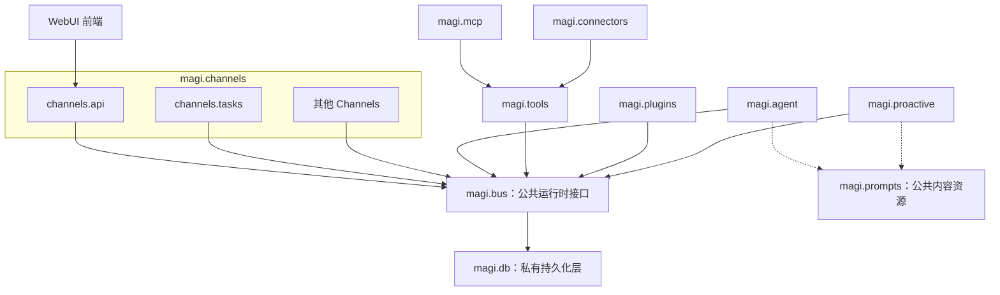
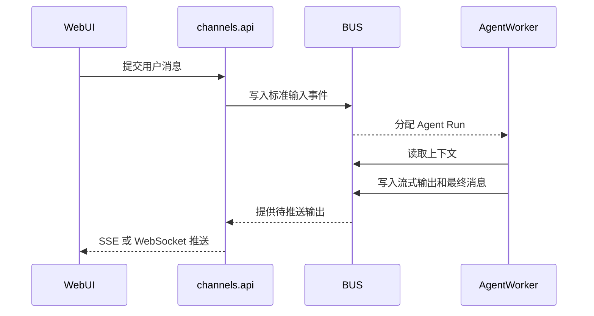
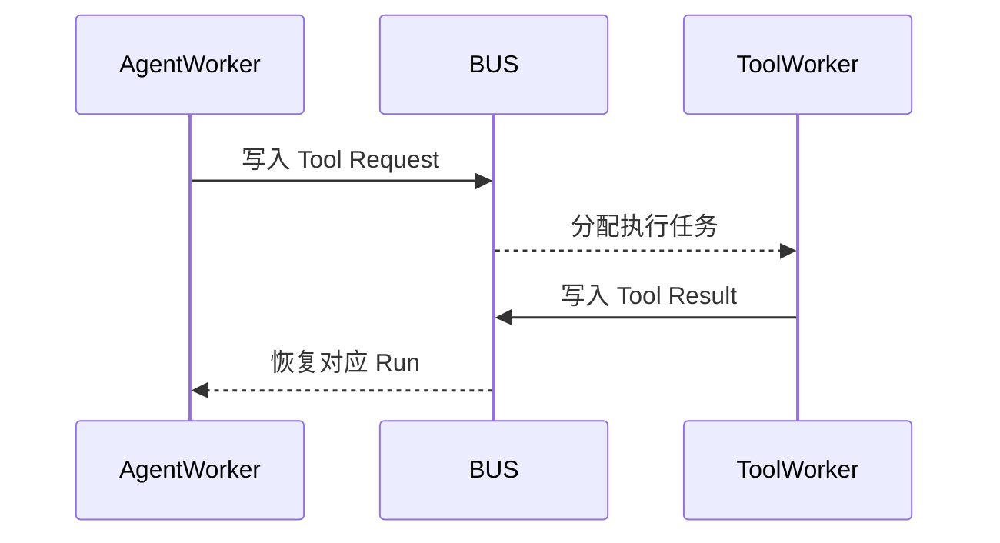
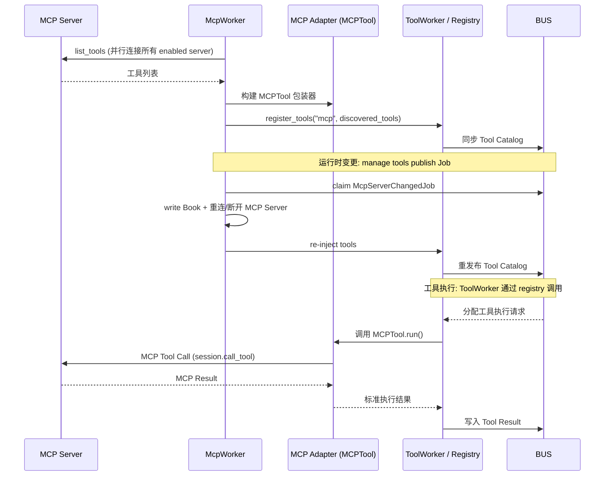
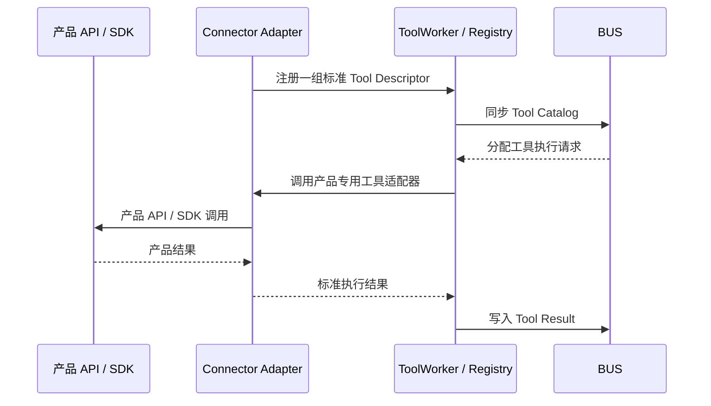
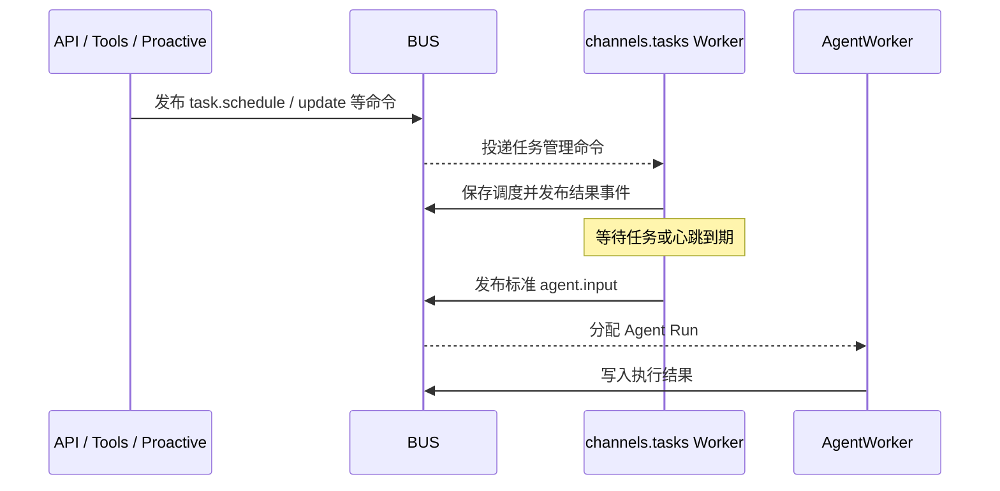

# MAGI 模块任务分工与依赖关系

## 1. 文档目的

本文定义 MAGI 目标架构中各模块的任务边界、允许的直接依赖、禁止承担的职责，以及模块之间的运行时协作方式。

本文中的箭头 `A → B` 表示：**A 在代码层面可以直接依赖 B**。它不等同于业务流程中的消息流向。

例如，Agent 可以在运行时发起工具调用，但 `magi.agent` 不应导入或直接调用 `magi.tools`：

```text
代码依赖：magi.agent → magi.bus ← magi.tools
运行时流程：Agent → BUS → ToolWorker → BUS → Agent
```

## 2. 总体架构原则

MAGI 的模块边界遵循以下规则：

1. `magi.bus` 是唯一的公共运行时接口。
2. `magi.prompts` 是唯一的公共内容资源模块。
3. `magi.db` 不是公共模块，只有 `magi.bus` 可以直接访问。
4. `agent`、`tools`、`channels`、`plugins` 和 `proactive` 的运行时业务统一通过 BUS 协作，彼此不得直接依赖。
5. `magi.plugins` 严格只依赖 `magi.bus`，不能把 Agent、Tools、Channels 或 Connectors 当作插件 SDK。
6. `magi.tools` 是最底层的工具运行时与能力层，定义统一合同、目录、执行器注册表和唯一的 ToolWorker；核心 built-in tools 只保留原子化、通用能力。
7. `magi.mcp` 与 `magi.connectors` 都是 Tools 的上层适配实现，依赖并实现 `magi.tools` 定义的 `ToolProvider` / `ToolExecutor` 合同：MCP 适配标准 MCP Server；Connectors 为具体产品提供一组专用工具。
8. MCP 拥有独立的 `McpWorker`，负责管理 MCP Server 连接的生命周期、消费 `mcpServerChangedJobBoard` 变更通知，并作为 `McpServerBook` 的唯一写者。Connectors 不拥有独立 Worker。MCP 和 Connectors 不消费 BUS Tool Job；由 Composition Root 将适配器实例注册到 Tools，ToolWorker 在运行时通过注册表调用它们。
9. `magi.channels.tasks` 是 BUS 上的通用任务调度 Worker。API、Tools 和 Proactive 只向 BUS 发布任务管理命令；Tasks 消费命令、登记调度，并在到期时通过 BUS 唤起 Agent。
10. `magi.channels.tasks` 不包含任何预设任务或主动策略；`magi.proactive` 才负责定义系统级任务与心跳，以增强 Agent 的主动性。
11. WebUI 前端只依赖 `magi.channels.api` 提供的 HTTP、WebSocket 或流式接口。
12. `magi.__main__` 是 Composition Root，可以导入并组装各模块，但不得承载业务逻辑。

## 3. 总体依赖图



图中的箭头只表示代码依赖。工具体系需要同时区分三种方向：

| 关系 | 方向 | 含义 |
|---|---|---|
| 代码依赖 | `MCP / Connectors → Tools → BUS` | 适配器导入并实现 Tools 拥有的合同；Tools 不导入具体适配器 |
| 装配关系 | `__main__ → Tools + MCP + Connectors` | Composition Root 创建适配器并注册到 Tools |
| 运行时调用 | `BUS Tool Job → ToolWorker → Registry → Adapter` | ToolWorker 调用已注入的实例，不改变代码依赖方向 |

因此，运行时的 `ToolWorker → MCP/Connector 实例` 调用不是 `magi.tools → magi.mcp/magi.connectors` 的源码依赖，而是依赖倒置后的接口调用。

主依赖链可简化为：

```text
WebUI → channels.api ─┐
proactive ────────────┤
MCP ───────┐          │
connectors ┴→ tools ──┤
其他 channels ───────┼→ BUS → DB
channels.tasks ──────┤
agent / plugins ─────┘

需要构造 LLM 内容的模块 → prompts
```

## 4. 模块职责总表

| 模块 | 核心任务 | 允许直接依赖 | 主要下游消费者 |
|---|---|---|---|
| WebUI 前端 | 用户界面、状态展示、流式交互 | `magi.channels.api` 的网络接口 | 最终用户 |
| `magi.channels.api` | WebUI 后端、HTTP/WebSocket/SSE 接入；把用户调度操作发布到 BUS | `magi.bus` | WebUI 前端 |
| `magi.channels.tasks` | 消费 BUS 中的任务命令，管理通用任务与心跳调度，并通过 BUS 可靠触发 Agent | `magi.bus` | BUS 上的任务命令生产者与 Agent Worker |
| 其他 `magi.channels.*` | Telegram 等消息渠道适配 | `magi.bus` | 外部消息平台 |
| `magi.proactive` | 定义系统级任务和心跳，通过 BUS 登记调度，增强 Agent 主动性 | `magi.bus`、`magi.prompts` | 开发者定义的主动策略 |
| `magi.agent` | 推理循环、上下文构建、LLM 调用 | `magi.bus`、`magi.prompts` | Runtime 中的 Agent Worker |
| `magi.tools` | 定义统一工具合同、Catalog 同步、Executor Registry 和唯一 ToolWorker；承载原子化通用 built-in tools 以及通过 BUS 管理任务的工具 | `magi.bus` | Agent Tool Jobs、核心 built-in tools、已注册适配器 |
| `magi.mcp` | 实现 Tools 合同，将 MCP Server 的发现与执行能力注册为适配器；拥有独立 McpWorker 管理连接生命周期和配置变更 | `magi.tools`、`magi.new_bus` | MCP Server 配置与连接 |
| `magi.connectors` | 实现 Tools 合同，按产品组织一组专用工具；无独立 Worker | `magi.tools` | 产品专用 API、SDK、CLI 或本地自动化接口 |
| `magi.plugins` | 插件发现、生命周期和插件能力登记 | `magi.bus` | 外部或内置插件 |
| `magi.bus` | 命令、事件、查询、队列、事务和一致性协议 | `magi.db` | 所有 BUS 消费者 |
| `magi.db` | 数据模型、数据库引擎、迁移与存储实现 | 通用基础库 | 仅 `magi.bus` |
| `magi.prompts` | Prompt 模板和可复用内容块 | 通用基础库 | Agent、Proactive 等 |
| `magi.__main__` | 启动、配置装配、依赖注入和进程角色选择 | 可组装所有模块 | Runtime 进程入口 |

## 5. 各模块详细分工

### 5.1 `magi.bus`

#### 负责

- 定义跨模块命令、事件、查询和结果协议。
- 提供消息写入、读取、确认、重试和失败处理接口。
- 管理 Worker 租约、抢占、幂等键和并发控制。
- 提供事务边界、Outbox/Inbox、一致性和恢复机制。
- 提供 Agent、Tool、Channel、Plugin 等运行状态的查询接口。
- 将上层的业务操作转换为 `magi.db` 的持久化操作。
- 屏蔽 SQLite 与 PostgreSQL 的实现差异。

#### 不负责

- 不执行 LLM 推理。
- 不执行具体工具。
- 不理解 Telegram、HTTP、MCP 等外部协议。
- 不包含数据库 ORM Model；Model 属于 `magi.db`。
- 不根据业务语义主动决定下一步任务。

#### 依赖

```text
magi.bus → magi.db
```

BUS 对外暴露稳定的协议和服务接口；数据库表结构、ORM Session 和 SQL 查询不应泄漏到 BUS 调用方。

### 5.2 `magi.db`

#### 负责

- ORM Model、Schema、索引和约束。
- SQLite 与 PostgreSQL 的 Engine、Session 和连接管理。
- 数据库迁移与版本兼容。
- 仓储实现和底层原子读写能力。
- 数据库方言差异、锁行为和性能优化。

#### 不负责

- 不定义跨模块业务协议。
- 不决定消息如何路由或由哪个 Worker 处理。
- 不被 Agent、Tools、Channels、Plugins 等模块直接导入。
- 不返回供业务模块长期持有的 ORM 对象。

#### 依赖

`magi.db` 不依赖任何 MAGI 业务模块。其唯一直接使用者是 `magi.bus`。

### 5.3 `magi.agent`

#### 负责

- 从 BUS 领取待处理的 Agent Run 或输入事件。
- 通过 BUS 读取会话、消息、工具目录和相关状态。
- 构建模型上下文并调用 LLM Provider Adapter。
- 处理流式模型输出。
- 将 assistant message、tool request、run state 和 usage 等结果写回 BUS。
- 在工具结果到达后恢复推理循环。
- 执行上下文压缩、截断和恢复策略。

#### 不负责

- 不直接调用工具实现或 MCP Client。
- 不直接投递 Telegram、WebUI 等渠道消息。
- 不直接访问数据库或 ORM。
- 不维护 Tool Catalog 的真实来源。
- 不负责插件发现和加载。

#### 依赖

```text
magi.agent → magi.bus
magi.agent → magi.prompts
```

LLM Provider Adapter 应作为 `magi.agent` 的内部子模块，而不是其他模块可以随意依赖的公共模块。

### 5.4 `magi.tools`

#### 负责

- 定义 MAGI 内部统一的 Tool Descriptor、参数 Schema、`ToolProvider`、`ToolExecutor` 和执行结果协议。
- 维护 Executor Registry，并注册最底层、原子化、可跨场景复用的内置工具执行器。
- 将所有来源的 Tool Catalog 变化统一同步到 BUS。
- 由唯一的 ToolWorker 从 BUS 领取工具执行请求。
- 通过 Executor Registry 解析并调用已注册的 built-in、MCP 或 Connector 执行器。
- 将成功、失败、超时和取消结果写回 BUS。
- 统一实现工具执行的权限、超时、并发、重试和幂等控制。
- 为 MCP 与 Connectors 提供明确且稳定的接入合同。
- 提供任务创建、更新、暂停、恢复、取消和查询工具；这些工具只通过 BUS 发布任务命令或查询，不直接调用 `magi.channels.tasks`。

#### 不负责

- 不发起 Agent 推理。
- 不直接修改会话上下文。
- 不直接操作数据库。
- 不导入或识别 `magi.mcp` 的具体实现；只调用注册为 Tools 合同的实例。
- 不导入或识别 `magi.connectors` 的具体实现；只调用注册为 Tools 合同的实例。
- 不为 MCP 或 Connector 创建第二套 Tool Job Worker。
- 不在核心层堆积某个产品专属的一整套业务工具；这类工具归属于对应 Connector。
- 不直接向 Channel 发送执行结果。

#### 依赖

```text
magi.tools → magi.bus
```

Tools 是工具体系的底座，不等于所有工具实现都必须放在 `magi.tools` 包内。判断归属时遵循：

- 能跨产品、跨场景复用，且职责足够原子的工具，可以作为核心 built-in tool。
- 围绕同一个产品、软件或服务形成的一组工具，应放入对应 Connector。
- 由 MCP Server 提供的工具，经由 `magi.mcp` 适配后接入。

### 5.5 `magi.mcp`

#### 负责

- 读取 MCP Server 配置（通过 `McpServerBook`）。
- 管理 MCP 连接、会话和重连。
- 从 MCP Server 发现工具。
- 将 MCP 工具描述转换为 `magi.tools` 的统一 Tool Descriptor。
- 将 Tools 发来的执行请求转换为 MCP 调用并返回规范化结果。
- 运行独立的 `McpWorker`：启动时引导连接所有 enabled server，运行时消费 `mcpServerChangedJobBoard` 变更通知。
- 作为 `McpServerBook` 的唯一写者，在同一个 handler 中完成配置写入与连接重载。

#### 不负责

- 不直接向 BUS 注册工具或写入工具结果（通过 `register_tools` 注入 registry）。
- 不拥有独立的 Tool Job Worker，不从 BUS 领取 Tool Job；ToolWorker 通过 registry 调用 MCP 工具实例。
- 不被 `magi.tools` 反向导入。
- 不参与 Agent 上下文和推理。
- MCP 管理工具（add/list/update/delete）位于 `magi.tools.mcp`，作为 builtin tools 注册，不属于 `magi.mcp` 包。

#### 依赖

```text
magi.mcp → magi.tools → magi.bus → magi.db
magi.mcp → magi.new_bus (McpServerBook + mcpServerChangedJobBoard)
```

其中只有相邻模块之间存在直接代码依赖。运行时由 ToolWorker 通过 Tools 的 Executor Registry 调用已注册的 MCP Adapter；该实例由 McpWorker 注入，因此不会形成 Tools 对 MCP 的源码依赖。McpWorker 是 `McpServerBook` 的唯一写者，manage tools 只 publish Job 不直写 Book。

### 5.6 `magi.connectors`

Connector 是面向某个具体产品或软件的一组工具适配，不是新的公共运行时层，也不是 Channel。

例如，一个脑图软件没有可用的 MCP Server 时，可以实现一个该产品的 Connector，在其中提供“创建脑图”“添加节点”“移动节点”“导出文件”等一组 built-in tools，再统一接入 Tools 体系。

#### 负责

- 围绕一个具体产品、软件或服务组织一组具有一致认证、配置和生命周期的专用工具。
- 调用目标产品的 API、SDK、CLI、本地协议或自动化接口。
- 把产品专用参数和结果转换为 `magi.tools` 定义的统一 Tool Descriptor 与执行结果。
- 在产品没有 MCP Server、现有 MCP Server 不可用，或 MCP 能力不足时提供原生工具集成。
- 复用 Tools 提供的注册、执行、权限、超时、结果规范化和 Catalog 同步机制。

#### 不负责

- 不定义一套与 `magi.tools` 平行的工具协议、Tool Catalog 或 Tool Job 队列。
- 不拥有独立 ToolWorker，也不从 BUS 领取 Tool Job。
- 不自行实现 Tools 已统一提供的权限、重试、幂等或结果持久化。
- 不直接向 Agent 暴露实例，也不直接参与 Agent 推理。
- 不直接访问数据库。
- 不直接依赖 Channels、Plugins 或 MCP。
- 不把产品专用实现下沉到核心 Tools 包。
- 不把外部事件输入职责混入工具 Connector；消息入口仍属于 Channels。

#### 依赖

```text
magi.connectors → magi.tools → magi.bus → magi.db
```

与 MCP 一样，只有相邻模块之间存在直接代码依赖。运行时由 ToolWorker 调用已注册的 Connector Adapter，Composition Root 负责实例化和注册。Connectors 与 MCP 是并列的两种工具接入方式：

```text
MCP Server ─────→ magi.mcp ───────┐
产品 API / SDK ─→ magi.connectors ─┴→ magi.tools → magi.bus
```

### 5.7 `magi.channels`

Channels 负责将不同来源的消息转换为统一的 BUS 协议，并把 BUS 中的输出转换为目标渠道能够接收的格式。Channel 是边界适配器，不包含 Agent 业务逻辑。

#### Channels 公共职责

- 验证和规范化外部输入。
- 将输入转换为 BUS 命令或事件。
- 从 BUS 领取待投递输出。
- 将输出转换为外部渠道格式并投递。
- 记录投递确认、失败、重试和渠道消息 ID。
- 处理渠道级鉴权、限流和连接生命周期。

#### Channels 不负责

- 不直接调用 Agent。
- 不直接执行工具。
- 不直接访问数据库。
- 不决定 Agent 的推理步骤。
- 不把某个渠道的数据结构扩散到 BUS 或其他模块。

#### 依赖

```text
magi.channels.* → magi.bus
```

`magi.channels` 包内可以存在少量私有公共类型，但这些类型不得成为其他顶层模块的共享 API。`channels.tasks` 不向 API、Tools 或 Proactive 暴露可直接调用的 Python 调度接口；其跨模块合同属于 BUS 协议。

#### `magi.channels.api`

负责 WebUI 所需的 HTTP、WebSocket 和流式接口，包括会话查询、消息提交、运行状态、流式输出和管理操作。它是 WebUI 的唯一后端边界。对于用户创建、更新、暂停、恢复或取消的计划任务与心跳，API 向 BUS 发布标准任务命令；查询任务时使用 BUS 的查询协议。

```text
WebUI 前端 → channels.api → BUS → channels.tasks Worker
```

WebUI 前端不能直接了解 BUS、数据库、Agent 或 Tool Worker 的内部结构。

#### `magi.channels.tasks`

`magi.channels.tasks` 是 MAGI 的通用任务调度器，而不是 Proactive 的专属 Channel。

#### 负责

- 从 BUS 消费 API、Tools、Proactive 等生产者发布的创建、更新、暂停、恢复或取消任务命令。
- 支持一次性任务、延迟任务、周期任务和心跳。
- 通过 BUS 保存调度定义、下一次触发时间、执行状态、去重键和失败信息。
- 发布任务命令的处理结果和状态事件，并通过 `correlation_id` 关联请求与响应。
- 在任务或心跳到期时，通过 BUS 写入标准 `agent.input`，触发对应 Agent 工作。
- 处理并发领取、幂等触发、失败重试、错过触发和进程重启后的恢复。
- 提供与具体任务内容无关的调度查询和管理接口。

#### 不负责

- 不内置任何预设任务、系统心跳或主动行为。
- 不决定 Agent 应主动完成什么工作。
- 不生成任务目标、Prompt 或业务上下文。
- 不直接调用 Agent，也不绕过 BUS 创建不可恢复的执行。
- 不承担工具执行或外部渠道投递职责。
- 不向其他业务模块暴露必须直接调用的调度服务对象。

#### 代码依赖与运行时协作

```text
channels.api ─┐
tools ────────┤
proactive ────┼→ BUS ← channels.tasks
agent ────────┘
```

上图只表示代码依赖：所有模块都依赖 BUS，彼此没有直接代码依赖。运行时消息流为：

```text
API / Tools / Proactive → BUS → Tasks Worker → BUS → AgentWorker
```

Tasks 只负责“按照调度定义，何时以及如何可靠地触发”；命令生产者负责“创建什么任务、为什么创建以及携带什么业务内容”。

#### 调度协议

任务管理操作应区分命令、查询和状态事件，不能笼统使用一个 `tasks.publish`：

```text
命令：task.schedule / task.update / task.cancel / task.pause / task.resume
查询：task.get / task.list
事件：task.scheduled / task.updated / task.cancelled / task.rejected / task.triggered
```

需要同步返回 `task_id` 或错误的调用使用 `correlation_id` 关联命令与结果事件。Tasks 到期时把调度领域消息转换成统一的 Agent 输入，而不是要求 Agent 理解 Tasks 内部模型：

```json
{
  "type": "agent.input",
  "source": "tasks",
  "agent_id": "agent-123",
  "correlation_id": "task-run-456",
  "payload": {
    "task_id": "task-789",
    "content": "检查邮箱并总结重要邮件"
  }
}
```

#### 其他 Channels

`telegram` 等其他渠道只处理各自平台的鉴权、消息格式、Webhook/Polling 和回执，不得包含 Agent 或 Tool 的特例逻辑。

### 5.8 `magi.proactive`

#### 负责

- 提供一系列由开发者定义的系统级任务和心跳定制。
- 根据策略、系统状态或外部事件决定应建立什么主动任务。
- 生成主动任务所需的目标、上下文提示和调度信息。
- 通过 BUS 发布任务创建、更新、暂停、恢复或取消命令。
- 管理主动策略的启停、默认频率和业务去重规则，从而增强 Agent 的主动性。

#### 不负责

- 不直接创建 Agent Run。
- 不直接调用 Agent、Tools 或其他 Channels。
- 不直接访问 DB。
- 不直接调用 `channels.tasks`；只依赖 BUS 中的通用调度协议。
- 不实现任务的可靠投递机制；该职责属于 `channels.tasks` Worker。
- 不在 `channels.tasks` 模块中硬编码系统预设任务；Proactive 只通过 BUS 登记这些任务，Tasks 自身保持纯粹。

#### 依赖

```text
magi.proactive → magi.bus
magi.proactive → magi.prompts
```

### 5.9 `magi.plugins`

#### 负责

- 发现、校验、启用、禁用和卸载插件。
- 管理插件 Manifest、版本、配置和生命周期状态。
- 通过 BUS 登记插件元数据、能力声明和运行状态。
- 将插件产生的命令或事件提交给 BUS。
- 为插件进程或 Worker 提供最小化的 BUS 接入能力。

#### 不负责

- 不直接导入 Agent、Tools 或 Channels。
- 不直接访问数据库。
- 不绕过 BUS 修改运行状态。
- 不把插件内部依赖变成 MAGI 核心模块依赖。
- 不直接加载或调用 Connectors；插件若声明相关能力，也必须通过 BUS 协议协作。

#### 依赖

```text
magi.plugins → magi.bus
```

如果插件提供工具、Connector、Channel 或其他能力，核心插件管理器仍只依赖 BUS。具体能力应通过 BUS 中的能力声明、工作队列或独立 Worker 接入，而不是让 `magi.plugins` 直接调用对应核心模块。

### 5.10 `magi.prompts`

#### 负责

- 保存系统 Prompt、SOUL、上下文块和其他模板。
- 提供模板渲染和版本标识。
- 提供压缩、标题、总结、主动任务等可复用 Prompt 内容。
- 保持 Prompt 内容与 Agent 执行逻辑分离。

#### 不负责

- 不调用 LLM。
- 不读取会话或数据库。
- 不发布事件或执行任务。
- 不依赖任何 MAGI 业务模块。

`magi.prompts` 是公共资源模块，但“公共”不意味着所有模块都必须使用它。只有确实需要构造 LLM 内容的模块才应依赖它。

### 5.11 WebUI 前端

#### 负责

- 会话、消息、Agent、工具、任务和运行状态的可视化。
- 用户输入、配置和管理操作。
- 消费 API 的流式响应并展示中间状态。
- 本地 UI 状态和服务端状态缓存。

#### 不负责

- 不直接连接数据库。
- 不复刻 BUS 的状态机或业务规则。
- 不直接调用 Agent、Tool 或 Plugin Worker。
- 不把后端内部 Model 当作稳定的前端协议。

#### 依赖

```text
WebUI 前端 → magi.channels.api
```

### 5.12 `magi.__main__` / Composition Root

#### 负责

- 读取启动参数和环境配置。
- 创建 BUS、数据库实现和各类 Worker。
- 实例化 MCP 与 Connector Adapter，并注册到 Tools 的 Executor Registry。
- 装配模块依赖和 Adapter。
- 根据进程角色启动 Runtime、WebUI API 或其他服务。
- 管理启动顺序、健康检查和优雅退出。

#### 不负责

- 不实现消息路由规则。
- 不包含 Agent 推理、工具执行或 Channel 业务逻辑。
- 不成为模块之间传递数据的中间层。
- 不提供可被业务模块反向依赖的工具函数集合。

Composition Root 是“可以看见所有模块”的例外，但所有业务协作仍必须遵守模块边界。

### 5.13 Orchestrator 与部署层

Orchestrator、Kubernetes Manifest、Docker 和本地 Runtime Launcher 属于部署与控制平面，不属于上述进程内业务依赖图。

#### 负责

- 创建、启动、停止和删除 MAGI/MAGIS 实例。
- 管理工作区、存储、端口、进程或容器生命周期。
- 提供部署状态和健康检查。
- 在 Kubernetes、本地桌面或无容器运行模式下装配相同的 Runtime 模块。

#### 边界

- 不直接访问某个 MAGI 实例的业务数据库。
- 不直接执行 Agent 或 Tool 业务逻辑。
- 通过明确的控制面 API、进程接口或平台 API 管理实例。
- 不因部署方式不同而改变核心模块依赖关系。

## 6. 允许与禁止的直接依赖

| 调用方 | 允许直接依赖 | 明确禁止直接依赖 |
|---|---|---|
| `agent` | `bus`、`prompts` | `tools`、`mcp`、`connectors`、`channels`、`plugins`、`db` |
| `tools` | `bus` | `agent`、`mcp`、`connectors`、`channels`、`plugins`、`db` |
| `mcp` | `tools` | `bus`、`agent`、`connectors`、`channels`、`plugins`、`db` |
| `connectors` | `tools` | `bus`、`agent`、`mcp`、`channels`、`plugins`、`db` |
| `channels.api` | `bus` | `agent`、`tools`、`mcp`、`channels.tasks`、`plugins`、`db` |
| `channels.tasks` | `bus` | `agent`、`tools`、`mcp`、`plugins`、`db` |
| 其他 `channels.*` | `bus` | `agent`、`tools`、`mcp`、`plugins`、`db` |
| `proactive` | `bus`、`prompts` | `channels.tasks`、`agent`、`tools`、`db` |
| `plugins` | `bus` | `agent`、`tools`、`mcp`、`connectors`、`channels`、`db` |
| `bus` | `db` | `agent`、`tools`、`mcp`、`connectors`、`channels`、`plugins` |
| `db` | 通用基础库 | 所有 MAGI 业务模块 |
| `prompts` | 通用基础库 | 所有 MAGI 业务模块 |
| WebUI 前端 | `channels.api` 的网络协议 | Python Runtime 模块、DB |
| `__main__` | 所有待组装模块 | 不适用；但不得承载业务逻辑 |

## 7. 典型运行时协作流程

### 7.1 用户消息与普通回复



API 与 Agent 从不直接调用对方。

### 7.2 Agent 工具调用



Agent 从 BUS 读取 Tool Catalog，因此不需要调用 Tools 模块获得工具列表。

### 7.3 MCP 工具发现与执行



### 7.4 Connector 工具发现与执行



Agent 只从 BUS 看到规范化后的工具目录和结果，不需要知道工具来自核心 built-in、MCP 还是 Connector。上面时序中的 Tools → Adapter 是对象级运行时调用；源码层仍然是 Adapter → Tools 合同。

### 7.5 通用任务调度



三类调用方的业务语义不同，但复用同一个执行机制：

- API：接受用户或管理员配置的任务与心跳。
- Tools：根据工具执行结果或工具语义安排延迟、周期性后续工作。
- Proactive：登记开发者预设的系统级任务与心跳，增强 Agent 主动性。

`channels.tasks` 不关心这些任务来自哪种策略，也不自带任何任务；它只负责消费 BUS 协议、管理调度定义的生命周期并可靠触发。调用方与 Tasks 不直接调用对方。

## 8. 开发任务拆分与前置依赖

### 第一阶段：稳定公共边界

1. 定义 `magi.bus` 的 Commands、Events、Queries、DTO 和错误语义。
2. 将 ORM Model、Engine 和 Migration 收口到 `magi.db`。
3. 确保 BUS API 不泄漏 ORM Model 或数据库 Session。
4. 整理 `magi.prompts` 的公共模板与渲染边界。

这是其他模块并行开发的前置条件。

### 第二阶段：并行改造 BUS 直接消费者

以下工作在 BUS 合同稳定后可以并行：

- Agent：改为只通过 BUS 获取上下文、Tool Catalog 和写入结果。
- Tools：实现 Catalog 同步、ToolWorker 和结果回写；核心执行路径仍只通过 BUS 协作。
- Channels：统一输入、输出、确认和失败协议，并优先稳定 `channels.tasks` 的通用调度合同。
- Plugins：实现只依赖 BUS 的注册与生命周期模型。

### 第三阶段：实现专属适配层

- 在 Tools 的接入接口稳定后，并行实现 `magi.mcp` 与 `magi.connectors`；两者都只依赖 Tools，不直接依赖 BUS。
- 在 BUS 的任务命令、查询、结果事件和 Agent 输入协议稳定后实现通用 `channels.tasks`，确保该模块不携带预设任务。
- 在 BUS 调度协议稳定后，分别让 `channels.api`、`magi.tools` 和 `magi.proactive` 通过 BUS 发布调度操作，不引入对 Tasks 的直接依赖。
- 在 Channels 公共协议稳定后实现其他渠道。
- 在 `channels.api` 稳定后迁移 WebUI 前端。

### 第四阶段：装配与端到端验证

- 由 `magi.__main__` 完成依赖注入和不同进程角色的装配。
- 验证 SQLite、本地多工作区和 PostgreSQL/MAGIS 部署。
- 增加架构依赖测试，阻止禁止的 Python Import。
- 增加崩溃恢复、重复投递、并发租约、Tool Resume 和流式输出测试。

## 9. 模块完成标准

目标架构可以认为完成，至少需要满足以下条件：

- 业务模块中不存在对 `magi.db`、ORM Model 或 Session 的直接导入。
- `agent`、`tools`、`channels`、`plugins` 和 `proactive` 之间不存在跨模块直接导入；运行时协作统一通过 BUS。Connectors 与 MCP 作为明确例外，只向下依赖 Tools。
- `magi.tools` 不依赖 `magi.mcp`。
- `magi.tools` 不依赖 `magi.connectors`。
- MCP 与 Connectors 都没有独立 ToolWorker，也不直接消费 BUS Tool Job。
- Composition Root 将 MCP/Connector Adapter 注册到 Tools，ToolWorker 只通过 Tools 合同和 Executor Registry 调用它们。
- `magi.mcp` 不绕过 Tools 直接访问 BUS。
- `magi.connectors` 不绕过 Tools 直接访问 BUS，也不创建平行的工具协议或 Catalog。
- 产品专用的一组工具归属于对应 Connector；Tools 核心只保留原子化、通用的能力与执行基础。
- `magi.plugins` 仍严格只依赖 BUS，不因插件提供工具或 Connector 能力而直接依赖 Tools 或 Connectors。
- `channels.tasks` 是不含预设任务和业务策略的通用调度器。
- API、Tools 和 Proactive 的任务及心跳均以标准命令写入 BUS，由 `channels.tasks` 消费、登记和管理。
- `channels.tasks` 到期后只通过 BUS 触发 Agent，不直接调用 Agent。
- `channels.tasks` 到期后发布统一的 `agent.input`，Agent 不需要理解 Tasks 内部领域模型。
- `magi.proactive` 不直接调用 `channels.tasks` 或创建 Agent Run，其系统级任务定义也不下沉到 Tasks。
- 任务命令和结果使用 `correlation_id` 关联，API 与工具可以可靠获得 `task_id` 或失败结果。
- WebUI 前端只使用 `channels.api` 提供的稳定接口。
- Tool Catalog 可完全通过 BUS 查询，Agent 无需接触工具实例。
- 所有跨 Worker 状态变化都可以从 BUS/DB 恢复。
- `__main__` 只负责装配，不包含业务分支。
- 架构依赖规则由自动化测试持续检查。

## 10. 一句话总结

MAGI 的核心分工是：**DB 管数据，BUS 管协议与一致性，Agent 管推理，Tools 管最底层的原子化通用工具及执行，Connectors 管面向具体产品的一组专用工具，MCP 管标准工具协议适配，Channels 管输入输出，Tasks 作为 BUS Worker 管通用调度与可靠触发，Plugins 只通过 BUS 管扩展，Proactive 定义系统级任务和心跳，Prompts 管公共内容，Composition Root 管装配；除 MCP/Connectors 向下复用 Tools 外，跨业务模块协作都经过 BUS。**
