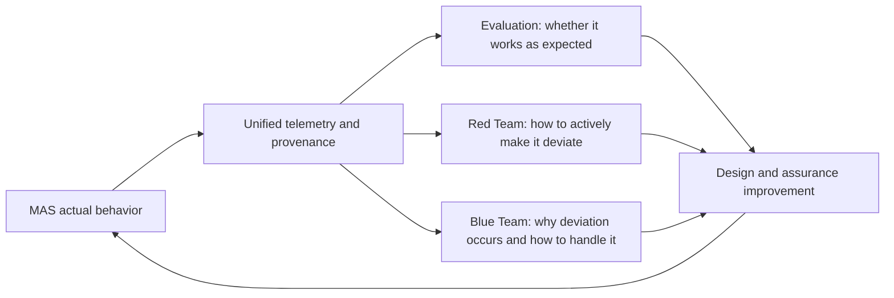
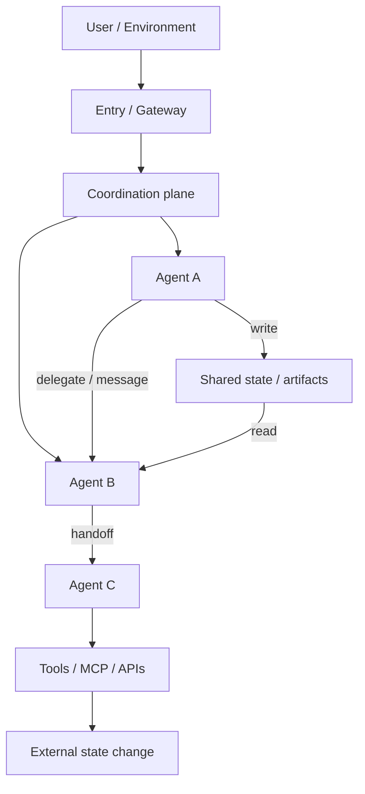

# Quality, Architecture, Observability and Security Assurance for Multi-Agent Systems: A Conceptual Framework and Research Agenda

[中文版](MAS质量架构可观测性与安全保障框架.md)

## Abstract

The object of study in Multi-Agent Systems (MAS) should not be reduced to "multiple large language models talking to each other." In current LLM-centric Agent engineering, MAS more accurately represents a systematic way of organizing intelligence: tasks, context, tools, permissions, state, and responsibilities are distributed among multiple agents with bounded autonomous decision-making capability, and overall behavior emerges through routing, delegation, handoff, communication, shared state, and governance mechanisms.

This report builds a unified analytical framework around MAS quality goals, collaboration architectures, observability, and security assurance. It answers five interrelated questions in sequence: what MAS should optimize; how MAS should be organized; how quality evaluation, red-teaming, and blue-teaming can share the same system model; how the object of study evolves from LLM input/output to Agent trajectories and then to the dynamic causal interaction graph of MAS; and how to uniformly design quality measurement, attack verification, and detection/attribution at every key observation point. The framework can be used both to analyze existing MAS and to guide the design of subsequent benchmarks, runtime instrumentation, and security assurance systems.

The core judgment of this paper is: **the most direct and verifiable engineering value of MAS at the current stage is context isolation.** The potential context of real-world tasks is nearly unbounded, while any single model's effective context, attention, and specialization capability are bounded. The value of MAS lies first not in "adding more agents" but in establishing context, responsibility, and permission boundaries, so that only necessary information crosses these boundaries in a controllable, traceable form. On this basis, MAS may also deliver specialization, parallelism, heterogeneous computing, checks-and-balances, and failure isolation — but it also introduces coordination overhead, information distortion, routing errors, shared-state pollution, and failure propagation. Therefore, the design and evaluation of MAS is fundamentally a **multi-objective optimization** problem.

Observability also evolves with the object of study: the primary target of LLM observability is input/output; the primary target of single-Agent observability is the trajectory; the primary target of MAS observability is the **dynamic causal interaction graph** jointly formed by multiple autonomous agents, shared state, and external actions. In this graph, agents are important nodes, but delegation, messages, handoffs, and state read/write — the **edges / interaction events** — are equally key minimal observation units. Quality evaluation, red-teaming, and blue-teaming should share this underlying telemetry and behavioral semantics: quality evaluation answers whether the system works as expected; red-teaming answers how to actively make the system deviate from expectations or break security boundaries; blue-teaming answers why deviation occurs, how to detect, attribute, isolate, and recover. Security must additionally check invariants that cannot be violated; it cannot be reduced to the inverse of quality metrics.

---

## 1. An Optimization Formulation of the Research Problem

This report reframes the research task as five interlocking questions.

### RQ1: What are the conditions of existence, design goals, and system-level quality model for MAS?

The focus is not only on final task accuracy, but on answering: why does this task need multiple agents; what conditions should a "good MAS" satisfy on context isolation, task effectiveness, specialization, coordination, communication, parallelism, cost, robustness, governance, and security boundaries; how these goals trade off against each other; and when single-agent is instead the better solution.

### RQ2: What are the main collaboration and organization architectures of MAS, and how do they allocate control, context, communication, and state?

The focus is on analyzing, from runtime mechanisms rather than product names, six control architectures: Router, Supervisor, Pipeline, Graph/Workflow, Handoff, and Self-organizing/Swarm; while treating Group Chat/Debate as a communication-and-deliberation mode, and Logical/Distributed/A2A as deployment and trust-domain dimensions. The core question is: **who decides what the next actor does, and in what form does information cross agent boundaries?**

### RQ3: How to build a unified analytical framework for quality evaluation, red-teaming, and blue-teaming?

The focus is on showing that the three share the same set of system behavior properties and telemetry, but optimize different objectives: Evaluation measures expected behavior; Red Team actively seeks manipulable failure paths; Blue Team infers causes from anomalous behavior and responds. At the same time, continuous performance/quality attributes must be distinguished from non-violable security invariants.

### RQ4: How should observability evolve as the object of study moves from LLM to Agent to MAS?

The focus is on moving further from `input/output` and `trajectory` toward the `dynamic causal interaction graph`, identifying observation surfaces such as Entry, Identity, Context, Decision, Memory, Coordination, Communication, Shared State, Tool/Action, Topology, Outcome, and defining the minimum necessary fields and causal relations for each type of telemetry.

### RQ5: How to translate architectures, observation surfaces, and the three perspectives into an executable MAS Assurance Matrix?

The focus is on building:

```text
Observation Surface
        ↓
Quality Failure + Evaluation Method
        ↓
Red-team Exploit Hypothesis
        ↓
Blue-team Detection + Attribution + RCA + Response
```

The goal of this matrix is not to enumerate attack names, but to make every system boundary measurable, attack-verifiable, detectable, and explainable.

---

## 2. Conceptual Boundaries, Significance, and Conditions of Existence for MAS

### 2.1 Working Definitions of Agent and MAS

This paper defines an Agent as a computational entity that, given an identity, goal, context, model, tools, memory, permissions, and runtime constraints, can perceive state, make decisions, and take actions.

A system that merely contains multiple Agent objects does not automatically constitute a research-worthy MAS. The MAS referred to in this paper has at least the following two characteristics:

1. The system contains two or more distinguishable decision-making entities, which have different context, capability, state, goals, permissions, or life cycles.
2. System outcomes depend on coordination relationships among entities, not just a simple concatenation of independent model calls.

The significance of MAS is also not "one Agent is not smart enough, so add more Agents," but transforming complex intelligent systems from a single cognitive entity into a system with division of labor, boundaries, collaboration, and governance structure. Its main values can be summarized by six keywords:

```text
MAS
 │
 ├── Decomposition       Problem decomposition
 ├── Specialization      Specialization
 ├── Isolation           Isolation
 ├── Parallelism         Parallelism
 ├── Coordination        Coordination
 └── Governance          Governance
```

These six values are not independent of one another. Decomposition creates the possibility of specialization and parallelism; isolation establishes cognitive, permission, and failure boundaries; coordination combines local work into system outcomes; governance constrains control, responsibility, and risk.

### 2.2 Problem Decomposition and Specialization

A single Agent must, within one cognitive space, undertake different tasks such as research, planning, coding, execution, and review. MAS can assign these responsibilities to Agents with different system prompts, context, tools, memory, models, and permissions:

```text
                         Coordinator
                    ┌────────┼────────┐
                    ▼        ▼        ▼
               Researcher  Coder  Reviewer
```

Its value is not merely role-playing, but splitting both the task space and the cognitive space simultaneously, so that each Agent can develop stable capabilities within bounded responsibilities, and allow the use of domain-specific models, specialized tools, and local memory. Whether specialization actually produces benefits must be verified through Specialist-vs-Generalist comparisons and marginal-utility experiments on Agents.

### 2.3 Parallel Search, Coverage, and Scale Extension

Decomposable tasks can shift from sequential reasoning to parallel exploration:

```text
                    ┌─> Research A ─┐
Task ───────────────┼─> Research B ─┼─> Synthesis
                    └─> Research C ─┘
```

Parallel MAS can simultaneously retrieve from different information sources, test multiple hypotheses, review different modules, or execute heterogeneous tools, thereby improving speed, coverage, and solution-space diversity. However, parallelism yields net value only when the synchronization, merging, and coordination overhead is lower than the time saved and the information gain obtained. An increase in the number of Agents does not equal improved scalability; the system may degrade non-linearly due to communication-edge count, resource contention, and aggregation complexity.

### 2.4 Cognitive Isolation and Context Architecture

LLMs perform reasoning and action within a given context, but the real-world available information, history, tool results, and domain knowledge keep growing. Skills, Tools, Retrieval, and Memory can expand a single Agent's effective context, but cannot eliminate the following tension:

```text
Potentially unbounded world context
                 vs.
Finite effective model context and attention
```

When all information enters the same context, the system may suffer context pollution, attention dilution, instruction conflict, memory pollution, injection propagation, and irrelevant token cost. MAS establishes Agent boundaries, placing information from different domains into different cognitive spaces, and allowing only summaries, structured messages, or controlled artifacts to cross boundaries.

```text
Research Context                    Coding Context
      │                                   │
      ▼                                   ▼
Research Agent ── structured artifact ──> Coding Agent
```

Therefore, **the most direct and verifiable engineering value of MAS at the current stage is context isolation; MAS can also be seen as a Context Architecture.** Its core management objects include: who can see what; who should not see what; which information must cross boundaries; whether the information is deleted, modified, injected, or misunderstood when it crosses; and which decision and action this information ultimately influenced.

### 2.5 Responsibility Boundaries and Failure Attribution

When a single Agent fails, research, planning, tool selection, execution, and verification are often mixed within the same trajectory. MAS can explicitly separate these responsibilities:

```text
Planner → Researcher → Executor → Verifier
```

This allows the system to evaluate task decomposition, evidence quality, action correctness, and verification effectiveness separately, and answer "who is responsible for which part of the result." Responsibility boundaries provide the structural foundation for credit assignment, failure attribution, and RCA; if control and responsibility still cannot be distinguished, multi-agent only adds superficial roles without improving governability.

### 2.6 Checks and Balances, Separation of Duties, and Governance

MAS can assign proposal, execution, approval, and audit to different entities:

```text
Planner → Executor → Reviewer → Policy Agent → Action
```

This allows the system to implement verification, debate, consensus, adversarial review, and separation of duties, and to separate "intelligence" from "authorization." A high-capability Agent does not need to automatically possess high permissions; an Agent that can propose actions should not necessarily be entitled to approve and execute them. This structure provides institutional constraints that are difficult to stably achieve with a single Agent in high-risk scenarios.

### 2.7 Heterogeneous Intelligence and Heterogeneous Resource Orchestration

MAS can choose different models, runtimes, and tools based on task type: high-cost frontier models handle complex research, small models handle routing, code models handle programming, local models process sensitive data, and rules or classifiers carry out safety gating. It functions like heterogeneous computing with CPUs, GPUs, and dedicated accelerators working together:

```text
                        Coordinator
              ┌────────────┼────────────┐
              ▼            ▼            ▼
        Frontier Model  Code Model  Local Guard Model
           Research       Code       Sensitive Data
```

This Heterogeneous Cognitive Computing can improve capability and cost efficiency, but also introduces model capability calibration, data boundaries, protocol compatibility, and cross-trust-domain governance issues.

### 2.8 From Model Capability to System Capability

The deepest significance of MAS is shifting the object of study from model to system. The capability of a single Agent does not automatically translate into overall capability: serial systems accumulate local errors, parallel systems produce conflicts, shared state propagates pollution, and self-organizing systems may form inefficient or dangerous topologies.

```text
LLM:    Input → Model → Output

Agent:  Input → Model → Tool/Environment → Replan → Output

MAS:    Agents + Contexts + Tools + State + Interaction + Governance
                                  ↓
                            System Outcome
```

Therefore, MAS research moves further from intelligence engineering toward intelligent systems engineering: it must evaluate not only node capability, but also boundaries, interfaces, control, dependencies, state consistency, failure propagation, and overall governance.

### 2.9 Coordination and Governance Are the Unique Difficulties of MAS

Decomposition, specialization, and parallelism already have mature precedents in traditional software engineering. What truly makes MAS an independent research problem is: how do multiple entities with incomplete information, probabilistic decisions, and bounded autonomy form reliable, predictable, explainable, and controllable overall behavior?

Observability and Evaluation are therefore not peripheral dashboards of MAS, but its infrastructure after becoming an engineering system. Without cross-Agent context and state provenance, it is hard to answer "who caused what"; without interaction-level telemetry, it is impossible to distinguish node mistakes, communication distortion, and coordination failures.

### 2.10 Necessity Criterion for MAS

MAS is not inherently superior to a single Agent. To judge whether a multi-agent design is justified, the counterfactual merging criterion can be used:

> If merging two Agents does not significantly lose context isolation, specialization, parallelism, heterogeneity, governance, permission separation, failure isolation, or autonomous collaboration capability, then these two Agents very likely do not need to be designed as two Agents.

Therefore, MAS must demonstrate that its system gain exceeds the new coordination cost, information transfer loss, latency, expense, and failure risk. This criterion is also the starting point for subsequent quality standards and the multi-objective optimization framework.

---

## 3. MAS Quality Standards and Design Goals

### 3.1 Primary Standard: Net System Gain Relative to a Single Agent

The quality of MAS cannot be discussed without a baseline. At minimum, one should compare:

- Single-Agent baseline;
- Single-Agent enhanced with tools, skills, and memory;
- Fixed workflow;
- Candidate MAS architecture.

What needs to be answered is not only "does MAS complete the task," but also:

```text
MAS Benefit
= Outcome Gain
+ Isolation Gain
+ Parallelism Gain
+ Governance Gain
+ Robustness Gain
- Coordination Overhead
- Transfer Loss
- Cost and Latency
- New Failure Risk
```

Ablation experiments are recommended: remove an Agent, merge two Agents, fix a dynamic route, disable shared memory, change parallel to serial, then observe overall performance changes. If removing an Agent barely affects results while significantly reducing cost and latency, then its marginal utility is low.

### 3.2 Quality Dimensions

#### 3.2.1 Task Effectiveness

Measures whether the system correctly, completely, and stably fulfills user goals, including success rate, correctness, completeness, constraint satisfaction, real-world action results, and user utility. Final outcomes still matter, but they are only top-level indicators of system quality and cannot explain how the outcome was formed.

#### 3.2.2 Context Isolation and Sufficiency

Context quality must simultaneously avoid "too much" and "too little":

- Context Pollution: the Agent sees irrelevant, unauthorized, or distracting information;
- Context Deficiency: the Agent lacks the information necessary to complete the task;
- Context Leakage: information crosses Agent, tenant, or permission boundaries that should not be crossed;
- Context Distortion: information is distorted during summarization, paraphrase, or format conversion.

Two complementary metrics can be defined:

\[
Context\ Precision = \frac{Relevant\ Context\ Consumed}{Total\ Context\ Consumed}
\]

\[
Context\ Recall = \frac{Required\ Context\ Present}{All\ Required\ Context}
\]

The former reflects purity and token efficiency; the latter reflects completeness of task information. Optimizing only one leads to extreme results: very sparse context may be "pure" yet unable to complete the task; very dense context may be comprehensive yet lose isolation value.

#### 3.2.3 Specialization and Marginal Utility

It should be verified whether a Specialist significantly outperforms a Generalist within its scope of responsibility, and whether the gain is sufficient to cover the additional cost. It can be defined as:

\[
Agent\ Marginal\ Utility_i = Performance(MAS)-Performance(MAS\setminus Agent_i)
\]

The actual analysis should simultaneously report changes in quality, cost, latency, and risk, and cannot be compressed into a single score. Role adherence, capability boundaries, and responsibility overlap should also be tested, to avoid "nominal specialization" that merely swaps the system prompt.

#### 3.2.4 Decomposition, Routing, and Delegation Quality

Measures whether the task is correctly split, whether dependencies among subtasks hold, whether the correct Agent is chosen, whether input is sufficient, whether the delegation timing is reasonable, and whether fallback after failure is correct. Typical metrics include task coverage, dependency correctness, routing accuracy, wrong-agent rate, fallback rate, and delegation rework rate.

#### 3.2.5 Handoff and Communication Fidelity

The correct findings of Agent A produce system value only when Agent B correctly receives and uses them. Communication quality includes at least: transmission completeness, semantic accuracy, timeliness, source credibility, receipt acknowledgement, the proportion actually included in context, and the receiver's understanding and use of the information.

Key facts can be divided into required facts, transferred facts, received facts, and correctly used facts, so as to locate where loss occurs — in generation, conversion, transmission, context assembly, or reasoning.

#### 3.2.6 Coordination Efficiency

The tokens, time, and calls in MAS can be divided into useful work that advances the task versus coordination work that describes tasks, paraphrases background, repeats confirmations, argues pointlessly, waits, and retries. A conceptual metric is:

\[
Coordination\ Efficiency = \frac{Useful\ Work}{Total\ Work}
\]

In actual evaluation, "useful" can be estimated by ablation or causal contribution, supplemented by interaction count, redundant-labor rate, invalid fan-out, handoff count, waiting time, synchronization overhead, and the incidence of loop/deadlock/thrashing.

#### 3.2.7 Parallelism and Scalability

The number of parallel branches does not equal real speedup. One should measure critical path, wall-clock latency, Agent utilization, queueing time, synchronization wait, merge overhead, resource contention, and the marginal benefit as the Agent count grows. Scalability testing should observe whether throughput, cost, topology complexity, and error rate exhibit non-linear degradation.

#### 3.2.8 Robustness, Failure Containment, and Recovery

The system should be tested under Agent errors, tool failures, message delays, state conflicts, partial unavailability, and malicious input. Key metrics include failure blast radius, failure propagation depth, degradation capability, retry effectiveness, recovery time, state consistency, and the ability to remain safe under partial failure.

#### 3.2.9 Governance, Accountability, and Explainability

The system should be able to answer: who created the task; who made the routing or authorization decision; who modified shared state; who consumed that state; which evidence influenced the final action; who should receive credit or bear blame. Responsibility boundaries must align with the real control, capability, and permissions, and cannot rely solely on Agent names or role descriptions.

#### 3.2.10 Resource Efficiency (Cost, Latency, and Resources)

Costs in tokens, money, latency, compute, network, and external API should be aggregated per session, task, Agent, interaction, model call, and tool call. Two MAS systems with the same outcome score may have completely different engineering quality due to interaction topology and redundant labor.

### 3.3 MAS Is Multi-Objective Optimization, Not a Single-Metric Ranking

MAS simultaneously wants to maximize task quality, isolation, coverage, robustness, and governance, while minimizing cost, latency, coordination overhead, and risk. This can be expressed by a scenario-specific utility function:

\[
U = w_QQ + w_II + w_RR + w_GG - w_CC - w_LL - w_OO - w_KK
\]

where \(Q\) is task quality, \(I\) is isolation, \(R\) is robustness, \(G\) is governance, \(C\) is cost, \(L\) is latency, \(O\) is coordination overhead, and \(K\) is security risk. Weights must be determined by scenario: a payment system will significantly increase security and authorization weights; a research-assistance system may value coverage and evidence quality more; real-time customer service values latency and continuity more.

A more robust approach is to report multi-dimensional results and the Pareto frontier, rather than fabricating a seemingly precise overall score. An architecture is worth adopting only if it is superior on at least one important dimension without unacceptable regression on others.

---

## 4. Main Collaboration and Organization Architectures of MAS

### 4.1 Classification Principle and Scope

MAS can be classified by control flow, communication topology, state model, or deployment boundary. To avoid mixing different dimensions at the same level, this report uses **how the next-step control is generated** as the main axis, dividing collaboration architectures into six categories: Router, Supervisor, Pipeline, Graph/Workflow, Handoff, and Self-organizing/Swarm.

```text
                         MAS Collaboration Architecture
                                      │
              ┌───────────────────────┼───────────────────────┐
              │                       │                       │
          Centralized control     Flow-based control      Autonomous collaboration
              │                       │                       │
       ┌──────┴──────┐         ┌──────┴──────┐         ┌──────┴──────┐
       │             │         │             │         │             │
    Router       Supervisor  Pipeline   Graph/Workflow Handoff  Self-organizing
                                                                     / Swarm
```

Group Chat / Debate is not treated as a seventh main control architecture, but as a superimposable communication-and-deliberation mode: it can be scheduled by a Supervisor, and can also appear in Handoff or Swarm. Similarly, Distributed/A2A is a deployment, protocol, and trust-domain dimension, not a seventh control flow. Real systems often mix multiple modes, e.g., the top layer uses a Supervisor to decompose tasks, the Research subsystem uses a parallel Graph, and external experts join via A2A Handoff.

### 4.2 Six Main Collaboration Architectures

#### 4.2.1 Router / Dispatcher: One-Time or Few-Time Dispatch

```text
                         ┌─> Legal Agent ─────> Output
User Task ──> Router ────┼─> Coding Agent ────> Output
                         └─> Research Agent ──> Output
```

The Router selects one or more Agents based on task intent, capability, and constraints, and usually does not continuously participate in task reasoning itself. Workers execute independently, and results can be returned directly or lightly aggregated. Its core value is sending different topics into different contexts, forming direct context partitioning. Main risks are misrouting, confidence distortion, missing fallback, and attackers manipulating classification to bypass dedicated safety or approval processes.

#### 4.2.2 Supervisor / Hub-and-Spoke / Agents-as-Tools: Central Coordination

```text
                              Supervisor
                     ┌────────────┼────────────┐
                     │ delegate   │ delegate   │ delegate
                     ▼            ▼            ▼
                Researcher      Coder       Reviewer
                     │            │            │
                     └────────────┼────────────┘
                                  ▼
                              Supervisor
                                  │
                                  ▼
                                Output
```

The Supervisor holds the global goal and main session state, responsible for decomposition, delegation, result collection, replanning, and aggregation; control always returns to the center. Workers can maintain independent context and only return results through structured interfaces. This is currently one of the most typical context-oriented MAS, with strong governance and isolation; but the Supervisor also becomes a decision bottleneck, single point of failure, and high-value attack target.

#### 4.2.3 Pipeline / Sequential: Ordered Pipeline

```text
Input ──> Planner ──> Researcher ──> Writer ──> Reviewer ──> Output
```

Tasks flow in a predefined order from one Agent to the next, with the final result output by the last stage, without returning to the first Agent. The next step is specified by the developer rather than decided by the current Agent. This architecture has clear responsibility, predictability, and low coordination overhead, suitable for tasks with stable processes and clear stage boundaries; its main risk is the accumulation of upstream errors, missing context, and semantic distortion stage by stage, while downstream may blindly trust upstream results.

#### 4.2.4 Graph / Workflow: Branching, Merging, Looping, and Mixed Control

```text
                              ┌─> Research A ─┐
Input ──> Planner ────────────┤               ├─> Synthesis ─> Reviewer
                              └─> Research B ─┘                  │
                                                               ├─ pass ─> Output
                                                               └─ fail ─> Planner
```

Agents or executors are nodes; dependencies, messages, and state flow are edges. Graphs can contain parallel branches, conditional edges, retries, loops, human approvals, and fan-in/fan-out; Pipeline can be seen as a linear special case of Graph. Production systems often adopt "deterministic skeleton + local Agent decisions" to balance controllability and adaptability. The core questions are actual path selection, critical path, state consistency, loop termination, race conditions, and unreachable nodes.

#### 4.2.5 Handoff / Delegation Chain: Dynamic Transfer of Control

```text
User ──> General Agent
              │ handoff: legal issue
              ▼
          Legal Agent
              │ handoff: tax issue
              ▼
           Tax Agent ──> Output
```

The current Agent decides the next takeover, and transfers goal, context, and control to it. The difference from Pipeline is that the next hop is not fully pre-specified; the difference from Supervisor is that control does not have to return to the center. Handoff maintains continuity of user interaction and supports dynamic specialization, but concentrates risk on recipient selection, handoff timing, context filtering, responsibility continuity, and permission inheritance.

#### 4.2.6 Self-organizing / Swarm: Self-Organizing Network

```text
                               Agent A
                            ↙     ↓     ↘
                       Agent B <─→ Agent C
                          ↑          ↓
                          └── Agent D ┘

              discover → select → request → collaborate → reorganize
```

The system has no fixed center or complete predefined path. Agents search for other Agents based on current gaps, compare capability and trust, request collaboration, accept or reject tasks, and dynamically form execution topology; the number of participating Agents and connection relationships may also change during runtime. Its advantages are flexibility, openness, and support for emergent collaboration in complex environments; the difficulty concentrates on discovery trust, identity authentication, capability advertisement, topology emergence, coordination explosion, resource budget, responsibility attribution, and security containment.

### 4.3 Two Orthogonal Dimensions

#### 4.3.1 Group Chat / Debate: Communication and Deliberation Mode

```text
              ┌─────────────────────────────┐
              │       Shared Channel        │
              │  Agent A: proposal          │
              │  Agent B: critique          │
              │  Agent C: evidence          │
              │  Judge: decision            │
              └─────────────────────────────┘
```

Group Chat is suitable for debate, review, voting, and consensus, but it describes how Agents share information and take turns speaking, without sufficiently specifying who holds the next-step control. Shared transcripts also cause high overlap between different Agents' contexts, easily producing anchoring, herd behavior, echo chambers, pollution propagation, and token bloat. Therefore, it can be superimposed on the six architectures, but group independence and shared-context risk should be evaluated separately.

#### 4.3.2 Logical MAS and Distributed/A2A MAS: Deployment and Trust Domains

```text
Logical MAS                           Distributed / A2A MAS
┌──────────────────┐                  ┌──────────┐      ┌──────────┐
│ One Application  │                  │Runtime A │ A2A  │Runtime B │
│ A  B  C Agents   │                  │ Agent A  │ ───> │ Agent B  │
└──────────────────┘                  └──────────┘      └──────────┘
```

- Logical MAS: Agents have different prompts, context, tools, or memory, but share the application, orchestrator, and main failure domain.
- Distributed/A2A MAS: Agents have independent runtime, life cycle, deployment, resources, and security boundaries, communicating via protocols across hosts, frameworks, organizations, or trust domains.

Distributed deployment strengthens failure isolation, resource isolation, and heterogeneity, but also introduces network unreliability, identity federation, cross-organizational authorization, message replay, protocol compatibility, clock ordering, and cross-domain RCA issues.

#### 4.3.3 Context and State Exchange Modes

Control architecture only specifies "who decides the next step" and does not sufficiently specify "what is shared" between Agents. The same Supervisor, Graph, or Swarm can adopt completely different context/state architectures; the latter often more directly determines system quality and attack surface.

| Exchange Mode | Mechanism | Main Value | Main Risk |
|---|---|---|---|
| Independent Context | Each Agent keeps private context | Strong isolation, small pollution surface | Missing key information, repeated retrieval |
| Full Transcript Sharing | Share full conversation history | Strong continuity, simple implementation | Context bloat, leakage and pollution propagation |
| Filtered Handoff Context | Summarize or filter before handoff | Trade off continuity and isolation | Summary distortion, constraint loss, filter bypass |
| Structured Message Passing | Communicate via schematized messages | Clear interface, easy to verify | Insufficient schema, semantics compressed or injected |
| Artifact Passing | Pass files, reports, code, evidence packages | Suits complex results and asynchronous collaboration | Artifact tampering, unclear origin, version drift |
| Shared Blackboard / State | Read/write shared plans, tasks, or workspaces | Convenient for coordination and global sync | Race conditions, stale reads, single-point pollution and broad propagation |
| Shared Memory | Share long-term knowledge and history | Cross-task learning, reduced duplication | Persistent poisoning, cross-user leakage, long-lived errors |

These modes can be combined. Analysis of MAS should not only ask "Supervisor or Swarm," but also: what each Agent actually sees; how messages are converted into the receiver's context; who writes and consumes shared state; and which facts cross boundaries as artifacts or memory.

### 4.4 Control Spectrum

The six architectures are not isolated from each other, but form a spectrum from developer control to Agent control:

```text
Developer-controlled                                      Agent-controlled
       │                                                          │
       └─ Pipeline ─ Graph ─ Router ─ Supervisor ─ Handoff ─ Swarm ┘

More deterministic                                      More emergent
More predictable                                  More adaptive/autonomous
Lower coordination uncertainty            Higher observability/security cost
```

The relative positions of Router and Pipeline vary by implementation; what matters is not absolute ordering, but identifying whether routing, path, and next hop are determined by rules, models, central Agents, or local Agents in the network.

### 4.5 Comparison of Architectural Mechanisms

| Architecture | Next-Step Control | Context Boundary | Main Communication | Typical State | Main Advantage | Main Quality and Security Risk |
|---|---|---|---|---|---|---|
| Router | Router / rules / classifier | Strong; partitioned by domain | Task input and results | Central session or stateless | Simple, low overhead, easy to audit | Misrouting, routing manipulation, missing fallback |
| Supervisor | Central Supervisor | Usually strong; workers independent | Delegation and structured return | Global state centralized, local state separated | Strong decomposition, governance, aggregation | Central bottleneck, over-delegation, single-point failure |
| Pipeline | Developer predefined | Stage-by-stage isolation | Upstream output becomes downstream input | Pass along the pipeline | Clear responsibility, predictable | Cumulative error, transfer loss, downstream blind trust |
| Graph/Workflow | Mixed rules and Agents | Node-level isolation | Typed edges, events, shared state | Checkpoint/graph state | Controllable parallelism, branching, retry | Wrong path, loops, races, state inconsistency |
| Handoff | Current Agent | Depends on handoff filter | Control and context package | State moves with active Agent | Continuous interaction, dynamic specialization | Context loss/leakage, wrong permission inheritance |
| Self-organizing/Swarm | Agent network | Strong or weak, dynamic | Discovery, A2A, collaboration request | Distributed/shared/local mixed | High adaptability, open collaboration | Impersonation, capability forgery, topology manipulation, runaway propagation |

### 4.6 Five-Star Comparison of Architectural Trade-offs

The following table provides qualitative ratings for forming research hypotheses, not an experimentally validated objective ranking. Apart from "Coordination Cost," higher stars indicate stronger capability; for Coordination Cost, higher stars indicate greater overhead and complexity. Specific implementations may significantly change ratings.

| Architecture | Context Isolation | Flexibility | Predictability | Parallelism | Coordination Cost | Failure Attribution |
|---|---:|---:|---:|---:|---:|---:|
| Router | ★★★★★ | ★★☆☆☆ | ★★★★★ | ★★★★☆ | ★☆☆☆☆ | ★★★★★ |
| Pipeline | ★★★★☆ | ★★☆☆☆ | ★★★★★ | ★★☆☆☆ | ★☆☆☆☆ | ★★★★★ |
| Graph / Workflow | ★★★★☆ | ★★★☆☆ | ★★★★☆ | ★★★★☆ | ★★☆☆☆ | ★★★★☆ |
| Supervisor | ★★★★★ | ★★★★☆ | ★★★☆☆ | ★★★☆☆ | ★★★☆☆ | ★★★☆☆ |
| Handoff | ★★★★☆ | ★★★★☆ | ★★☆☆☆ | ★★★☆☆ | ★★★☆☆ | ★★☆☆☆ |
| Self-organizing / Swarm | ★★★★☆ | ★★★★★ | ★☆☆☆☆ | ★★★★★ | ★★★★★ | ★☆☆☆☆ |

This table suggests an overall trend requiring empirical verification: the higher the autonomy, the higher the flexibility and parallel potential, but also the higher the coordination complexity, attribution difficulty, and security uncertainty. Context Isolation is determined not only by topology, but also by the specific data strategies for messages, shared state, memory, and handoff.

### 4.7 Overall Judgment on Architecture Choice and Industry Status

The mainstream of current engineering practice is not a large number of Agents communicating fully freely, but closer to "few specialized Agents + strong orchestration + explicit context boundaries." Graph/Workflow and Supervisor preserve local autonomy within a deterministic structure and are therefore more suitable for production environments; Handoff and Swarm provide capability for more open collaboration, but impose higher requirements on identity, trust, budget, and observability.

Architecture choice should not be a simple binary between "fixed workflow" and "fully self-organized." A more reasonable principle is to delineate autonomy boundaries by risk: security invariants, resource budgets, and high-risk action approvals remain deterministic; local search, partner selection, and low-risk collaboration can be left to Agents' autonomous decisions.

---

## 5. A Unified Three-Perspective Framework for Quality Evaluation, Red-Teaming, and Blue-Teaming

### 5.1 The Three Share a Behavior Model but Pose Different Questions



All three perspectives can use the same metrics, but interpret them differently:

- Quality Evaluation: under normal tasks, random perturbations, and benchmark scenarios, does the system achieve its design goals;
- Red Team: can attackers actively and repeatedly manipulate these properties to degrade performance, lose control of resources, or break security boundaries;
- Blue Team: how to discover anomalies from telemetry, distinguish benign failures from adversarial behavior, locate the earliest cause, propagation path, and affected scope, and complete containment and recovery.

For example, `routing accuracy` in the quality perspective is correctness; in the red-team perspective it is whether routing can be manipulated through input, capability advertisements, or shared state; in the blue-team perspective it is anomaly-routing detection and causal attribution.

### 5.2 Security Is Not Simply the Inverse of Quality

Many security incidents do not reduce task quality. For example, an Agent reads a private database without authorization and gives a completely correct answer based on it; from the task-accuracy perspective the system performs well, but confidentiality and authorization have been violated.

Therefore, MAS Assurance contains at least two categories of objectives:

1. Behavioral Quality Properties: continuous properties such as quality, cost, latency, isolation, coordination, and robustness;
2. Security Invariants: identity, authentication, authorization, confidentiality, integrity, tenant isolation, least privilege, separation of duties, policy compliance, and action approval boundaries that must never be violated.

Red-teaming can either maximize quality degradation or break invariants without obviously reducing quality; blue-teaming must monitor both categories.

### 5.3 Formalizing the Three Perspectives as the Same Control Problem

Quality evaluation can be expressed as: under task distribution and benign perturbations, can the system maintain target properties.

```text
Task + benign perturbation → MAS → metrics and invariants
```

Red-teaming can be expressed as: within a finite attack budget, find the input, Agent, message, state, or action sequence that maximizes metric degradation or violates invariants.

```text
Adversarial perturbation → MAS → maximize degradation / violate invariant
```

Blue-teaming can be expressed as: based on incomplete telemetry, detect, classify, causally locate, impact-assess, contain, and recover from observed deviations.

```text
Observed anomaly
      ↓
Detection → Benign/Adversarial → Root cause → Blast radius
      ↓
Containment → Recovery → Corrective control
```

### 5.4 Unified MAS Assurance Stack

```text
                    MAS Runtime
                         │
              Instrumentation / Hooks
                         │
        Unified Events + Traces + Provenance
                         │
          ┌──────────────┼──────────────┐
          ▼              ▼              ▼
     Evaluation       Red Team       Blue Team
     quality/utility  exploitability detect/RCA/respond
          └──────────────┼──────────────┘
                         ▼
              Policy and Design Improvement
```

This structure means that the underlying instrumentation should not be redundantly built for Eval, Red, and Blue separately. The three should share event semantics, identity model, context/state provenance, trace correlation, and graph reconstruction capability, differing only in analysis objectives, datasets, and response strategies.

---

## 6. From LLM to Agent to MAS: Evolution of the Object of Study and Observability

### 6.1 LLM: Input/Output and Model Call

The traditional object of study approximates:

```text
Prompt → LLM → Response
```

Main telemetry includes prompt, response, model, token, latency, sampling parameters, content-safety labels, and output scores. Red-teaming often builds input-output mappings around malicious prompts and harmful responses.

### 6.2 Agent: Action Trajectory and Environment State Change

The Agent introduces tools, memory, and looped decisions:

```text
State₀ → Model → Action → Observation → State₁ → Replan → ... → Outcome
```

The unit of study shifts from a single call to a trajectory. Model calls, tool parameters and results, memory read/write, state transitions, errors, approvals, and real effects on browsers, databases, file systems, communication systems, payments, and the OS must be recorded.

### 6.3 MAS: Dynamic Causal Interaction Graph

MAS is not just multiple trajectories existing side by side. Agents create tasks for each other, select partners, transfer control, modify shared state, and change other Agents' subsequent context through messages. Therefore system execution should be represented as a graph evolving over time:

\[
G_t = (V_t, E_t, S_t)
\]

where:

- \(V_t\): nodes such as Agents, Tasks, Model Calls, Tools, Memory Items, Artifacts, External Entities;
- \(E_t\): directed relationships such as delegate, handoff, message, read, write, derive, approve, invoke, cause;
- \(S_t\): each Agent's local state, shared state, permission state, and external environment state.



This graph changes dynamically during execution: Agents and tasks may appear or disappear, edges may be concurrent, retried, or looped, and topology may be autonomously formed by Agents. Therefore, the goal of MAS observability cannot stop at showing parent-child span trees, but must reconstruct the interaction graph sufficient to support causal queries.

### 6.4 Why Edge / Interaction Event Is the Key Minimal Observation Unit

Recording only what Agent A and Agent B individually did still cannot explain system behavior. What truly changes the system is often the edges:

- Why A chose B;
- What A passed to B;
- Which content was summarized, filtered, or modified before transmission;
- What B actually received and put into context;
- Whether this message led to a particular decision of B;
- Whether control, permissions, or responsibility changed with the handoff.

Therefore, an interaction event should have at least:

```text
event_id / trace_id / causal_parent_ids
event_type / timestamp / ordering
source_agent / destination_agent
source_identity / destination_identity / trust_domain
task_id / parent_task_id / goal
decision_reason / policy_version
payload_hash / schema / sensitivity label
context_sources / transformation / filtering
permission requested / permission granted
delivery / receipt / context inclusion / use
cost / latency / status / error
```

In privacy- or business-sensitive scenarios, the full payload need not be preserved, but verifiable hashes, data classification, source, transformation records, and access evidence must be retained.

### 6.5 Key Observation Surfaces and Telemetry Types for MAS

#### Entry / Session / Goal

Records user goal, constraints, risk level, tenant, session, external input source, task creation, and acceptance criteria. It is the baseline for judging whether subsequent behavior deviates from original intent.

#### Identity / Role / Capability / Trust

Records Agent ID, owner, role, model, version, capability declarations, tools, permissions, trust domain, deployment location, and life cycle. In MAS, identity is not ordinary metadata, but a security boundary for routing, authorization, and attribution.

#### Context Assembly and Provenance

Records the composition of the context actually seen by each model call: system instructions, Agent identity, current and parent tasks, user messages, Agent messages, memory, tool outputs, shared state, and artifacts. Each context item should be traceable to its source, transformation, and authorization basis.

#### Decision / Model

Records decisions such as route, plan, delegate, approve, reject, stop, retry, as well as candidates, selection results, confidence, policy version, and disclosable reasons. There is no need to rely on private chain-of-thought; structured decision rationale and externally verifiable evidence are more suitable as audit objects.

#### Memory / Retrieval

Records query, candidates, ranking, reads, writes, versions, data labels, expiration time, source, and downstream consumers, to identify retrieval failures, stale information, and memory poisoning.

#### Coordination / Discovery / Scheduling

Records events such as task_created, agent_search, candidate_agents, ranking, trust_check, agent_selected, task_delegated, accepted, rejected, scheduled, cancelled, completed.

#### Communication / Handoff / A2A

Records sender, receiver, intent, message, attachment, transformation, signature, delivery, receipt, actual context inclusion, and control change. Must support cross-trace, cross-runtime, and cross-trust-domain correlation.

#### Shared State / Blackboard / Artifact

Records who wrote what when and why, version diffs, conflicts, readers, downstream derivatives, and sensitivity labels. State provenance is key to analyzing indirect failure propagation.

#### Tool / MCP / External Action

Records tool discovery, selection, parameters, authorization, execution result, side effects, idempotency keys, approvals, rollback capability, and external resource identifiers. Must distinguish between "model-proposed action" and "actual environment change."

#### Topology / Concurrency / Resource

Records active Agents, dynamic edges, fan-out/fan-in, critical path, loops, waits, queues, concurrency conflicts, token velocity, cost, and resource limits, used to identify coordination explosion and resource amplification.

#### Outcome / Verification / Recovery

Records task acceptance, evidence, Verifier judgment, user outcome, real-world state, policy violations, recovery points, compensation actions, and final state, to close the causal chain from goal to result.

### 6.6 Trace Model: Trees Are Not Enough; Links and Provenance Are Required

The traditional parent-child span tree fits a single call chain, but is hard to express fan-out/fan-in, multi-parent dependencies, shared state, asynchronous messages, and loops. MAS telemetry should at least support:

- parent-child: call or containment relation;
- causal links: an event jointly influenced by multiple preceding events;
- message correlation: pairing of send and receive;
- state version lineage: state versions with readers and writers;
- artifact/data lineage: how facts and artifacts are derived;
- synchronized clocks or logical ordering: event order across runtimes;
- graph replay: reconstruct topology, state, and impact paths over time.

If the underlying implementation uses distributed tracing mechanisms such as OpenTelemetry, using only parent-child span hierarchies is still insufficient to express complex MAS. In implementation, span links, message events, stable Agent/Task/Interaction identifiers, and semantic fields for context, state, delegation, and handoff must be combined. In other words, general tracing can provide the transport skeleton, but MAS still needs to supplement organizational behavior and semantic causal layers.

### 6.7 Four Levels of MAS Observability

From an engineering-maturity perspective, MAS observability can be divided into four progressive levels. Higher levels depend on lower-level data, but the unit of analysis and the question are not the same.

```text
L1 Agent Observability
   What did this Agent do?
   model / tool / memory / context / local state

                    ↓

L2 Interaction Observability
   What happened between Agents?
   message / handoff / delegation / artifact transfer

                    ↓

L3 Coordination Observability
   Why did this form of collaboration emerge?
   routing / discovery / scheduling / dependency / topology

                    ↓

L4 System Observability
   Is the entire MAS effective, controllable, and worthwhile?
   outcome / cost / latency / robustness / scalability
   failure propagation / security invariants / recovery
```

The corresponding evaluation should also progress from Agent Evaluation layer by layer to Interaction, Coordination, and System Evaluation. Platforms that only provide LLM, Tool, and Agent spans mainly cover L1; platforms that can show cross-Agent calls but cannot express message transformation, shared state, and dynamic topology cover at most part of L2. True MAS system observability requires reconstructing organizational behavior, global state, and causal propagation at L3 and L4.

---

## 7. MAS Assurance Matrix: Observation Surface × Quality × Red Team × Blue Team

The table below translates key observation surfaces into a unified testing framework. Each row should be further implemented as normal benchmarks, perturbation tests, adversarial tests, detection rules, attribution queries, and response playbooks.

| Observation Surface | Quality Issues and Evaluation Methods | Red-Team Exploits | Blue-Team Detection, Attribution and RCA |
|---|---|---|---|
| Entry / Goal / Session | **Issues**: goal misinterpretation, missing constraints, task boundary drift, cross-tenant confusion. **Evaluation**: goal-extraction accuracy, constraint coverage, conversation replay, equivalent-paraphrase stability, goal alignment with final behavior. | Embed conflicting goals in user input, external pages, or attachments; use ambiguous requests to induce boundary crossing; confuse tenant, session, or task IDs; disguise malicious sub-goals as system goals. | Compare original goal, parsed goal, and execution graph; detect task-scope mutations and cross-tenant associations; trace input source along the first anomalous subtask; isolate session and reconstruct affected tasks. |
| Agent Identity / Role / Capability / Trust | **Issues**: role-name mismatch, wrong capability declaration, over-broad permissions, version drift. **Evaluation**: capability benchmark, role adherence, permission minimization, identity-runtime binding, capability-declaration calibration. | Agent impersonation, capability spoofing, malicious capability advertisement, role hijacking, low-trust Agents inducing high-trust Agents to act on their behalf. | Verify signatures and runtime identity; detect deviation between role and actual tool behavior; compare capability advertisement, historical performance, and selection result; locate confused-deputy chain along trust-domain crossing. |
| Context Assembly / Provenance | **Issues**: pollution, deficiency, leakage, unclear source, instruction conflict. **Evaluation**: Context Precision/Recall, sensitive-info exposure rate, required-fact coverage, source-traceability rate, deletion/addition controlled experiments. | Prompt injection propagating across Agents via messages, web pages, memory, or artifacts; induce loading of irrelevant information to cause attention dilution; steal other Agents' or tenants' context; forge high-priority instructions. | Detect abnormal-source proportion, sensitive-label crossing, and priority conflicts; trace abnormal context items back to message, tool result, and external source; compare context diff before and after injection; revoke pollution source and replay task. |
| Model / Decision | **Issues**: planning error, wrong stopping condition, miscalibrated confidence, unreviewable decisions. **Evaluation**: decision accuracy, candidate coverage, calibration curve, policy consistency, verifiable reasons, counterfactual replay. | Manipulate candidate set or scoring; hide high-risk attributes; induce premature stop, infinite retry, or wrong approval; exploit model differences to bypass policy. | Monitor low-confidence high-risk decisions, candidate-set anomalies, and policy-version changes; replay with the same input and compare; locate decisive evidence and first deviating decision; switch safety policy or human approval. |
| Memory / Retrieval | **Issues**: insufficient recall, wrong ranking, stale memory, repeated writes, cross-task pollution. **Evaluation**: retrieval precision/recall, freshness, source quality, write necessity, memory ablation and pollution tests. | Memory poisoning, malicious high-relevance text crowding out ranking, persistent injection, deletion or override of safety memory, cross-user data leakage. | Monitor anomalous writers, ranking sudden changes, old-version revival, and cross-domain reads; use version lineage to find first pollution; analyze which Agents consumed and propagated; isolate entries, rollback versions, invalidate cache. |
| Task Decomposition / Plan | **Issues**: missing subtasks, wrong dependencies, inappropriate granularity, repeated work, infeasible plan. **Evaluation**: subtask coverage, dependency correctness, plan feasibility, comparison with expert plan, plan ablation. | Induce deletion of verification or safety steps; create many fine-grained tasks for resource amplification; insert irrelevant but high-privilege subtasks; construct circular dependencies. | Detect missing safety nodes, abnormal subtask count, dependency cycles, and plan-scope expansion; compare plan versions; trace who modified key steps; restore trusted plan and cancel derived tasks. |
| Routing / Discovery / Selection | **Issues**: wrong Agent selected, incomplete candidates, ranking bias, no fallback. **Evaluation**: routing accuracy, top-k recall, confidence calibration, fallback success, selection stability by task type. | Routing manipulation, malicious Agents raising ranking, capability-keyword poisoning, blocking trusted Agents, directing sensitive tasks to low-trust or wrong-privilege entities. | Build normal distribution from task type to Agent; detect abnormal candidates, sudden ranking changes, and missing trust checks; trace back capability query, advertisement source, scoring features, and policy; revoke registration, reroute tasks. |
| Delegation / Acceptance | **Issues**: incomplete task description, unclear responsibility, overloaded recipient, wrong accept/reject. **Evaluation**: delegation accuracy, input sufficiency, acceptance calibration, rework rate, queue and load matching. | Forge delegation source; split dangerous tasks into seemingly harmless partial requests; use delegation chains for permission borrowing; cause delegation storm. | Verify delegator identity and authority; detect task-semantic vs permission mismatch, abnormal chain depth and frequency; trace along delegation chain to the initial request; stop further delegation and revoke temporary permissions. |
| Handoff / Message Transformation | **Issues**: key-fact loss, semantic distortion, wrong recipient, premature/late handoff, broken responsibility. **Evaluation**: required/transferred/received/used facts comparison, message integrity, handoff necessity, context-compression ablation. | Delete safety constraints, modify facts, inject implicit instructions, forge sender, replay old messages, exploit handoff errors to inherit permissions. | Pair send/receive, verify hash, signature, version, and timing; compare semantic diff before and after transformation; check items actually included in receiving context; locate distortion stage and replay from last trusted checkpoint. |
| A2A / Communication Channel | **Issues**: packet loss, duplication, out-of-order, protocol incompatibility, semantic misunderstanding. **Evaluation**: delivery/ack rate, latency, duplication rate, schema compliance, interoperability and fault-injection tests. | Message spoofing/tampering/replay, protocol downgrade, traffic amplification, blocking key messages, exploiting schema ambiguity to inject extra semantics. | Verify bidirectional identity, nonce, signature, and schema; detect replay, timing anomalies, and traffic surges; correlate network events with semantic events; isolate peer, rebuild session, and check all consumers. |
| Shared State / Blackboard / Artifact | **Issues**: write conflict, stale read, override, missing source, errors inherited by many. **Evaluation**: consistency, version correctness, read/write necessity, artifact correctness, concurrency and rollback tests. | Poison shared plan/memory, remove safety constraints, tamper with artifacts, exploit races to override trusted updates, write sensitive data to public area. | Record immutable versions, diff, writer/readers, and causal links; detect sensitive-field changes, abnormal writers, and short-time high-fan-out reads; compute the consumer set of polluted versions; freeze state, rollback, and recompute derivatives. |
| Tool / MCP Selection and Parameters | **Issues**: wrong tool selection, wrong parameters, repeated calls, misreading observation result, invalid calls. **Evaluation**: tool selection/argument accuracy, execution success rate, idempotency, necessity, tool-result utilization. | Tool poisoning, malicious MCP description, parameter injection, induce calls to high-risk tools, let low-privilege Agent borrow through high-privilege Agent as confused deputy. | Detect role-tool mismatch, abnormal parameters, unregistered endpoints, and high-risk call chains; correlate tool-description source with selection decision; pause tool, rotate credentials, check side effects and all downstream consumers. |
| Permission / Approval / Security Boundary | **Issues**: over-broad permissions, missing approval, temporary authorization not reclaimed, separation-of-duties failure. **Evaluation**: policy coverage, least-privilege gap, deny correctness, approval latency, over-permission simulation. | Privilege escalation, authorization bypass, approval forgery, permission inheritance, splicing multiple low-risk actions across Agents into high-risk effect. | Record principal, resource, action, policy, decision for every action; detect cross-role combinations and abnormal authorization paths; treat invariant violation as highest priority; revoke token, block action, and audit similar accesses. |
| Topology / Scheduling / Concurrency | **Issues**: invalid fan-out, super nodes, bottlenecks, deadlock, livelock, ping-pong, races. **Evaluation**: graph density, critical path, centrality, loop rate, wait time, speedup, concurrency fault injection. | Coordination amplification/Agent DoS; induce infinite discovery and delegation; manipulate topology to isolate review Agent; create races and resource starvation. | Monitor Agent count, edge count, fan-out, token velocity, and loops against dynamic baseline; locate first anomalous propagation edge; throttle, set hop/budget caps, cut subgraphs and restore to stable topology. |
| Aggregation / Debate / Consensus / Verification | **Issues**: wrong aggregation, correct minority information drowned out, herd behavior, Verifier miss, circular arguments. **Evaluation**: synthesis fidelity, independence, diversity, judge calibration, known-error detection, Reviewer control. | Manipulate majority, sybil agents, anchor first answer, let malicious Agent act as Judge, use many consistent low-quality opinions to suppress credible evidence. | Analyze contribution source and relevance, identify highly similar outputs and abnormal voting groups; check Judge identity, evidence citation, and conflict of interest; rerun independent verifier, isolate suspicious groups and re-aggregate. |
| Outcome / External State Change | **Issues**: wrong final answer, partial completion, action inconsistent with statement, irreversible side effects. **Evaluation**: task acceptance, environment-state diff, end-to-end replay, user utility, constraint and invariant check. | Induce harmful but superficially successful results; hide side effects; change payment, file, database, or communication state; implement data exfiltration under high-quality output. | Cross-check model intent, tool receipt, and real state in three-way comparison; detect unapproved effects; traverse causal graph backward from outcome to find earliest controllable cause; execute compensation transaction, notification, and recovery. |
| Cost / Lifecycle / Error / Recovery | **Issues**: cost runaway, timeout, Agent leak, repeated errors, incomplete recovery. **Evaluation**: per-task/Agent/edge cost, budget compliance, MTTR, checkpoint correctness, degradation tests. | Resource exhaustion, token flooding, retry storm, prevent termination, destroy checkpoint, exploit error handling to bypass policy. | Detect cost and rate deviation, repeated identical errors, orphan Agents, and checkpoint anomalies; correlate resource growth with first trigger event; terminate subgraphs, cap budget, restore trusted state, audit unfinished side effects. |

### 7.1 Cross-Cutting Metrics: From Single-Point Scores to Graph-Level Analysis

In addition to row-by-row testing, MAS also requires graph-level metrics across observation surfaces:

- Failure Blast Radius: the number of Agents, tasks, states, and external resources affected by one error or compromised Agent;
- Propagation Depth / Time: the number of edges and time from root cause to final impact;
- Attribution Accuracy: the blue team's accuracy in locating root cause, propagation path, and responsible entity;
- Mean Time to Detect / Contain / Recover: the time to discover, isolate, and recover;
- Causal Trace Completeness: the proportion of final key decisions and actions traceable to their source;
- Interaction Necessity: whether task quality drops after removing a particular edge;
- Structural Efficiency: the nodes, edges, tokens, and critical-path length required to achieve equivalent outcomes;
- Security Invariant Violation Rate: the proportion of invariants broken under normal and adversarial tests;
- Containment Effectiveness: the proportion of propagation blocked after detection and the remaining impact.

### 7.2 Recommended Experimental Methods

1. Baseline comparison: compare against enhanced single-Agent, fixed workflow, and other MAS architectures.
2. Component ablation: remove, merge, or replace Agents, edges, memory, shared state, and verifier.
3. Counterfactual replay: keep other conditions unchanged, replace one routing, message, or state version, and observe outcome.
4. Perturbation testing: inject latency, packet loss, tool failure, erroneous facts, Agent unavailability, and concurrency conflict.
5. Adversarial testing: design tests with explicit attack budgets on Entry, Message, Memory, Discovery, State, Tool, and Permission surfaces.
6. Causal fault injection: inject faults at known locations, verify whether telemetry can locate root cause and propagation path.
7. Long-horizon and scale testing: increase task length, Agent count, concurrency, and trust domains, observe non-linear degradation.
8. Online shadow evaluation: in production environment only observe or shadow-execute candidate policies, without directly changing high-risk actions.

---

## 8. Observation Focus for Different Architectures

A unified Assurance Matrix does not mean all architectures collect and analyze all signals uniformly. Control, state location, and communication mode determine the most critical failure surface of each architecture, and also determine the priorities of Quality, Red, and Blue perspectives.

| Architecture | Core Observation Unit | Primary Quality Issue | Primary Attack Surface | Blue-Team RCA Starting Point |
|---|---|---|---|---|
| Router | One route decision | Whether the correct Agent is selected | Routing and candidate manipulation | Abnormal routing and its input, candidates, and scoring |
| Supervisor | Plan / delegation / synthesis | Whether decomposition, delegation, and aggregation are correct | Central decision hijacking and permission borrowing | First erroneous central decision and its downstream delegation tree |
| Pipeline | Stage transition | Where information decays | Upstream poisoning and stage-by-stage amplification | First stage edge that generates error or loses facts |
| Graph / Workflow | Node, edge, and state transition | Whether correct path is selected and state remains consistent | Path, loop, race, and checkpoint manipulation | First fork from normal execution graph |
| Handoff | Control / context transfer | Whether control and context transfer correctly | Message tampering, impersonation, and permission inheritance | send/transform/receive/context-use chain |
| Self-organizing / Swarm | Discovery event and dynamic graph | Whether effective organization is formed | Sybil, capability forgery, topology and resource amplification | First anomalous discovery/selection/propagation edge |

### 8.1 Router: Focus on Routing Decision Boundary

**Quality Evaluation.** The core is `Task → Correct Agent`. Beyond routing accuracy, top-k recall, confidence calibration, stability under task-distribution shift, cost of wrong routing, fallback triggering, and whether multi-way concurrency yields real benefit should also be measured. Router's context-isolation value should be verified through "how much less irrelevant information the target Agent's actual context has compared to a single Agent."

**Red Team.** Attackers try to change task formulation, hide risk attributes, pollute capability directories, or manipulate scoring to make tasks enter Agents with insufficient capability, low trust, or inappropriate permissions; they may also deliberately create low-confidence inputs to force the system into a loose fallback.

**Blue Team.** Focus on building normal routing distributions from task type to Agent, and retaining candidate lists, scoring features, confidence, policy version, and trust checks. RCA should trace from the abnormal route decision back to the input source, candidate changes, and scoring basis, rather than only checking the final worker's failure.

### 8.2 Supervisor: Focus on Central Decision Chain

**Quality Evaluation.** Need to separately evaluate task decomposition, delegation, worker input sufficiency, result acceptance, replanning, and synthesis. A Supervisor may delegate the wrong task to an excellent worker, or may ignore correct worker results; therefore final outcome cannot replace central-decision-level evaluation. Supervisor bottleneck, over-delegation, and single-point failure should also be tested.

**Red Team.** The Supervisor is a high-value target. Attackers can manipulate the global plan through input or worker return, induce it to delete safety steps, split dangerous tasks into seemingly harmless subtasks, borrow permission from high-privilege workers, or cause a delegation storm to consume resources.

**Blue Team.** Should preserve plan versions, candidates and reasons for each delegation, worker context package, returned results, and synthesis provenance. RCA traverses the delegation tree upward from the final failure, distinguishing "Supervisor gave the wrong task," "Worker executed wrongly," and "Supervisor aggregated wrongly," and determines the earliest deviation point.

### 8.3 Pipeline: Focus on Inter-Stage Information Decay

**Quality Evaluation.** Each stage should separately measure input quality, output quality, required-fact retention rate, stage latency, and error rate. Known key facts can be injected on each edge to check whether they are deleted, modified, misunderstood, or correctly used; a stage can also be bypassed for ablation to estimate its marginal utility and chaining effect.

**Red Team.** Upstream nodes of the Pipeline have amplification effects. Attackers may plant erroneous facts, remove safety constraints, or change formats at early stages, making subsequent Agents treat them as trusted input; they may also target bottleneck stages to block the entire process.

**Blue Team.** Stage-by-stage diff and binary replay are suitable. RCA does not search for the last Agent with wrong output, but locates the first stage that generated errors, lost necessary information, or wrongly accepted upstream content, and measures the propagation depth of the error from that point.

### 8.4 Graph / Workflow: Focus on Actual Path and Global State

**Quality Evaluation.** Need to answer which path was actually executed, whether branch choices were correct, whether the critical path is shortest, whether parallelism brings speedup, whether loops terminate normally, whether retries are effective, and whether checkpoints are consistent. Static design graphs cannot replace runtime graphs; planned graph, actual graph, and ideal/baseline graph should be compared.

**Red Team.** Attackers can manipulate conditional edges and branch decisions to bypass Reviewer or Policy nodes; they can also create loops, unreachable states, races, duplicate executions, and malicious checkpoints, driving the system into high-cost or unsafe paths.

**Blue Team.** Should preserve node/edge events, branch reasons, state versions, checkpoints, fan-out/fan-in, and logical timing. RCA can perform graph diff between the abnormal execution graph and normal same-class tasks, prioritizing the first path fork, state conflict, or loop-formation event.

### 8.5 Handoff: Focus on Joint Transfer of Control and Context

**Quality Evaluation.** Handoff is not a regular message, because it simultaneously changes the active Agent, responsible entity, and subsequent context. Should test why handoff, recipient correctness, timing, required facts, payload transformation, receipt acknowledgement, actual context inclusion, and whether pre- and post-handoff permissions comply with policy.

**Red Team.** Typical exploits include forging sender, choosing malicious recipient, deleting safety constraints, injecting instructions into payload, replaying old handoff, stealing information via full-context transfer, and wrongly inheriting sender permissions.

**Blue Team.** Each handoff should form a complete `send → transform/filter → receive → context inclusion → first decision` chain. RCA compares semantic and permission diff before and after transformation, locates where distortion, leakage, or over-permission occurred, and replays from the last trusted handoff point.

### 8.6 Self-organizing / Swarm: Focus on Organization Formation Process

**Quality Evaluation.** The primary question is no longer whether a single Agent's output is correct, but whether the Agent society has formed an effective organizational structure. Should evaluate discovery quality, candidate diversity, trust calibration, dynamic topology, repeated search, isolated nodes, super nodes, cluster/echo chamber, deadlock, ping-pong, coordination efficiency, failure blast radius, and reorganization capability.

**Red Team.** Attackers can forge identity and capability, batch-create Sybil Agents, manipulate capability ranking, isolate review Agents, control super nodes, pollute shared state, or induce the network to infinitely discover and delegate, forming coordination amplification / Agent DoS. The goal of a compromised Agent is often to expand propagation range rather than directly produce harmful output.

**Blue Team.** Should continuously reconstruct the dynamic graph, and build dynamic baselines for Agent count, edge count, centrality, fan-out, community structure, trust-domain crossing, token velocity, and propagation chain. RCA starts from the first anomalous discovery, selection, or message edge, computes all consumers and affected subgraphs forward; response must support cutting edges, isolating Agents, freezing shared state, and safe reorganization.

### 8.7 Group Chat / Debate: Focus on Group Independence

Group Chat is a superimposable mode; its quality focus is whether viewpoints are independent, whether evidence is diverse, whether discussion truly corrects errors, and whether consensus is better than the best single Agent. Red Team can exploit anchoring, herd behavior, malicious Judge, Sybil voting, or many similar low-quality opinions to suppress minority correct evidence. Blue Team should analyze speech similarity, information-source correlation, speaker selection, voting groups, and Judge provenance, identifying echo chambers and coordinated manipulation.

### 8.8 Distributed / A2A: Focus on Cross-Trust-Domain Causal Chain

Distributed deployment requires correlating local semantic events with network events. Quality evaluation should cover interoperability, message delivery, out-of-order, idempotency, timeout, and remote state consistency; red-team focus includes identity impersonation, message tampering/replay, protocol downgrade, capability-advertisement deception, and cross-organizational confused deputy; blue-team relies on bidirectional identity, signatures, nonces, send/receive correlation, logical timing, and cross-domain trace links for attribution.

---

## 9. Research and Engineering Recommendations

### 9.1 Define the Semantic Model First, Then Build Dashboards

Product construction should not start with a trace viewer, but should first unify event semantics and identifier associations for Agent, Task, Interaction, Context Item, State Version, Artifact, Tool Action, Permission Decision, and Outcome. Without unified semantics, Eval, Red, and Blue will each create incompatible data silos.

### 9.2 Make Context Provenance and State Provenance Core Capabilities

The most critical question in MAS is often not "which model call failed," but "where did this fact or instruction enter the system, through which Agents, messages, and state versions, and ultimately influenced which action." Therefore provenance should not be an optional audit attachment, but the skeleton of the dynamic causal graph.

### 9.3 Edge-Level Hooks as First-Class Instrumentation Interface

The runtime should at least provide hooks for route, delegate, handoff, message send/receive, state read/write, artifact publish/consume, permission grant, and tool effect. Only collecting Agent-internal LLM/tool spans will show nodes but not organizational behavior.

### 9.4 Use Invariants to Constrain Autonomy, Budgets to Constrain Emergence

For high-autonomy architectures, non-violable identity, permission, data, and external-action boundaries should be explicitly defined; budgets should also be set for hops, fan-out, Agent count, tokens, time, money, and retries. Autonomy can decide local paths, but cannot cancel system-level boundaries on its own.

### 9.5 Evaluation Must Support Drilling Down from Outcome to Causal Chain

A mature interface or analysis system should allow drilling down from a failed outcome to related Agents, interactions, context items, state versions, and tool effects; it should also compute all consumers and blast radius forward from a polluted source. This is closer to real MAS RCA than merely viewing logs in time order.

### 9.6 Build a Minimum Viable MAS Assurance Loop

It can be landed in the following order:

```text
Identity and task correlation
        ↓
Agent/tool/model trajectory
        ↓
Cross-agent interaction events
        ↓
Context and state provenance
        ↓
Dynamic graph reconstruction
        ↓
Evaluation + Red tests + Blue RCA
        ↓
Runtime policy and recovery controls
```

---

## 10. Conclusion

MAS should not be understood as "multiple LLMs being smarter than one LLM," but as a system architecture that organizes bounded intelligence, bounded context, and bounded permissions. Its most direct engineering value at present is context isolation: through different Agents' cognitive boundaries, relevant information enters relevant entities, irrelevant or unauthorized information stays outside the boundary, and information crossing boundaries is delivered through verifiable interfaces. Specialization, parallelism, heterogeneity, separation of duties, and checks-and-balances mechanisms are built on this foundation.

But boundaries alone do not automatically produce a good system. MAS introduces new systemic risks such as task decomposition, routing, delegation, handoff, shared state, topology formation, and failure propagation. It must demonstrate, using single-Agent or simple workflow as baseline, that its gain in quality, isolation, robustness, or governance is sufficient to cover coordination overhead, cost, latency, and new attack surface. For this reason, MAS evaluation is multi-objective optimization, not a single-accuracy ranking.

The evolution of the object of study can be summarized as:

```text
LLM:   Input / Output
Agent: Trajectory
MAS:   Dynamic Causal Interaction Graph
```

In MAS, node-level observation is still necessary, but insufficient to explain system behavior. Edges / interaction events such as delegation, messages, handoffs, state read/write, and permission changes are among the key minimal observation units; Context Provenance and State Provenance connect these events into a causal network usable for attribution.

Quality evaluation, red-teaming, and blue-teaming are not three isolated fields. They share the same MAS behavior model and underlying telemetry: Evaluation judges whether the system works as expected; Red Team examines how the system is actively manipulated; Blue Team explains why deviations occur and completes detection, attribution, containment, and recovery. Security must additionally maintain security invariants, because high-quality output can be accompanied by unauthorized access, data leakage, or permission abuse.

Ultimately, what a trustworthy MAS needs is not more logs, but a unified MAS Assurance Stack: one that can reconstruct the dynamic interaction graph, explain how information and control cross boundaries, verify whether the architecture achieves its design goals, and provide actionable causal answers when errors or attacks occur.

---

## Future Research Directions

The quality dimensions, architectural taxonomy, and assurance matrix proposed in this paper still need further calibration through theoretical comparison and experimental validation. Subsequent work can proceed along three routes:

1. Theory and literature route: compare the framework with related research in traditional MAS, distributed systems, software reliability, organizational science, and security engineering, clarifying conceptual inheritance and MAS-specific problems.
2. Benchmark route: select controllable tasks from the Assurance Matrix, build normal, fault, and adversarial datasets, and examine metric computability, discriminative power, and diagnostic value.
3. System route: design unified event schemas, edge-level hooks, context/state provenance, and dynamic graph queries, forming a prototype platform reusable by Evaluation, Red Team, and Blue Team.
